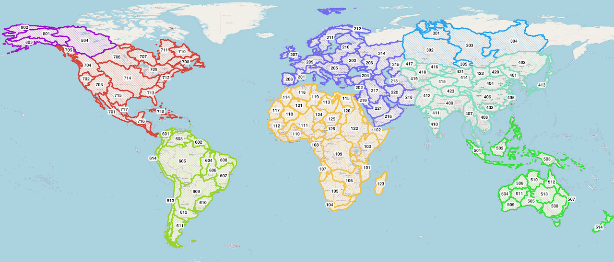

# GIS Data

The GEOGLOWS GIS data used in the hydrologic model is available for users to download and use for their own purposes. This dataset is referred to as hydrography, hydrofabric, or river network. It is vector data with points and lines with coordinates, not grid data, and it includes two main pieces:
- The exact stream center lines used in the hydrologic model.
- The exact catchment boundaries used in the hydrologic model.

Each stream centerline corresponds to exactly one unique catchment boundary. The streams and catchments each have a unique 9-digit ID that identifies the catchment. This ID is the same for the stream and the corresponding catchment.

---

## VPUs

The GIS data is divided into 125 smaller pieces called VPUs. This makes the large quantity easier to manage and access. Each VPU represents one watershed (such as the Amazon River or the Nile River) or a combination of watersheds. The following image shows the VPU breakdown throughout the world.

The VPU boundaries are also available to help identify which VPU includes a user's area of interest. Then the catchments and streams are accessed through their VPU.

[GIS Data.pdf](https://drive.google.com/file/d/10NrEV3GAQlI5OypeWn6pCAInDiGBFHLX/view?usp=sharing)

---

## Available Metadata

The V2 streams have the following attributes, which come from the TauDEM delineation process. For more explanation of these attributes, please check [here](#).

*For modified features, this value was not recomputed and should not be trusted.*

- **LINKNO** - A river ID number unique to the TDXHydro delineation. In TDXHydro v1 this is not globally unique. In future versions, this will be the same as geoglowsID.
- **DSLINKNO** - The ID of the river immediately downstream of the segment represented on that row.
- **USLINKNO*** - There will be 1 column per river segment upstream of the river on this row.
- **DSNODEID** - The node identifier for the node at the downstream end of the river.
- **strmOrder** - The Strahler stream order.*
- **Length** - Geodesic length in meters of the river segment.
- **Magnitude** - The Shreve stream magnitude.*
- **USContArea** - The total drainage area upstream of the most upstream point (i.e., the inlet) of this segment.*
- **DSContArea** - The total drainage area upstream of the most downstream point (i.e., the outlet) of this segment.
- **strmDrop** - The change in elevation between the inlet and outlet of the river segment.*
- **Slope** - The average stream slope, equal to "strmDrop / Length."
- **StraightL** - Distance from start to end of a river in a straight line between the first and last points.*
- **WSNO** - Watershed number.
- **DOUTEND** - Distance to the eventual outlet from the end of the river.*
- **DOUTSTART** - Distance to the eventual outlet from the start of the river.*
- **DOUTMID** - Distance to the eventual outlet from the midpoint of the river.*

V2 streams also have the following additional attributes added by the GEOGLOWS modelers:
- **TDXHydroRegion** - The original TDX regional group number of which this stream is part.
- **TopologicalOrder** - The topological order of a stream, from headwater to outlet.
- **Musk_k** - The Muskingum k parameter.
- **Musk_x** - The Muskingum x parameter.
- **TerminalNode** - This number is the TDXHydroLinkNo of the eventual outlet of this stream's watershed.
- **VPUCode** - A three-digit number representing which VPU region this stream belongs to.

---

## TDX-Hydro

The GEOGLOWS hydrography is a modification of TDX-Hydro. TDX-Hydro is a global hydrography dataset based on 12-meter elevation data from TanDEM-X (TDX). This proprietary elevation data was processed with TauDEM, a terrain analysis tool, to delineate streams and catchments. The original 12-meter elevation data is not accessible, but 30-meter elevation products such as GLO30 and FABDEM, which were made from TDX, are available.

### Modifications Made to the TDX-Hydro Dataset
There were some slight modifications made to the TDX-Hydro dataset when creating the GEOGLOWS stream network. This is not a comprehensive list; more details are available at [https://data.geoglows.org/dataset-descriptions/gis-streams-and-catchments](https://data.geoglows.org/dataset-descriptions/gis-streams-and-catchments).

- Regions in the far north and south were excluded, along with some small islands, because runoff datasets may not be as accurate in these regions, and there is less interest.
- Streams that had no length and no upstream/downstream segments were removed along with their associated catchments.
- Streams with no length but with upstream and downstream segments were removed with their associated catchments, and the upstream and/or downstream segments were modified to preserve the connectivity of the network.
- For many of the regions, headwater streams were dissolved with the downstream segments.
- Small watersheds that did not represent real flowing streams were often dropped.
