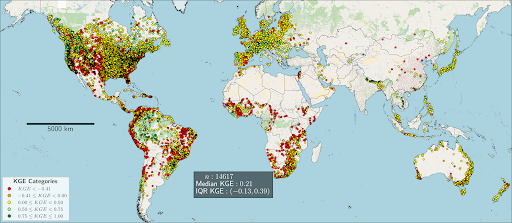
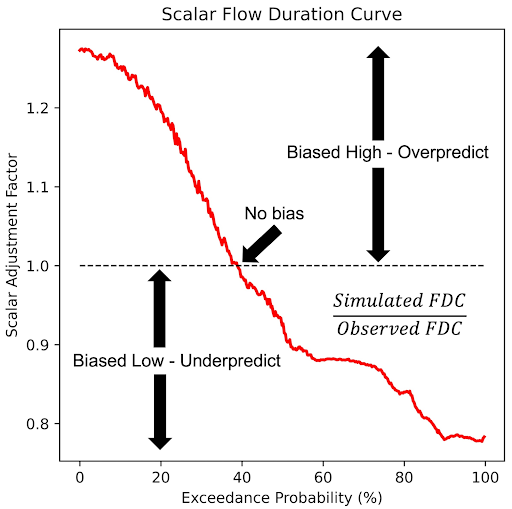

# Bias Correction and SABER

The validation results underscore the importance of ongoing model evaluation and improvement to enhance the performance of the GEOGLOWS Model. Consistently addressing bias, variability, and correlation across different regions is crucial for improving the accuracy and reliability of hydrological simulations. The GEOGLOWS Hydrologic Model exhibits biases that can limit its precision, prompting the development of a bias correction approach. To correct these systematic biases at instrumented locations, we propose the Monthly Flow Duration Curve Quantile-Mapping (MFDC-QM) method. This method targets biases related to flow variability and correlation.

After applying the bias correction, we observed a significant improvement in the distribution of bias and variability ratios, with a slight improvement in correlation values across the stations, resulting in more reliable simulations and improved Kling-Gupta Efficiency (KGE) metrics.

## Validation Exercises and Results

To validate the GEOGLOWS Model, we selected gauging stations that are connected to the GEOGLOWS Model stream network and meet specific criteria. These criteria include stations paired with a GEOGLOWS reach ID, stations with at least one year of data, and stations with records available after January 1, 1979, which aligns with the start date of version 1 of the model. With the release of version 2, which extends the retrospective simulation back to January 1, 1940, we are now able to include a larger set of stations for validation. The performance of the GEOGLOWS retrospective simulation is assessed using the Kling-Gupta Efficiency (KGE) metric, which decomposes into three components: bias, variability, and correlation. This validation process ensures that the model's simulations are consistent with observed streamflow data, providing reliable information for water resource management and hydrological studies.

[GEOGloWS - BiasCorrection Updated.pdf](https://drive.google.com/file/d/1voFzujDRYzeacfhB5lTUboIUu3fqIvQZ/view?usp=sharing)

## Interactive Learning - Bias Correction

To dive deeper into the analysis of bias correction and performance evaluation, we have prepared an interactive Google Colab notebook. This notebook provides step-by-step guidance for conducting these analyses using real-world data from the Magdalena River at El Banco in Colombia. It covers both bias correction and performance evaluation, allowing you to engage with the data and methods discussed in this guide: [Bias_Correction_GEOGloWS_ECMWF_Hydrological_Model_Retrospective_Simulation Colab.ipynb](https://colab.research.google.com/drive/1_TGLCuq8l0M30mpOjXQ6ip2ROgOtWwfy?usp=sharing).

---

## SABER (Stream Analysis for Bias Estimation and Reduction)

The SABER method is a bias correction tool designed for large hydrologic models like GEOGLOWS, specifically addressing the issue of model biases in both gauged and ungauged river basins. SABER uses flow duration curves (FDC) to compare the observed discharge with the simulated values from hydrologic models, identifying and correcting biases. For ungauged locations, where direct observations are unavailable, SABER uses the scalar flow duration curve (SFDC).

SABER allows the bias correction process to extend to ungauged basins by analyzing similar watershed behaviors based on spatial proximity and clustering of flow regimes. This method is particularly useful for regions where data scarcity limits traditional calibration, such as in global models like GEOGLOWS, ensuring more accurate discharge forecasts across large spatial domains.

SABER works by comparing simulated discharge data to observed values at gauged locations to detect high or low biases. It applies machine learning clustering techniques to group watersheds with similar flow characteristics, helping to extend bias correction from gauged to ungauged basins. SABER's process includes calculating SFDCs for different exceedance probabilities, dividing the simulated flows by the corresponding SFDC values, even in regions affected by dams or reservoirs.

