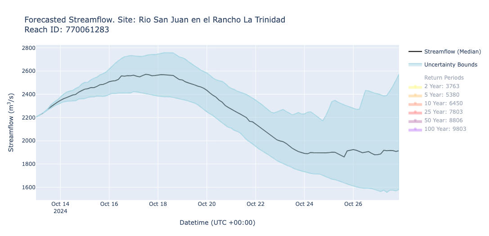

# Forecast Data

The GEOGLOWS model produces ensemble streamflow forecasts using data 
from the ECMWF (European Centre for Medium-Range Weather Forecasts) 
ensemble system. Each forecast includes 52 ensemble members: 51 
low-resolution members with a 15-day forecast horizon, and 1 
high-resolution member with a 10-day horizon. The low-resolution 
members have a time resolution of 3-hour intervals, while the 
high-resolution member provides forecasts at 1-hour intervals. 
These forecasts offer probabilistic insights into future streamflow 
conditions, allowing users to assess potential variability.

Forecast plots are designed to help users interpret the range of 
possible outcomes and uncertainties. The most commonly used forecast 
plot presents the median, 20th percentile, and 80th percentile, 
which represent 60% of the probability distribution within the 
ensemble members. These statistics give insight into the potential
variability of future streamflows. This allows users to gauge the 
likelihood of different flow scenarios.

In some cases, the plot may also include mean, minimum and maximum
flow values, as well as the high-resolution member, offering a 
comprehensive understanding of the forecast. This statistical 
breakdown allows users to assess the likelihood of various flow 
scenarios, making it a valuable tool  for making informed decisions 
related to water resource management, flood forecasting, disaster 
preparedness, and risk mitigation.

[Forecast Data Presentation](https://drive.google.com/file/d/1_dDtF3F74Un8PKVkZZdslDjp_MP64-dX/view?usp=sharing)

The Colab notebook provides an interactive guide on accessing and 
visualizing forecast data from the GEOGLOWS Model. It demonstrates 
how to retrieve streamflow forecasts, plot the data using Python 
libraries, and interpret key statistics for effective water resource 
management and planning:

[Forecast Simulation Colab](https://colab.research.google.com/drive/1JFBpIBZBXwAk9Q_mLhNgoOiv11pbSlNn?usp=sharing)

## Forecast Bias Correction

The GEOGLOWS model applies bias correction to its forecast data by 
assuming the forecast shares the same biases as the retrospective 
simulation. This process involves mapping forecasted streamflow values 
to a non-exceedance probability using the historical simulation's flow 
duration curve and then replacing the forecasted values with corresponding
values from the observed flow duration curve.

This method helps improve forecast accuracy, particularly during 
earlier forecast lead times, aligning the data more closely with
historical observations. However, improvements are limited by the 
assumption that the biases in forecast data are identical to those
in the retrospective simulation​.

[Bias Correction Presentation](https://drive.google.com/file/d/1AHKDHPlIQSi-8-Qvxdt6IQid0kUZ8RJD/view?usp=sharing)

This Colab notebook offers a step-by-step guide for performing 
bias correction on GEOGLOWS forecast values. It shows how to adjust 
forecasted streamflow values using historical observations, improving 
the accuracy of predictions and aligning the data with real-world 
measurements for better hydrological analysis: 

[Bias Correction Colab](https://colab.research.google.com/drive/1SG9AGKjNjzAVmEDEYBkVvK1nnvD5btXt?usp=sharing)

