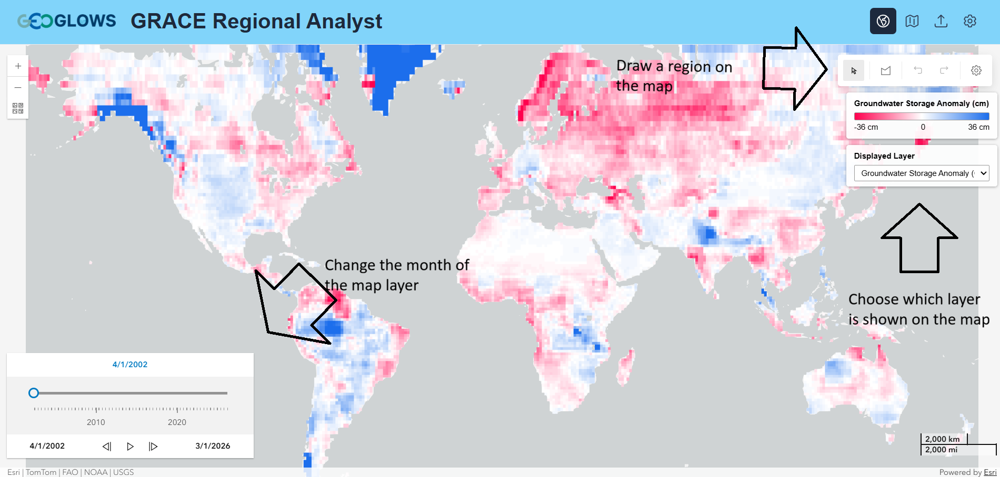
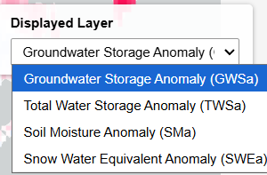
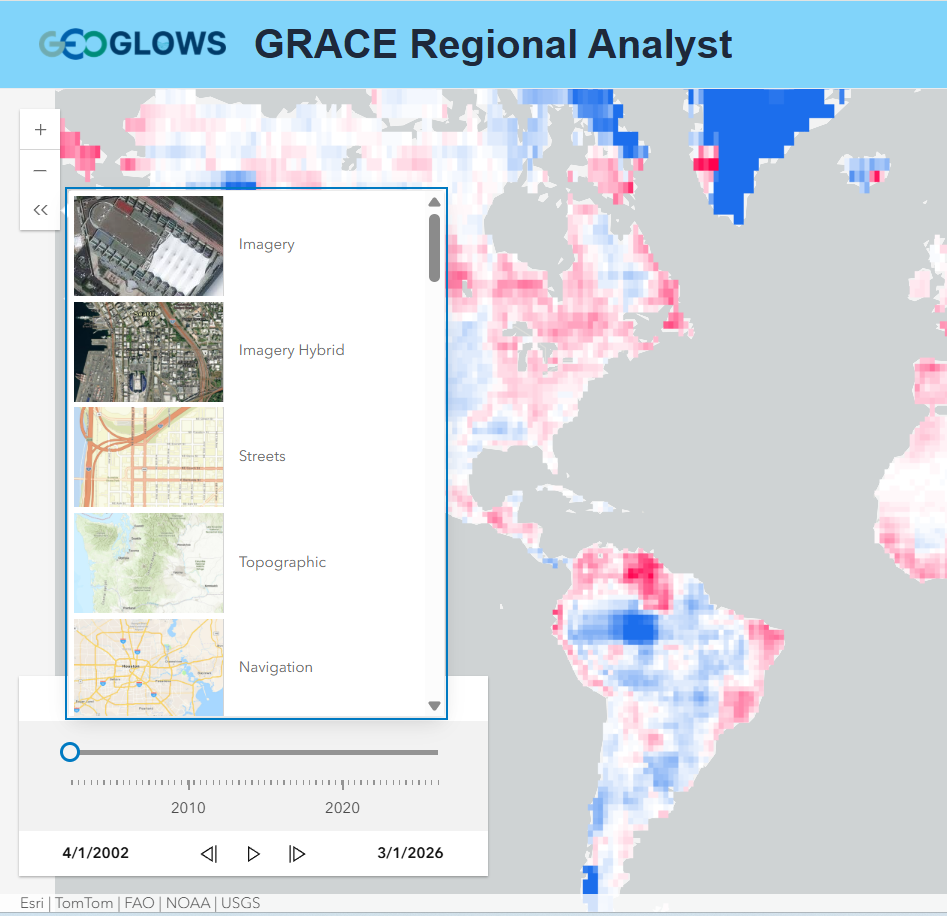
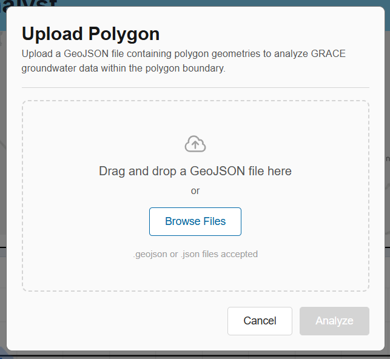
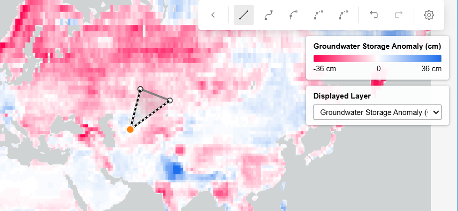
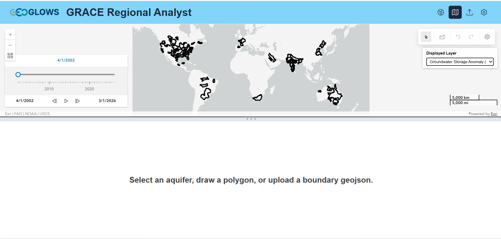
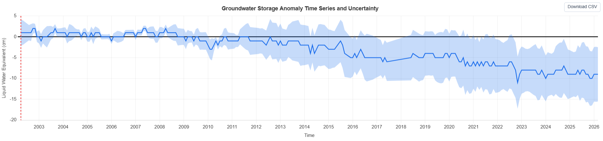
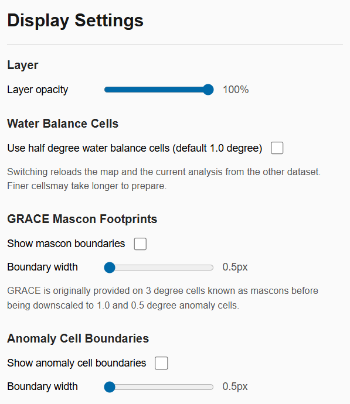
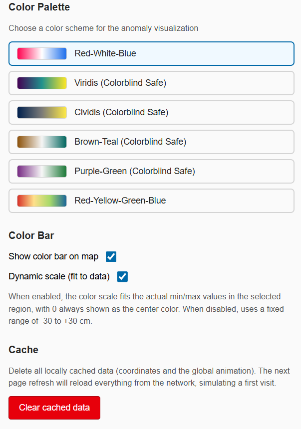

## Vue d'Ensemble

GRACE Regional Analyst est une application web qui offre une interface cartographique pour visualiser les composantes de stockage à l'échelle
mondiale, les animer dans le temps, générer des séries temporelles et télécharger les résultats.

L'application est disponible à l'adresse
[apps.geoglows.org/grace-anomalies](https://apps.geoglows.org/grace-anomalies){:target="_blank"}.

Cette page couvre tout ce qui se fait au sein de l'application. Les concepts qui sous-tendent ces étapes — comment les données sont dérivées, comment
les régions sont découpées et ce que signifient les résultats — sont présentés dans
[Algorithme de Calcul](../understanding/computational-algorithm.md).

## L'Interface Cartographique

À l'ouverture de l'application web, la première chose visible est la carte. Le curseur temporel, en bas à gauche, change le mois affiché et permet
d'animer la série d'un mois au suivant. Les outils de dessin, en haut à droite, servent à définir une région d'intérêt, ce qui est décrit plus en
détail ci-dessous.

Toujours dans le coin supérieur droit, l'utilisateur peut choisir la couche qu'il souhaite visualiser. Les options sont l'Anomalie du Stockage des
Eaux Souterraines (GWSa), l'Anomalie du Stockage Total en Eau (TWSa), l'Anomalie de l'Humidité du Sol (SMa) et l'Anomalie de l'Équivalent en Eau de
la Neige (SWEa). Chacune est décrite dans [Données Disponibles](../datasets/available-data.md).

Sur le côté gauche, une option permet de sélectionner un fond de carte. Plusieurs options différentes sont proposées.

{ width="420" }

## Sélection d'une Zone ou d'un Point

Pour sélectionner une zone ou un point, l'utilisateur dispose de plusieurs options.

La première option consiste à téléverser un geojson de la zone qui l'intéresse. Pour cela, sélectionnez le bouton de téléversement dans le coin
supérieur droit. Une fenêtre pop-up s'ouvrira alors, permettant de téléverser le fichier. Les fichiers `.geojson` et `.json` sont tous deux acceptés.

{ width="440" }

L'option suivante consiste à utiliser les outils de dessin pour tracer une région d'intérêt sur la carte. Double-cliquez pour terminer le polygone.

Une autre façon de choisir où visualiser les données consiste à utiliser les outils de dessin pour sélectionner un point d'intérêt unique. Une analyse
ponctuelle renvoie la série temporelle des cellules de la grille contenant ce point, ce qui est présenté dans
[Analyse en un Point Unique](../understanding/computational-algorithm.md#analyse-en-un-point-unique).

La dernière façon de choisir une région consiste à sélectionner un aquifère existant. Pour cela, sélectionnez « Aquifer Scale » dans le menu supérieur
droit. Les limites des aquifères seront alors chargées sur la carte, et l'une d'elles pourra ensuite être sélectionnée.

Une fois sélectionné, la carte n'affichera que cet aquifère ainsi que les données qui lui sont associées.

La manière dont la région est transformée en série temporelle — quelles cellules de la grille sont retenues et la taille minimale de région
recommandée — est présentée dans [Découpage de la Grille](../understanding/computational-algorithm.md#decoupage-de-la-grille).

## Visualisation et Téléchargement des Résultats

Une fois qu'un point ou une région a été sélectionné sur la carte, le graphique de la série temporelle correspondante se charge dans la moitié
inférieure de l'application. Le graphique présente la composante sélectionnée sous forme de courbe, avec son incertitude sous forme de bande ombrée,
en équivalent en eau liquide (cm).

Dans le coin supérieur droit du graphique se trouve un bouton permettant de télécharger le CSV. Les données actuellement affichées sur le graphique
seront celles qui seront téléchargées. Changez la couche affichée sur le côté droit de la carte pour modifier la variable représentée.

Chaque composante de stockage se télécharge dans son propre fichier comportant quatre colonnes. Les unités de stockage sont en équivalent en eau
liquide (cm).

| Colonne | Contenu |
|---------|---------|
| `Date` | Mois de la valeur, dans un format de date standard |
| `GWS` | Anomalie du stockage des eaux souterraines, en cm |
| `GWS_upper` | Borne supérieure de la plage d'erreur |
| `GWS_lower` | Borne inférieure de la plage d'erreur |

Les colonnes de valeurs portent le nom de la composante téléchargée : un fichier d'équivalent en eau de la neige comporte `SWE`, `SWE_upper` et
`SWE_lower`. Les dates sont déjà dans un format de date standard et ne nécessitent aucune conversion.

## Paramètres

L'application propose quelques paramètres que l'utilisateur peut ajuster. On y accède en sélectionnant les paramètres dans le menu supérieur droit.
Une fenêtre pop-up s'ouvre alors avec la liste des paramètres.

{ width="440" }

**Opacité de la couche** détermine l'intensité avec laquelle la couche d'anomalies est dessinée par-dessus le fond de carte. En la diminuant, le fond
de carte devient visible en dessous.

**Cellules de bilan hydrique** bascule entre les cellules de 1.0 degré utilisées par défaut et des cellules plus fines d'un demi-degré. Le changement
recharge la carte et l'analyse en cours à partir de l'autre jeu de données, et les cellules plus fines sont plus longues à préparer. Voir
[Résolution de la Grille](../datasets/available-data.md#resolution-de-la-grille).

**Emprises des mascons GRACE** dessine les contours des cellules d'origine de 3 degrés sur lesquelles les données sont livrées. Un curseur règle
l'épaisseur du trait.

**Limites des cellules d'anomalie** dessine les contours des cellules de 1.0 ou 0.5 degré sur lesquelles les anomalies sont restituées. Un curseur
règle l'épaisseur du trait.

{ width="440" }

**Palette de couleurs** définit le schéma de couleurs utilisé pour la couche d'anomalies. Red-White-Blue est la palette par défaut, et quatre options
adaptées au daltonisme sont disponibles : Viridis, Cividis, Brown-Teal et Purple-Green.

**Barre de couleur** affiche ou masque la légende sur la carte.

**Échelle dynamique** est activée par défaut et ajuste l'échelle de couleurs aux valeurs minimale et maximale de la région sélectionnée, le 0 étant
toujours la couleur centrale. En la désactivant, une plage fixe de -30 à +30 cm est utilisée.

**Effacer les données en cache** supprime les coordonnées et l'animation globale mises en cache localement. Le prochain rafraîchissement de la page
rechargera tout depuis le réseau, simulant une première visite.
