## Overview

In addition to obtaining the GRACE-derived groundwater storage anomaly, it is possible to analyze the storage anomaly time series to extract an
estimate of annual recharge using a technique called the Water Table Fluctuation (WTF) method.

The WTF method was originally developed to estimate recharge from seasonal fluctuations in groundwater levels measured directly in monitoring wells.
When a water level time series exhibits seasonal fluctuations as shown below, it is assumed that the declining period during the dry part of the year
results from pumping and groundwater discharge, and the rise during the wet part of the year is the result of recharge.

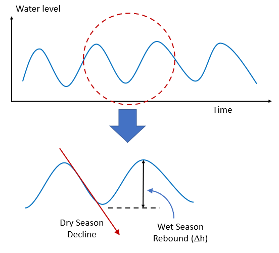

Using water levels derived from a monitoring well, we can estimate the recharge as follows:

```
R = Sy × (Δh / t)
```

where Δh is the rebound in water level, t is the time period (typically one year) and Sy is the specific yield or appropriate storage coefficient.

The storage coefficient is necessary because the water level rise in the surrounding aquifer occurs in the fractional void space and the storage
coefficient converts it to the appropriate liquid water equivalent component in the [length]/[time] infiltration rate units used by recharge. If we
perform this analysis using the groundwater storage anomaly curve derived from GRACE, we do not need to use a storage coefficient as the anomaly is
already in liquid water equivalent form and we can directly estimate the recharge as:

```
R = ΔGWSa / Δt
```

where ΔGWSa = the rise in groundwater extracted from the GRACE-derived groundwater storage anomaly curve.

## Methods for Estimating Recharge Component

There are two general approaches for determining the height of the rise associated with recharge:

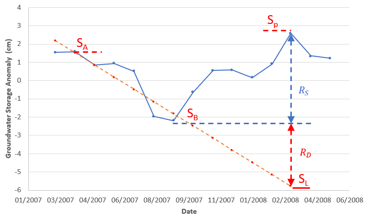

With the more conservative method, the rise is measured from the trough to the next peak as follows:

```
R_method_1 = ΔGWSa / Δt = (Sp - SB) / Δt = RS
```

Another method is to assume that the groundwater decline as a result of pumping and discharge continues at the same rate in the wet season and
therefore the rise should be computed from a linear extrapolation of the declining line as follows:

```
R_method_2 = ΔGWSa / Δt = (Sp - SL) / Δt = RS + RD
```

The recharge rates extracted from these two equations could be considered a low and a high estimate, although in our experience method 1 seems to be
the most accurate. An example of applying the WTF method to estimate recharge in Southern Niger can be found in
[Evaluating Groundwater Storage Change and Recharge Using GRACE Data: A Case Study of Aquifers in Niger, West Africa](https://www.mdpi.com/2072-4292/14/7/1532){:target="_blank"}.

## Downloading the Water Level Time Series

To apply the WTF method to estimate recharge on GRACE data, one must first download the groundwater storage anomaly time series. Load the region and
select the Groundwater Storage Anomaly component, then download the time series as either a comma separated values (CSV) file or an Excel (XLS) file.

<!-- TODO: The app interface has changed. Write the download steps and capture a new screenshot
     against the current version of the app. The old screenshot (images-wtf/ggst_download.png) shows
     the previous interface and was deliberately not carried over. -->

Each storage component downloads as its own file with four columns: the date, the value, and the upper and lower bounds of the error range. The
storage units are liquid water equivalent in cm.

| Column | Contents |
|--------|----------|
| `Date` | Month of the value, in a standard date format |
| `GWS` | Groundwater storage anomaly, in cm |
| `GWS_upper` | Upper bound of the error range |
| `GWS_lower` | Lower bound of the error range |

The value columns are named for the component you downloaded — a snow water equivalent file has `SWE`, `SWE_upper`, and `SWE_lower`.

Dates are already in a standard date format and need no conversion.

## Gaps in the GRACE Data

If you carefully inspect the groundwater storage time series CSV file, you will see that there are several missing months or gaps in the data. For
example, the month of June is missing in 2003:

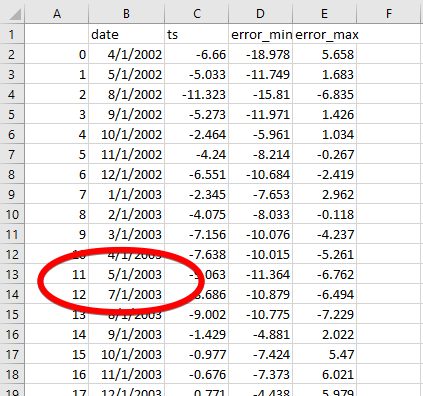

<!-- TODO: this figure is from the older export, so its column headers (ts, error_min, error_max)
     differ from the current ones (GWS, GWS_upper, GWS_lower). The gap it illustrates is still
     correct. Replace with a current screenshot when convenient. -->

This is because there were periods when the GRACE satellites did not produce usable data. The largest gap is a 12-month period in 2017-2018 between
the end of the original GRACE mission in 2017 and when the subsequent GRACE-FO satellites were launched and became operational in 2018. Here is a
sample plot for an aquifer in Southern Niger with the gaps shown:

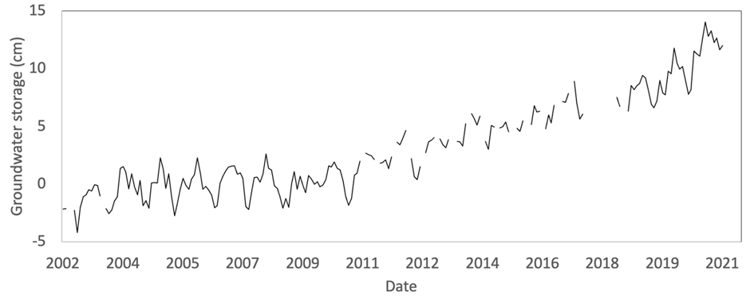

For the years with large gaps, it can be difficult to identify seasonal trends and apply the WTF method. One way to resolve this problem is to use a
statistical algorithm to detect seasonal patterns in the data and impute synthetic data in the gaps. This can be accomplished using a simple seasonal
decomposition model (`statsmodels.tsa.seasonal.seasonal_decompose`) implemented in the statsmodels Python package to impute the missing data. This
model first removes the trend using a convolution filter (the trend component), then computes the average value for each period (the seasonal
component), in our case months, with the residual component being the difference between the monthly average (seasonal component) and the actual
monthly measurements. With this approach, we decompose the GWSa time series into three components: the trend, the seasonal, and the random
components:

```
Y[t] = T[t] + S[t] + e[t]
```

Where Y[t] is the GWSa, T[t] is the GWSa trend, S[t] is the seasonal GWSa component, and e[t] is the residual GWSa component. The decomposition
components for the data shown above are as illustrated here:


To impute the missing data, we use the trend from the data decomposition, then add the average of the monthly and residual values for that month to
estimate the missing value. This model can be written as:

```
Y[t] = y(T[t]) + mean(S[t] + e[t])
```

The following figure shows the original time series in black, with imputed values in red:

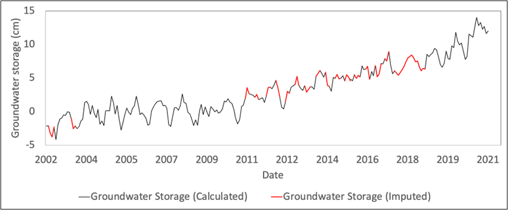

## Data Imputation Tools

To assist users in applying the statsmodel method described above to impute gaps in the GRACE data, the Python code to perform the imputation is
implemented in a Google Colab notebook. After launching the notebook, follow the instructions in the code.

[Open the gap imputation notebook in Colab](https://colab.research.google.com/github/BYU-Hydroinformatics/ggst-notebooks/blob/main/impute_gaps_GRACE.ipynb){:target="_blank"}

Before running the code, you will need to prepare and upload a CSV file with the original data with the gaps. This file will need to contain only two
columns, which you can copy and paste from the full CSV and then save as a separate CSV file (`base_file.csv` for example).

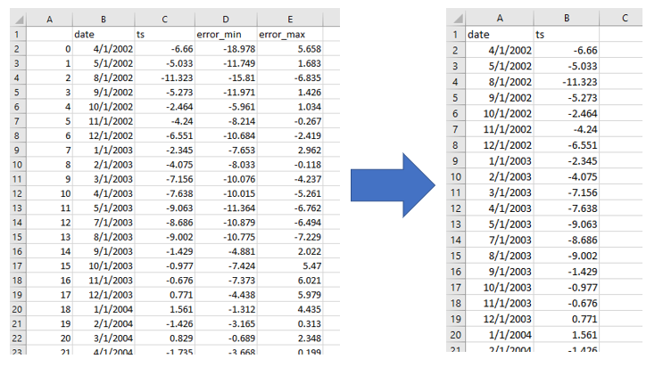

Here is a sample file you can use with the script:
[west-gwsa-raw-clean.csv](../../static/files/west-gwsa-raw-clean.csv)

## Multi-Linear Trend Analysis

In the seasonal decomposition method described above for gap imputation, a single linear trend was described. Here is the trend resulting from the
sample file linked above with a single trend line:

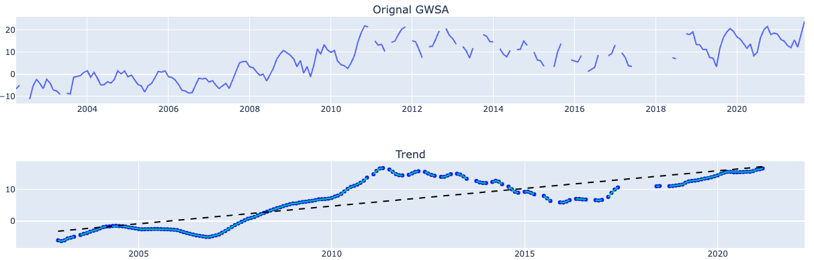

However, many data sets exhibit multiple linear trends. For this dataset, there are four distinct trends. The Python script has an option to perform
a multi-linear regression analysis. For this dataset, we set the `number_breakpoints` variable to 3, and run a multi-linear regression algorithm that
fits the data as follows:

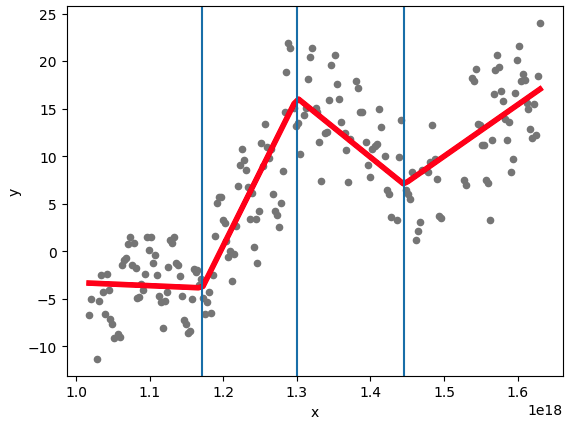

Note that 3 interior breakpoints result in four linear trends. This option results in the following trends:

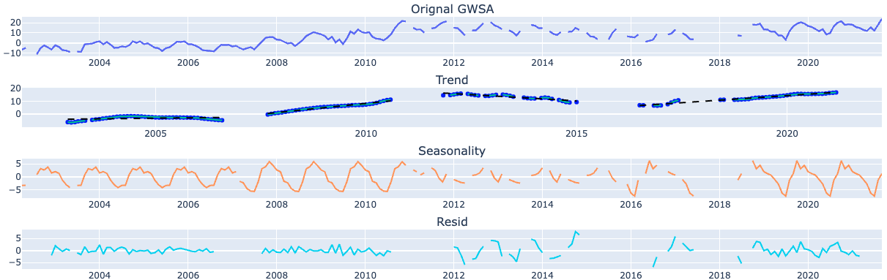

And finally, the gap imputation with 4 trend lines results in the following:

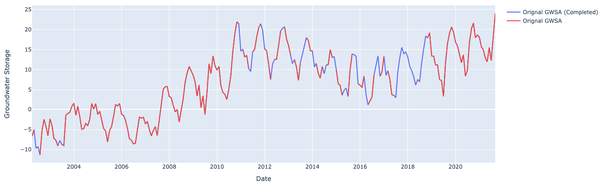

## Data Processing Examples

Once the gaps have been filled, the last step is to plot and analyze the curves one season at a time, extract the GWSa values from the curve, and
calculate the recharge estimate using either method 1 and/or method 2.

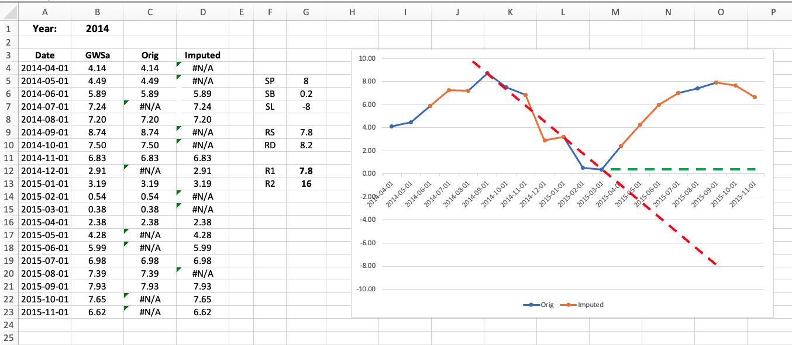

The following Excel file illustrates how to examine and process each season of data from a GRACE-derived and imputed groundwater storage anomaly time
series:
[west-gwsa-wtf.xlsx](../../static/files/west-gwsa-wtf.xlsx)

After opening the file, copy-paste the GWSa values generated by the imputation algorithm as shown here. Note that the imputed values have more digits
than the original values. The formulas in columns C & D separate the imputed data in column B to allow a multi-colored plot where the original
imputed sections can be clearly visualized.

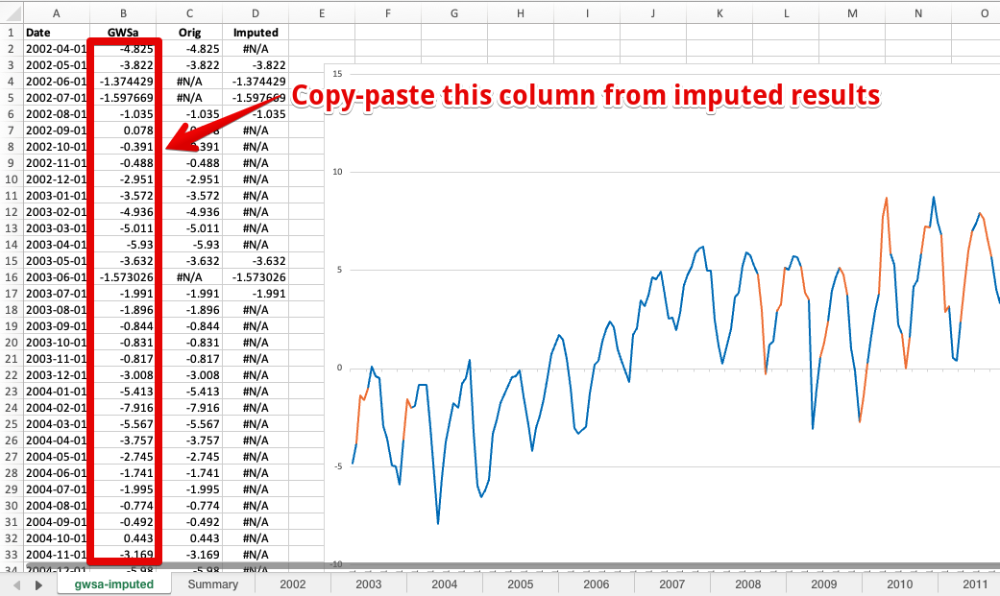

At this point you can browse through each of the tabs for the years starting in 2002. On each page, the seasonal values are automatically pulled from
the main sheet using a VLOOKUP formula. For each page, manually adjust the red and green lines to fit the descending branch and the base. Then
manually scale off the SP, SB, and SL values in cm from the vertical axis and enter into the three cells indicated in the diagram. The RS, RD, R1,
and R2 values will then be automatically calculated.

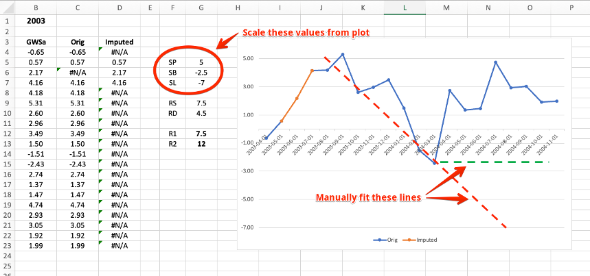


As you examine the plot for each year, you may need to adjust the range of the vertical axis before you can properly fit the lines. To do this,
double-click on the vertical axis, click on the axis options tab, and manually adjust the minimum and maximum bounds to properly frame the plot.


If you need to add additional years, copy one of the yearly sheets, rename it, and change the year at the top of the sheet. After processing all of
the years and calculating all of the R1, R2 values, you can see a summary in the Summary sheet.


