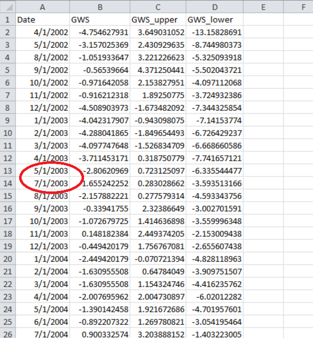

## Vue d'Ensemble

Au-delà de l'obtention de l'anomalie du stockage des eaux souterraines dérivée de GRACE, il est possible d'analyser la série temporelle des anomalies
de stockage afin d'en extraire une estimation de la recharge annuelle, au moyen d'une technique appelée méthode de Fluctuation de la Nappe Phréatique
(WTF, d'après l'anglais Water Table Fluctuation).

La méthode WTF a été développée à l'origine pour estimer la recharge à partir des fluctuations saisonnières des niveaux d'eau souterraine mesurés
directement dans des puits de suivi. Lorsqu'une série temporelle de niveaux d'eau présente des fluctuations saisonnières comme celles illustrées
ci-dessous, on suppose que la période de baisse pendant la saison sèche résulte du pompage et de la décharge des eaux souterraines, et que la hausse
pendant la saison humide résulte de la recharge.


À partir des niveaux d'eau relevés dans un puits de suivi, la recharge peut être estimée comme suit :

```
R = Sy × (Δh / t)
```

où Δh est la remontée du niveau d'eau, t la période considérée (généralement un an) et Sy la porosité efficace, ou le coefficient d'emmagasinement
approprié.

Le coefficient d'emmagasinement est nécessaire car la remontée du niveau d'eau dans l'aquifère environnant se produit dans l'espace poreux, et le
coefficient la convertit en équivalent en eau liquide, dans les unités de taux d'infiltration [longueur]/[temps] utilisées pour la recharge. Si cette
analyse est réalisée à partir de la courbe d'anomalie du stockage des eaux souterraines dérivée de GRACE, il n'est pas nécessaire d'utiliser un
coefficient d'emmagasinement, puisque l'anomalie est déjà exprimée en équivalent en eau liquide ; la recharge peut alors être estimée directement
comme suit :

```
R = ΔGWSa / Δt
```

où ΔGWSa est la remontée des eaux souterraines extraite de la courbe d'anomalie du stockage des eaux souterraines dérivée de GRACE.

## Méthodes d'Estimation de la Composante de Recharge

Il existe deux approches générales pour déterminer l'amplitude de la remontée associée à la recharge :


Avec la méthode la plus conservatrice, la remontée est mesurée du creux jusqu'au pic suivant, comme suit :

```
R_méthode_1 = ΔGWSa / Δt = (Sp - SB) / Δt = RS
```

Une autre méthode consiste à supposer que la baisse des eaux souterraines due au pompage et à la décharge se poursuit au même rythme pendant la saison
humide, et que la remontée doit donc être calculée à partir d'une extrapolation linéaire de la droite de décroissance, comme suit :

```
R_méthode_2 = ΔGWSa / Δt = (Sp - SL) / Δt = RS + RD
```

Les taux de recharge issus de ces deux équations peuvent être considérés comme une estimation basse et une estimation haute, bien que, d'après
l'expérience des auteurs, la méthode 1 semble la plus juste. Un exemple d'application de la méthode WTF pour estimer la recharge dans le sud du Niger
est présenté dans
[Evaluating Groundwater Storage Change and Recharge Using GRACE Data: A Case Study of Aquifers in Niger, West Africa](https://www.mdpi.com/2072-4292/14/7/1532){:target="_blank"}.

## Téléchargement de la Série Temporelle du Niveau d'Eau

Pour appliquer la méthode WTF et estimer la recharge à partir des données GRACE, il faut d'abord télécharger la série temporelle des anomalies du
stockage des eaux souterraines. Chargez la région, sélectionnez la composante Anomalie du Stockage des Eaux Souterraines, puis téléchargez le CSV. Les
étapes et le format du fichier sont décrits dans
[Visualisation et Téléchargement des Résultats](../accessing-data/web-app.md#visualisation-et-telechargement-des-resultats).

## Lacunes dans les Données GRACE

En examinant attentivement le fichier CSV de la série temporelle du stockage des eaux souterraines, on constate que plusieurs mois sont manquants, ou
qu'il existe des lacunes dans les données. Le mois de juin 2003, par exemple, est absent :



Cela s'explique par le fait que les satellites GRACE n'ont pas produit de données exploitables pendant certaines périodes. La plus grande lacune est
une période de 12 mois en 2017-2018, entre la fin de la mission GRACE d'origine en 2017 et le moment où les satellites GRACE-FO suivants ont été lancés
et sont devenus opérationnels en 2018. Voici un graphique d'exemple pour un aquifère du sud du Niger, avec les lacunes mises en évidence :


Pour les années comportant de larges lacunes, il peut être difficile de dégager les tendances saisonnières et d'appliquer la méthode WTF. Une façon de
résoudre ce problème consiste à utiliser un algorithme statistique pour détecter les motifs saisonniers dans les données et imputer des données
synthétiques dans les lacunes. Cela peut être réalisé au moyen d'un modèle simple de décomposition saisonnière
(`statsmodels.tsa.seasonal.seasonal_decompose`) implémenté dans le paquet Python statsmodels. Ce modèle retire d'abord la tendance à l'aide d'un filtre
de convolution (la composante de tendance), puis calcule la valeur moyenne de chaque période (la composante saisonnière), ici les mois, la composante
résiduelle correspondant à l'écart entre la moyenne mensuelle (composante saisonnière) et les mesures mensuelles réelles. Avec cette approche, la série
temporelle de GWSa est décomposée en trois composantes : la tendance, la saisonnalité et l'aléa :

```
Y[t] = T[t] + S[t] + e[t]
```

Où Y[t] est la GWSa, T[t] la tendance de la GWSa, S[t] la composante saisonnière de la GWSa et e[t] la composante résiduelle de la GWSa. Les
composantes de la décomposition pour les données présentées ci-dessus sont illustrées ici :


Pour imputer les données manquantes, on utilise la tendance issue de la décomposition, à laquelle on ajoute la moyenne des valeurs mensuelles et
résiduelles de ce mois afin d'estimer la valeur manquante. Ce modèle peut s'écrire :

```
Y[t] = y(T[t]) + mean(S[t] + e[t])
```

La figure suivante montre la série temporelle d'origine en noir, avec les valeurs imputées en rouge :


## Outils d'Imputation des Données

Afin d'aider les utilisateurs à appliquer la méthode statsmodels décrite ci-dessus pour combler les lacunes des données GRACE, le code Python
réalisant l'imputation est implémenté dans un cahier Google Colab. Après avoir lancé le cahier, suivez les instructions figurant dans le code.

[Ouvrir le cahier d'imputation des lacunes dans Colab](https://colab.research.google.com/github/BYU-Hydroinformatics/ggst-notebooks/blob/main/impute_gaps_GRACE.ipynb){:target="_blank"}

Avant d'exécuter le code, vous devrez préparer et téléverser un fichier CSV contenant les données d'origine avec les lacunes. Ce fichier ne doit
comporter que deux colonnes, que vous pouvez copier-coller depuis le CSV complet puis enregistrer dans un fichier CSV distinct (`base_file.csv`, par
exemple).


Voici un fichier d'exemple que vous pouvez utiliser avec le script :
[west-gwsa-raw-clean.csv](../../static/files/west-gwsa-raw-clean.csv)

## Analyse de Tendances Multilinéaires

Dans la méthode de décomposition saisonnière décrite ci-dessus pour l'imputation des lacunes, une seule tendance linéaire était utilisée. Voici la
tendance obtenue à partir du fichier d'exemple lié ci-dessus, avec une unique droite de tendance :


Cependant, de nombreux jeux de données présentent plusieurs tendances linéaires. Pour ce jeu de données, il existe quatre tendances distinctes. Le
script Python propose une option permettant de réaliser une analyse de régression multilinéaire. Pour ce jeu de données, la variable
`number_breakpoints` a été fixée à 3, puis un algorithme de régression multilinéaire a été exécuté, ajustant les données comme suit :


Notez que 3 points de rupture intérieurs donnent quatre tendances linéaires. Cette option produit les tendances suivantes :


Enfin, l'imputation des lacunes avec 4 droites de tendance donne le résultat suivant :


## Exemples de Traitement des Données

Une fois les lacunes comblées, la dernière étape consiste à tracer et analyser les courbes une saison à la fois, à extraire les valeurs de GWSa de la
courbe et à calculer l'estimation de recharge selon la méthode 1 et/ou la méthode 2.


Le fichier Excel suivant illustre comment examiner et traiter chaque saison de données d'une série temporelle d'anomalies du stockage des eaux
souterraines dérivée de GRACE et imputée :
[west-gwsa-wtf.xlsx](../../static/files/west-gwsa-wtf.xlsx)

Après avoir ouvert le fichier, copiez-collez les valeurs de GWSa générées par l'algorithme d'imputation comme illustré ici. Notez que les valeurs
imputées comportent davantage de décimales que les valeurs d'origine. Les formules des colonnes C et D séparent les données imputées de la colonne B
afin de permettre un graphique multicolore où les sections imputées d'origine sont clairement visibles.


À ce stade, vous pouvez parcourir chacun des onglets correspondant aux années à partir de 2002. Sur chaque page, les valeurs saisonnières sont
extraites automatiquement de la feuille principale au moyen d'une formule VLOOKUP. Sur chaque page, ajustez manuellement les droites rouge et verte
pour épouser la branche descendante et la base. Relevez ensuite manuellement les valeurs SP, SB et SL en cm sur l'axe vertical et saisissez-les dans
les trois cellules indiquées sur le schéma. Les valeurs RS, RD, R1 et R2 seront alors calculées automatiquement.


En examinant le graphique de chaque année, il peut être nécessaire d'ajuster l'échelle de l'axe vertical avant de pouvoir ajuster correctement les
droites. Pour cela, double-cliquez sur l'axe vertical, ouvrez l'onglet des options d'axe et ajustez manuellement les bornes minimale et maximale afin
de bien cadrer le graphique.


Si vous devez ajouter des années supplémentaires, copiez l'une des feuilles annuelles, renommez-la et modifiez l'année en haut de la feuille. Après
avoir traité toutes les années et calculé l'ensemble des valeurs R1 et R2, vous pouvez consulter une synthèse dans la feuille Summary.


