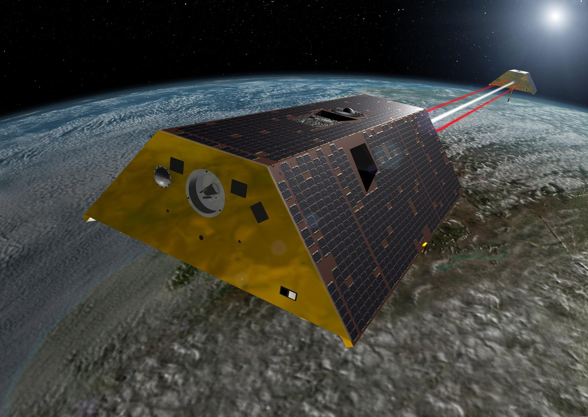
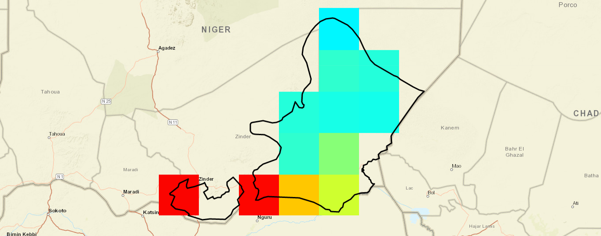
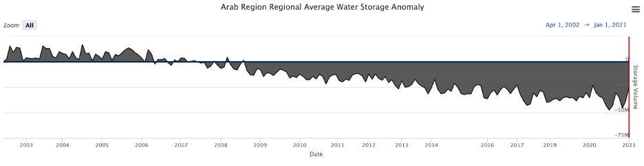

## Vue d'Ensemble

Les anomalies de stockage dérivées de GRACE reposent sur les données d'observation de la Terre collectées par la NASA au moyen de satellites qui
cartographient le champ de gravité terrestre. Les variations de gravité sont dues aux variations du stockage en eau, ce qui offre une occasion rare de
suivre le niveau des eaux souterraines par satellite, en complément d'une estimation des eaux de surface.

Cette page décrit comment la composante souterraine est isolée de cette mesure au moyen d'une approche de bilan de masse, et comment le résultat est
découpé selon une région d'intérêt. Pour le contexte des données et de l'application qui les diffuse, voir [Vue d'Ensemble](overview.md).

## Comment Fonctionne la Mesure

La mission GRACE a été lancée en mars 2002. Elle est composée d'une paire de satellites situés à 400 km au-dessus de la Terre et séparés de 200 km.
Lorsque les satellites survolent différentes régions de la Terre, le satellite avant et le satellite arrière sont légèrement attirés vers l'avant et
vers l'arrière en réponse à de subtiles variations du champ de gravité terrestre causées par des changements de masse en surface. La distance entre
les satellites varie donc, et ces variations sont enregistrées par un système micro-onde en bande K dont la précision atteint 10 microns.



*Crédit image : NASA/JPL-Caltech*

Les satellites GRACE suivent une trajectoire variable qui couvre l'ensemble de la Terre environ une fois par mois. Ces données sont ensuite traitées
par la NASA afin de produire une carte du champ de gravité terrestre. Chaque mois, une nouvelle carte est générée et les différences sont calculées
pour produire une carte d'anomalies de gravité. On suppose que les variations de masse sont principalement dues aux variations du stockage en eau.

Chaque mois, la NASA génère une carte en grille de l'anomalie du stockage total en eau à une résolution de 3 degrés. Cette carte est ensuite
désagrégée à l'aide d'un algorithme de conservation de la masse vers une résolution de 0.5 degré, puis mise à disposition au téléchargement au format
raster multidimensionnel netCDF.

## Dérivation des Eaux Souterraines

La composante souterraine des données brutes de GRACE peut être isolée au moyen d'une approche de bilan de masse, en utilisant les modèles du Global
Land Data Assimilation System (GLDAS) de la NASA pour calculer la composante de surface des données. Pour calculer le stockage total en eau de
surface, les composantes des modèles GLDAS représentant le stockage de surface sont additionnées puis soustraites du jeu de données GRACE, afin
d'estimer un jeu de données d'anomalie du stockage des eaux souterraines.

L'application utilise quatre jeux de données :

- Le jeu de données TWSa de GRACE
- Le jeu de données GLDAS de l'eau interceptée par la végétation (CAN)
- L'équivalent en eau de la neige GLDAS (SWE)
- L'humidité du sol GLDAS (SM)

Chaque composante GLDAS est convertie en anomalie par soustraction de la moyenne centrée sur les valeurs de 2004 à 2009, puis moyennée entre les trois
modèles GLDAS afin de produire un jeu de données d'anomalies par composante : CANa, SWEa et SMa. L'écart type entre les trois modèles GLDAS sert à
estimer l'incertitude.

Les données GLDAS sont normalement obtenues en grille à une résolution de 1 degré de latitude par 1 degré de longitude, tandis que la TWSa de GRACE est
diffusée à 0.5 degré. La réconciliation des deux grilles est réalisée par une moyenne pondérée par la surface des quatre cellules de la grille GRACE
coïncidant avec chaque cellule de la grille GLDAS.

Les composantes peuvent être calculées soit sur des cellules de 1 degré, option retenue par défaut, soit sur des cellules d'un demi-degré,
sélectionnées dans les paramètres de l'application. Voir
[Résolution de la Grille](../datasets/available-data.md#resolution-de-la-grille).

L'anomalie des eaux souterraines correspond à la différence entre la TWSa et la somme des anomalies des composantes de surface :

```
GWa = TWSa - (SWEa + CANa + SMa)
```

Le résultat de ce calcul est l'anomalie du stockage des eaux souterraines, une méthode éprouvée et validée pour prédire les évolutions à long terme du
stockage des eaux souterraines.

## Découpage de la Grille

Pour le découpage régional, l'utilisateur fournit une limite définissant la région d'intérêt. L'application sélectionne les cellules dont le centre se
situe à l'intérieur de cette limite et calcule l'anomalie moyenne de stockage pour chacune des composantes — TWSa, SWEa, CANa et SMa —, ce qui produit
une série temporelle de 2002 à aujourd'hui pour chaque composante, à pas de temps mensuel.

La figure ci-dessous montre le bassin du Tchad au Niger, découpé et affiché avec la limite de la région. Seules les cellules dont le centre se trouve à
l'intérieur de la limite sont retenues dans la moyenne.



Pour le stockage en eau, la moyenne de chaque composante est multipliée par la superficie de la région, ce qui donne des anomalies de volume.

### Taille de la Région

Il est recommandé qu'une région mesure au moins 3x3 degrés. Des régions plus petites peuvent être traitées, mais l'incertitude des résultats augmente.
Cela s'explique par le fait que les cellules natives de la grille GRACE ont une résolution de 3x3 degrés avant leur désagrégation en 0.5x0.5 degré.
Les cellules de la grille GLDAS mesurent 1x1 degré et, par conséquent, les cellules résultantes de l'Anomalie du Stockage des Eaux Souterraines (GWSa)
ont une résolution de 1x1 degré.

L'algorithme parcourt les cellules globales des grilles GRACE et GLDAS afin de trouver celles dont le centroïde tombe à l'intérieur de la limite de la
région. Si la région est si petite qu'aucune cellule n'est trouvée, un message d'erreur s'affiche.

### Analyse en un Point Unique

Outre l'analyse des variations du stockage des eaux souterraines moyennées sur une région, l'application permet de réaliser une analyse en un point
unique. Cela permet de générer rapidement une série temporelle en un point d'intérêt, ou de traiter les cas où la région d'intérêt est trop petite pour
être traitée comme une région.

Pour une analyse ponctuelle, l'application identifie les cellules des grilles GRACE et GLDAS contenant le point sélectionné et renvoie la série
temporelle du jeu de données choisi pour cette cellule. Si vous visualisez une région, le point sélectionné doit se situer à l'intérieur des limites de
cette région.

## Estimations de l'Incertitude

Il est essentiel de comprendre que les résultats de ces prédictions comportent des incertitudes et des limites.

Pour calculer l'incertitude de la composante du stockage des eaux souterraines, les estimations d'incertitude de GRACE et de GLDAS sont combinées en
calculant la racine carrée de la somme des carrés de l'incertitude de chaque composante, mesurée par leurs écarts types.

```
σGWa = √[(σTWSa)² + (σSWEa)² + (σCANa)² + (σSMa)²]
```

<!-- NOTE: the GGST source states this in prose as "the square root of the sum of the squares", but its
     rendered equation shows the terms SUBTRACTED:
     \sigma GWa = \sqrt {(\sigma TWSa)^2 - (\sigma SWEa)^2 - (\sigma CANa)^2 - (\sigma SMa)^2}
     The prose and the equation contradict each other in the source. We have written the sum-of-squares
     form here because it matches the prose and is the physically standard result; the subtracted form
     can go negative. Confirm with Norm Jones before publishing. -->

Les estimations obtenues pour les eaux souterraines ne conviennent pas à des applications très précises ou localisées, telles que l'implantation de
puits ; ces données servent plutôt à estimer les tendances générales du stockage des eaux souterraines.

## Courbe d'Épuisement du Stockage

L'application propose de visualiser les données de la série temporelle sous la forme d'une courbe d'épuisement du stockage, qui correspond à
l'intégrale dans le temps de l'anomalie de stockage.

La courbe d'épuisement du stockage présente les variations cumulées du stockage des composantes en eau par rapport aux niveaux observés lorsque les
missions GRACE ont commencé à diffuser des données, en avril 2002. Cette courbe est utilisée en gestion des eaux souterraines car elle offre une
visualisation simple de la quantité de stockage que les aquifères ont gagnée ou perdue depuis un instant donné.

Pour calculer l'épuisement, l'application additionne la GWSa au fil du temps afin de déterminer les variations du volume de stockage des eaux
souterraines de la région. Ces données montrent si une région épuise son stockage ou si les eaux souterraines s'y rechargent, fournissant ainsi des
informations précieuses sur la durabilité de la ressource.

Une illustration de l'Afrique du Nord et de la péninsule Arabique de 2002 à 2021 montre que les eaux souterraines de cette région s'épuisent depuis le
début de l'année 2009.



## Limites

Les données GRACE comportent des limites que les utilisateurs doivent connaître et comprendre. Les données sont fournies à une résolution relativement
grossière (1 degré de latitude par 1 degré de longitude), représentant approximativement un carré de 100 km x 100 km. À une résolution aussi faible,
fonder des décisions sur une seule cellule s'accompagne d'incertitudes élevées et inconnues. Les données brutes de GRACE sont d'une résolution encore
plus grossière (3 degrés de latitude par 3 degrés de longitude), qui est ensuite traitée pour produire des données TWSa de meilleure résolution.

Malgré ces limites, les données GRACE apportent des informations précieuses sur les aquifères, notamment sur les régions qui s'épuisent et celles qui
se rechargent, permettant ainsi aux gestionnaires d'exploiter durablement leurs ressources en eaux souterraines. Le meilleur usage de l'application est
de dégager les tendances générales des aquifères plutôt que de choisir l'emplacement d'un puits.

Il est également recommandé, lorsque cela est possible, de valider ces données avec des données locales. L'application affiche les incertitudes des
calculs sous forme de bandes d'erreur sur les séries temporelles, apportant un contexte sur les régions et les différentes périodes.
