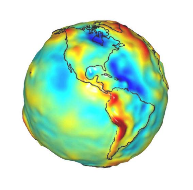
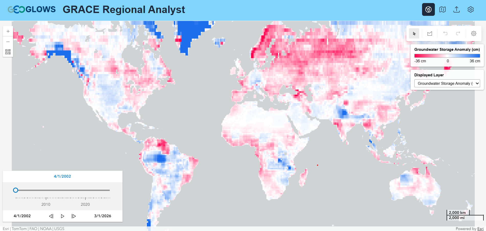

## Overview

The NASA Gravity Recovery And Climate Experiment (GRACE) mission provides data that can be used to analyze long-term groundwater storage change for
selected regions. The data can identify and characterize conditions in data-poor areas or identify trends in other regions where trends can be
obscured by noise from well data.

GRACE provides monthly estimates of water storage anomalies in equivalent water height and has provided monthly gravity field solutions since April
2002. Estimates of mass variability and associated observational errors are available on a global 300 km grid.

{ width="388" }

## GRACE-Derived Storage Anomalies

GRACE measures the total water stored in a column of the Earth — snow, surface water, soil moisture, canopy water, and groundwater combined. A mass
balance approach is used to separate the groundwater component from that total and report it for an area of interest.

By integrating data from both the GRACE and GRACE-FO missions, and using NASA GLDAS surface water data, groundwater storage changes can be observed.
The global nature of this data allows users to define regions representing countries, basins, or aquifers, aggregate the water volume changes in
those regions, and get results as time series plots for the whole region or at selected points.

The algorithm used to process the GRACE and GLDAS data to produce groundwater anomalies on both a global and regional scale is described in detail on
the [Computational Algorithm](computational-algorithm.md) page.

## The Web Application

GRACE Regional Analyst is a web application that delivers GRACE-derived storage anomalies. While several tools have been developed for processing and
visualizing GRACE data, it is designed specifically to support groundwater resource management by regional stakeholders and decision-makers. This is
accomplished by carefully processing the raw GRACE data to remove anomalies and improve resolution: separating the groundwater component from the
other water storage components using GLDAS, subsetting the data to specific regions of interest, and presenting the results in a simple, intuitive
interface.

It allows users to upload JSON files or draw a region on the map for their areas of interest. It also displays an animated map of the storage change
anomalies.

The application is available at
[apps.geoglows.org/grace-anomalies](https://apps.geoglows.org/grace-anomalies){:target="_blank"}. See
[Using the Web App](../accessing-data/web-app.md).

## Further Reading

GRACE has proved an effective tool for characterizing groundwater storage changes in large regions:

- [J. Famiglietti et al., 2011](https://agupubs.onlinelibrary.wiley.com/doi/full/10.1029/2010GL046442){:target="_blank"}
- [J. S. Famiglietti, 2014](https://www.nature.com/articles/nclimate2425){:target="_blank"}
- [Rodell, Velicogna, & Famiglietti, 2009](https://www.nature.com/articles/nature08238){:target="_blank"}
- [Thomas, Reager, Famiglietti, & Rodell, 2014](https://agupubs.onlinelibrary.wiley.com/doi/full/10.1002/2014GL059323){:target="_blank"}

<!-- TODO: decide whether these citations belong here or on the top-level Publications page. -->
