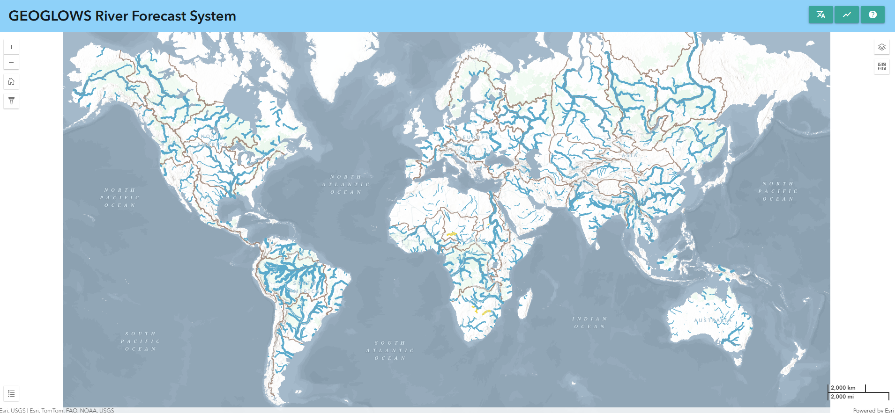

# What is GEOGLOWS? 

## Overview
The GEOGLOWS (Global Earth Observations Global Water Sustainability) 
initiative is a collaborative effort aimed at improving global 
water sustainability through advanced hydrological forecasting 
and data analysis. Leveraging the power of Earth observations, 
numerical weather predictions, and supercomputing, GEOGLOWS 
provides actionable information on streamflow status and 
outlook for every river worldwide. By making decades of 
historical climatological flow data and future forecasts 
easily accessible, GEOGLOWS supports informed decision-making
in water resource management, disaster risk reduction, and 
climate adaptation. This global service enables countries 
and organizations to enhance their understanding of 
water-related challenges and implement effective solutions, 
ultimately contributing to a more sustainable and 
resilient future.

The presentation linked below provides deeper insights 
into the scope and impact of GEOGLOWS.

[GEOGLOWS V2 Overview](https://drive.google.com/file/d/1h9skkuJQ-LR301nXSHjYRNHnso07gtac/view?usp=sharing)

## History
The GEOGLOWS initiative, established under the framework
of the Group on Earth Observations (GEO), has its roots 
in a commitment to integrate Earth observation data to 
enhance global water sustainability. The journey began 
in 2014 at the GEO Plenary in Geneva, where the need for 
coordinated water data management became evident. With 
support from partners such as NASA, ECMWF, and regional 
organizations, GEOGLOWS evolved from early efforts in the 
Dominican Republic to a broader application of global 
hydrological modeling. By leveraging advanced technologies, 
including the ECMWF’s global weather forecasts and cutting-edge
cloud computing, GEOGLOWS pioneered global streamflow 
forecasting services. These services provide critical 
information to support decision-making in water management,
helping to mitigate the impacts of floods, droughts, and
other water-related challenges. Over time, the initiative
has expanded its reach, integrating local and regional 
hydrological insights, and fostering collaborations 
across continents to address the complex issues of 
water scarcity and disaster preparedness.

The presentation below offers a deeper insight into 
the history and impact of GEOGLOWS.

[GEOGLOWS History](https://drive.google.com/file/d/1dICEwFCFEIWnYgVAUNlrqsUMj487yp4o/view?usp=sharing)

## Model Formulation
The GEOGLOWS model leverages the Hydrology Tiled ECMWF Scheme for Surface Exchanges over Land (HTESSEL) alongside the ECMWF Integrated Forecast System (IFS) to conduct detailed calculations of water and energy balances within grid cells. HTESSEL simulates how land surfaces respond to atmospheric conditions, estimating critical variables such as surface and sub-surface runoff for both operational ensemble forecasts and retrospective simulations. The model employs varying spatial resolutions for its runoff files, including approximately 25 km for historical ERA-5 data, 16 km for low-resolution ensemble members, and 8 km for high-resolution forecasts. By intersecting grid lines with specific basins and applying runoff depth values, the model calculates water volumes over different time periods, which are then routed through the stream network using the Muskingum method with the RAPID algorithm. This approach provides valuable discharge data for hydrological analysis and decision-making.

The presentation below offers a deeper insight into the model formulation of the GEOGLOWS Model.

[Model Formulation](https://drive.google.com/file/d/1thabA0RBfSVYAIcKkgMOBFSZwhtmxvv2/view?usp=sharing)

## Understanding GEOGLOWS Data
[Understanding GEOGLOWS Data Presentation](https://drive.google.com/file/d/1-4MQ1ge4J9I5iQGHYlY3f0VR724S_eXp/view?usp=sharing)

### Hydrofabric
  * The GEOGLOWS ECMWF Streamflow Service leverages a Hydrologic 
  Modeling as a Service (HMaaS) approach, centralizing 
  cyberinfrastructure, expertise, and state-of-the-art 
  forecasting capabilities to provide reliable streamflow 
  data. Instead of requiring local agencies to manage and 
  compute vast amounts of data independently, GEOGLOWS 
  streamlines the process by using ensemble meteorological 
  forecasts from ECMWF, processed through the HTESSEL 
  land surface model. This generates global runoff data, 
  which is mapped to GEOGLOWS watersheds and routed through 
  river networks using the RAPID model to produce 15-day 
  forecasts. Additionally, the ERA-5 retrospective 
  historical data spanning over 80 years is used to 
  derive return periods, placing current forecasts 
  in a meaningful historical context. These streamflow 
  forecasts are accessible via web mapping services and APIs, 
  facilitating the development of customized applications 
  tailored to address local water management challenges 
  such as flooding, drought, and water security.

### Map
  * The GEOGLOWS ECMWF Streamflow Model can be easily explored 
  using a mapping service developed in collaboration with 
  Esri (see: [https://hydroviewer.geoglows.org/](https://hydroviewer.geoglows.org/)). 
  The web map 
  allows users to visualize current streamflow conditions worldwide,
  with line thickness indicating discharge magnitude and 
  line color showing if and when a river's discharge exceeds
  the threshold for a specific return period. The app also 
  lets you select a specific stream to view both the forecast 
  and historical simulation data for that river.

### Retrospective Data
  * The retrospective (or historical) simulation is a deterministic
  model with a daily resolution, covering the period from 1940 to the 
  present (over 80 years). This simulation helps calculate return 
  periods for maximum discharge values using the Gumbel Distribution, 
  providing essential context for interpreting hydrological forecasts.

    
### Forecasts
  * The forecast simulation has a 15-day horizon and includes 
  52 ensemble members: 51 low-resolution members and 1 high-resolution
  member with a 10-day horizon. The time resolution is 3-hour 
  intervals for low-resolution ensembles and 1-hour intervals for 
  the high-resolution member. The preferred forecast plot features
  the median, 20th percentile, and 80th percentile (Uncertainty Bounds),
  representing 60% of the probability distribution within the 
  ensemble members.

## Stories of Application

GEOGLOWS has been instrumental in transforming water management 
and disaster response across the globe. From helping predict 
floods and droughts in Nepal, to improving transboundary flow 
forecasts in Bangladesh, GEOGLOWS empowers local agencies with 
the tools to make life-saving decisions. In the Dominican Republic, 
GEOGLOWS enhances capacity for hydrological challenges, including 
flood risk and irrigation management. The service has extended 
early warning lead times in Malawi and has been crucial in 
managing reservoir releases during hurricanes in Honduras. 
These real-world applications demonstrate the global impact 
of GEOGLOWS in addressing critical water-related challenges. 
For more in-depth stories of how GEOGLOWS is making a difference 
worldwide, visit [GEOGLOWS Stories](https://stories.geoglows.org/home).

[Stories Presentation](https://drive.google.com/file/d/1-CbslVlrtOyobNkR18uusWVdjqp0OsuW/view?usp=sharing) 

## Joining GEOGLOWS
Are you interested in being part of the global GEOGLOWS community? 
By joining, you can stay updated with the latest developments, collaborate 
with experts, and access valuable resources related to hydrological forecasting 
and water sustainability.

To join the GEOGLOWS network, simply sign up for our Google Group:
[Join the group!](https://groups.google.com/g/geoglows)

By becoming a member, you will be part of a growing community 
focused on advancing global water sustainability and streamflow forecasting.

