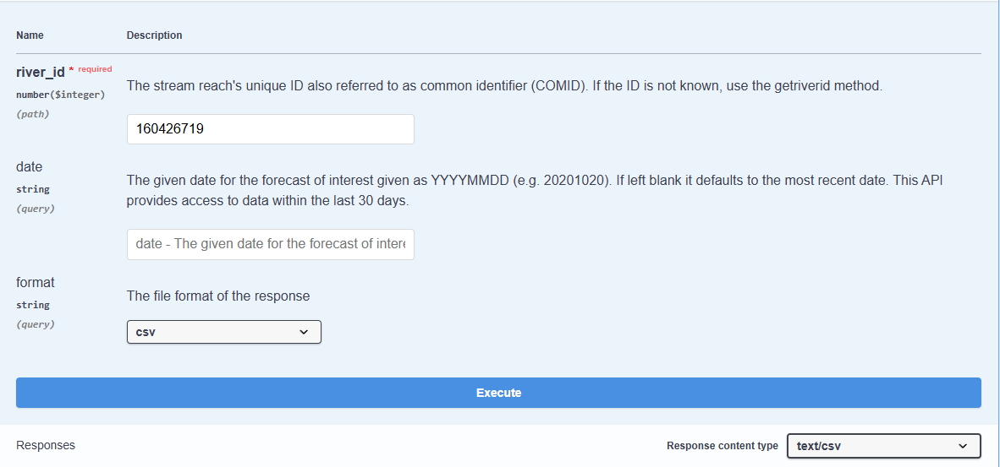
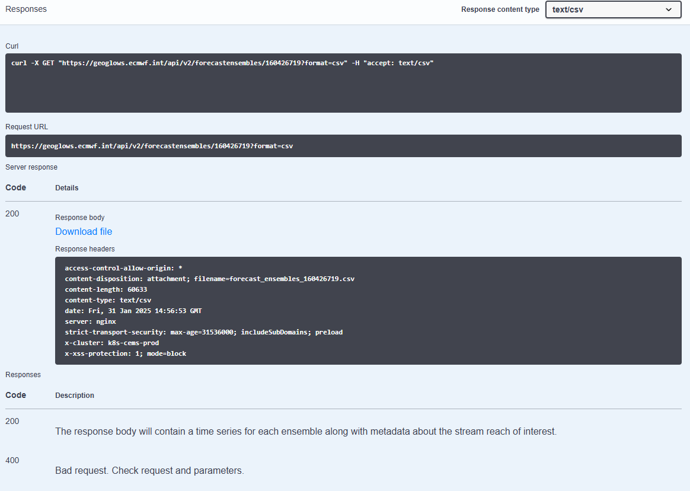

!!! danger "La API no es necesaria para la mayoría de los usuarios"
    La mayoría de los usuarios no necesita este tutorial. Todos los productos de pronóstico y simulación retrospectiva están disponibles para consultas, descargas masivas y a través del servicio de datos. Sin embargo, las instrucciones para consultar datos son las más rápidas, convenientes (y económicas para GEOGLOWS) para la mayoría de los usos. 
    Por favor, siga el tutorial sobre [consulta de datos fluviales](query-data.en.md) antes de continuar con esta sección.

Hay acceso programático a los datos de caudal de RFS a través de una **API REST**, permitiendo a los usuarios integrar fácilmente los datos hidrológicos globales en sus aplicaciones. Con esta API, los desarrolladores e investigadores pueden recuperar datos históricos y pronosticados de flujo de agua en formato **CSV** o **JSON**, lo que permite realizar análisis y visualizaciones personalizadas. La API proporciona acceso a todos los datos retrospectivos y pronosticados. Para más información, visite la [Documentación de la API RFS](https://geoglows.ecmwf.int/documentation).

---

## Uso de la API

Para utilizar la API, la mayoría de las funciones requieren que conozcas tu número de identificación del río. Puedes encontrar más información sobre cómo encontrar tu número de río aquí: [Tutorial para encontrar números de río](find-river-numbers.es.md). Puedes descargar los datos GIS por VPU a través del catálogo de datos o seleccionar un arroyo en la aplicación web y obtener un número de río de esa manera.

### Uso del sitio web de la API

Para utilizar el sitio web de la API, sigue estos pasos:

**Paso 1:** Haz clic en el botón azul **“Get”** junto al comando que te interesa. Esto abrirá una ventana donde podrás ingresar tus parámetros.

**Paso 2:** Antes de ingresar cualquier número, haz clic en **“Try it out”** para habilitar los campos de entrada. Esto te permitirá ingresar números y seleccionar los formatos de respuesta.

**Paso 3:** Ingresa la información requerida:

- Un **número de identificación de río de 9 dígitos (RiverID)** (también conocido como COMID o número de enlace (LINKNO)) en el campo `river_id`. Esto es obligatorio.
- Elige entre `csv` o `json` del menú desplegable bajo `format`. La selección predeterminada es `csv`.
- Para **consultas de datos de pronóstico**, ingresa una fecha en formato `YYYYMMDD`. Si se deja en blanco, se devolverá el pronóstico más reciente.

**Paso 4:** Haz clic en el botón azul **“Execute”** en la parte inferior de la pantalla. El sistema procesará tu solicitud y cargará durante unos segundos. Una vez finalizado, recibirás un código de respuesta junto con una opción para descargar el archivo.

### Acceso a la API usando Python

Una de las formas más fáciles de acceder a la API es a través de Python. Hay un **paquete Python GEOGLOWS** (documentado aquí: [Documentación de la API RFS](https://geoglows.readthedocs.io/en/latest/api-documentation.html)) que contiene comandos para análisis básicos y consultas de tipos específicos de datos.

Este cuaderno de Python proporciona ejemplos de cómo usar la API en Python, así como utilizar el paquete de Python: [Programmatic_Access Colab.ipynb](https://colab.research.google.com/drive/19PiUTU2noCvNGr6r-1i9cv0YMduTxATs?usp=sharing)

La API puede ser utilizada en aplicaciones que requieren datos de flujo de agua y puede integrarse directamente en los flujos de trabajo de Python.
