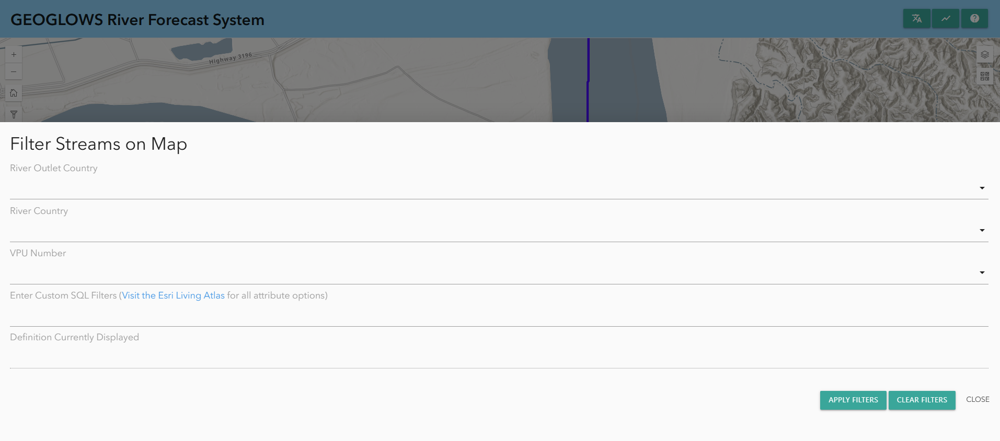
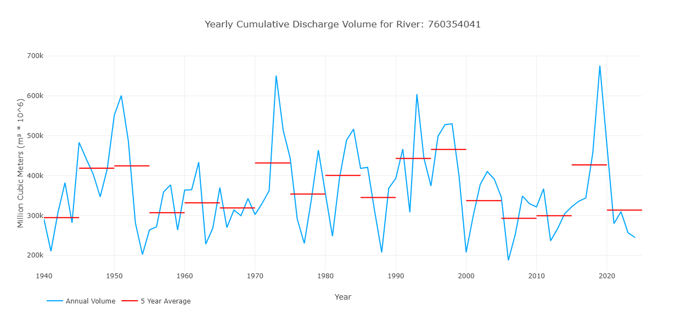
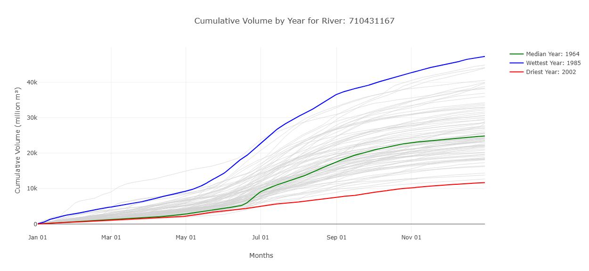
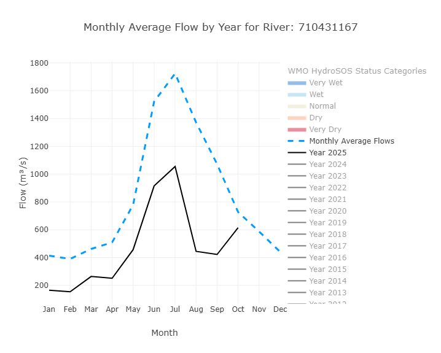
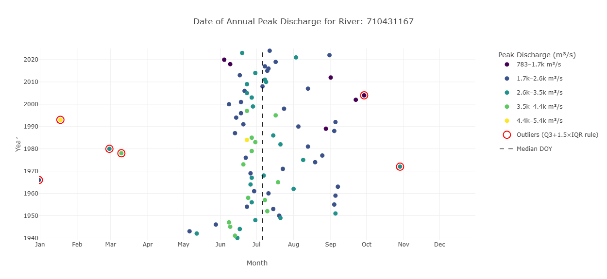
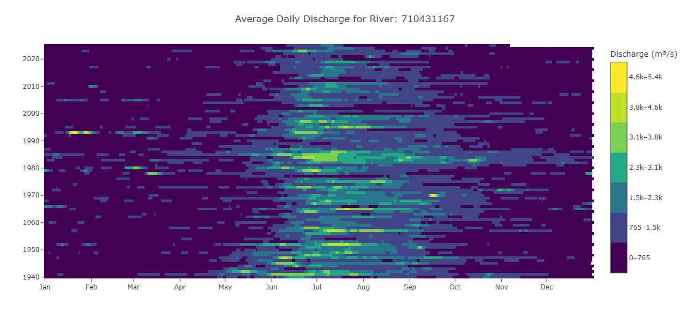
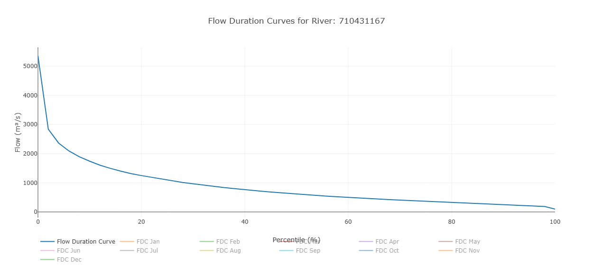
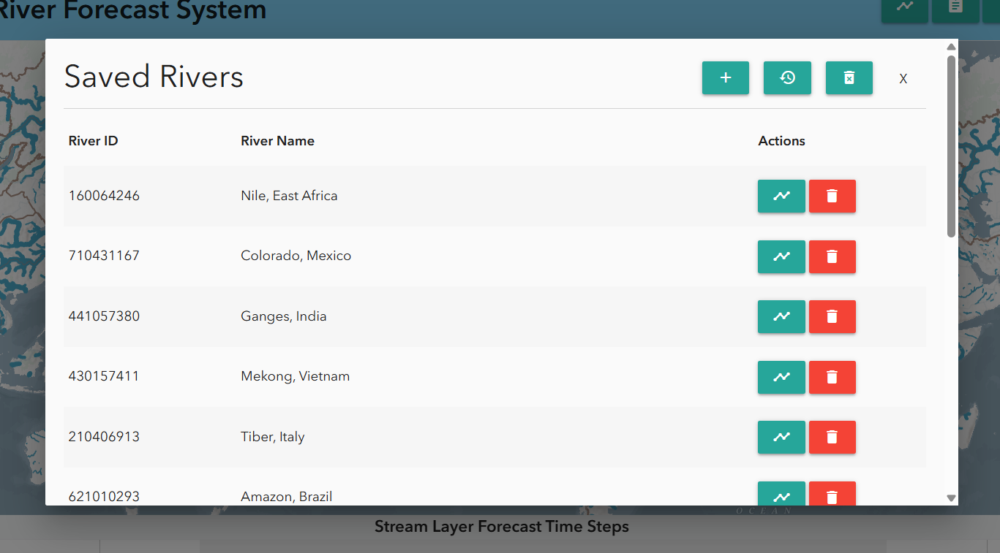

# Using the RFS Hydroviewer

## Overview
The [RFS Hydroviewer](https://hydroviewer.geoglows.org/) is a web-based tool for visualizing and accessing streamflow forecasts and historical data globally. It allows users to:

- Explore real-time streamflow conditions  
- Analyze forecast trends  
- Review hydrological simulations for any river  

The Hydroviewer supports informed decision-making in water resource management, disaster risk reduction, and climate resilience planning. Users can assess discharge values and identify potential flood or drought risks.

The Hydroviewer serves two main purposes:

- Visualization of streamflow data  
- Data plotting and retrieval  

The interface is available in English and Spanish. If the viewer is left in English, automated translation tools can be used, but translations are not guaranteed.

For more information, view the [webinar](../../webinars/rfs-v2-webinar-4.md)
 on the Hydroviewer.

## Map

The first major function of the app is to show maps that help users explore and understand the latest RFS forecast results. This is a multi-scale map, with the amount of visible streams changing as you zoom in or out. There are two breakpoints for a total of three views. Streams are based on TDX-Hydro datasets used in RFS, rounded to the nearest meter of accuracy, providing an almost perfect resolution copy of the original data.

### Stream Styling

This allows users to quickly identify rivers experiencing high flows.

- Color: Represents the estimated return period exceeded at a given time step. This helps identify rivers experiencing high flows quickly.

- Thickness: Indicates the amount of water predicted in the river. Use thickness as a guide for relative size, but check graphs for precise values.

Clicking on any river displays its river ID and opens a pop-up window with detailed graphs.

### Additional Layers

There are several additional layers that provide additional information. Some of these include:

1. Environmental Base Map: This is a pretty new Esri product which brings together several impressive basemaps and technologies. The RFS layer and styling were one of the many things considered in the design of the Environment map so it should have a useful view at many levels. There are brown lines tracing hydrobasins boundaries for useful reference in figuring out which major watershed you’re looking at when zoomed out. There are also some river names shown on the basemap.

2. WMO HydroSOS layers: Many RFS users participate in WMO activities such as HydroSOS. The HydroSOS program is evolving so this is not a finalized product. However, you can enable the layer and use the time slider to find a month that you want to view in the last 35 years. There is a dark red, light red, neutral yellow, light blue and dark blue which indicate if the basin was dry, normal, or wet relative to the normal amount over the period of 1990-2019.

### Filtering Data

Data can also be filtered by clicking on the filter button on the left-hand side. There, you will find options to filter based on:

- River country  
- VPU number  
- River outlet country  

This will only show rivers that meet these criteria on the map.

# Graphs and Charts

In addition to the map, the Hydroviewer also has information about specific rivers. This fulfills the second purpose of the Hydroviewer as a data retrieval tool. By selecting rivers, users can download .csv files with data on the river as well as view graphs with information about the river.

## Accessing Graphs

Rivers can be selected:

- By clicking on a river on the map  
- By entering a river ID directly  

To enter a River ID:

1. Open the chart pop-up window by selecting the chart icon in the upper right corner or from a previously selected river.  
2. Click “Enter River ID” at the top of the pop-up window.  
3. Type the river ID (e.g., Magdalena River in Colombia: 610363879) and click “OK.”  

The pop-up window will display forecast and retrospective graphs. Data can be downloaded via the camera icon in the upper-right corner of each plot.

## Forecast Graphs

By default, when you click on a stream, the 15-day forecast from the current day will be displayed. However, if you would like, you can see a forecast from a previous day by choosing a date from the top. 

An example of a forecast graph is shown here. By default, the return periods are off, but by clicking on them, they can be shown on the plot. More information on interpreting this plot is found in the [Forecast Data](../datasets/forecast.md) section of this training.

There is also a table that shows the percentage of ensemble members that exceed each return period each given day. This helps shows the probability of a certain return period being exceeded.

## Retrospective Graphs

You can view the retrospective data by switching to the retrospective view at the top of the pop-up window. The highlighted blue icon shows whether you are viewing the forecast or the retrospective data. By default, you will view 10 years of retrospective data, but this can be adjusted using the grey sliders at the bottom. The entire retrospective dataset, dating back to 1940, can be accessed this way.

This is the main retrospective plot, but other graphs exist that are derived from this retrospective data. They are designed to help interpret and analyze the data. They represent interpretations of the retrospective data, but are not all inclusive. Not all plots will be helpful in all use cases. The plots available are evolving based on current research.

### Yearly Cumulative Discharge

This graph shows one value for each year in the retrospective simulation, representing the total discharge volume over that year for that stream. This is represented by the blue line on the graph. The red lines show 5 year averages of the volume to represent how the volume in the stream may be changing over time.

### Cumulative Volume by Year

This graph shows the cumulative volume in millions of cubic meters throughout the year. The wettest and driest years are label to show an idea of the range of values that have been seen in the past. By hovering over a line on the hydroviewer it will tell you the specific year for each line. This graph also shows when the volume of water is most rapidly increasing, representing more streamflow.

### Monthly Average Flow with HydroSOS Categories

This graph has features that can be toggled on and off to highlight different things.
The default view shows the monthly average flows from the entire period of record (the dotted blue line) and the year to date monthly averages (the black line). Additional years can be turned on and off to see how those monthly averages compare.
Additionally, the HydroSOS levels can be toggled on and off to show the range of streamflow conditions—very dry, dry, normal, wet, and very wet—throughout the year. It is based on methods developed by the WMO for their HydroSOS initiative. The category ranges are calculated using historical monthly averages. Each month's values are ranked separately and assigned a percentile. These percentiles are then used to define the thresholds for each category.
This graph helps users understand how river flow values in a given year compare to what is considered normal, and whether conditions were wetter or drier than usual for each month.

### Annual Peak Discharge

This graph is designed to show information about the peak discharge of a river. The location tells about the time the discharge occurred and the color tells about the amount of water. The y-axis represents the different years. A dots location along the x-axis shows when in the year the peak discharge occurred. The colors represent the values of the peak discharge when it occurred. Outliers are highlighted in red.

### Raster Hydrograph

A raster hydrograph is a grid-based visualization showing the temporal variation of streamflow for a single river. The x-axis represents months, the y-axis represents years, and the color of each cell indicates the streamflow magnitude. The point is that you can see all 85 years at once. Looking across a row shows the flow for one year, while looking up or down a column shows the same date across all years, for example every March 15th. This makes it easy to identify seasonal patterns, quickly see wet and dry periods, and spot outliers or years where the wet season was longer or shorter than normal.

### Flow Duration Curve

This graph displays streamflow on the y-axis and exceedance probability on the x-axis. Each point represents a monthly flow value, showing how often that level of flow is exceeded. In addition to the individual monthly values, the graph includes an overall flow duration curve based on the entire dataset. This allows users to compare monthly flow patterns with the long-term distribution of flows. By default only the overall curve is shown and the individual months must be toggled on to see them.

## Saving Rivers

Users can save rivers for repeated access via the bookmark tab at the top of the Hydroviewer. Clicking the tab opens a pop-up window. By default, several major rivers are already listed. To add a river:

1. Click the plus sign
2. Enter the river ID and name.
Saved rivers can be accessed quickly by clicking the chart icon next to the river.

