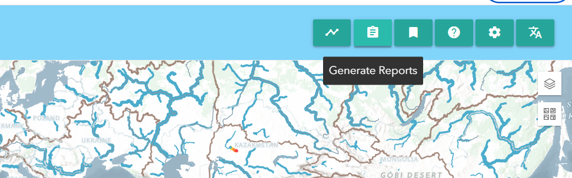
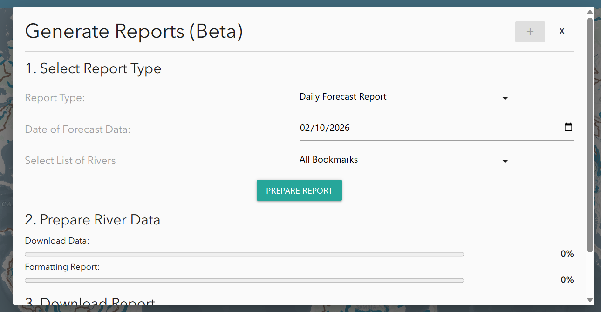

# Utilisation du RFS Hydroviewer

## Aperçu
Le [RFS Hydroviewer](https://hydroviewer.geoglows.org/) est un outil web pour visualiser et accéder aux prévisions de débit et aux données historiques des rivières dans le monde entier. Il permet aux utilisateurs de :

- Explorer les conditions de débit en temps réel  
- Analyser les tendances des prévisions  
- Consulter les simulations hydrologiques pour n'importe quelle rivière  

Le Hydroviewer soutient la prise de décisions éclairées en gestion des ressources en eau, réduction des risques de catastrophe et planification de la résilience climatique. Les utilisateurs peuvent évaluer les valeurs de débit et identifier les risques potentiels d'inondation ou de sécheresse.

Le Hydroviewer a deux objectifs principaux :

- Visualisation des données de débit  
- Traçage et récupération des données  

L'interface est disponible en anglais et en espagnol. Si le visualiseur reste en anglais, des outils de traduction automatique peuvent être utilisés, mais les traductions ne sont pas garanties.

Pour plus d'informations, consultez le [webinaire](../../webinars/rfs-v2-webinar-4.md)
 sur le Hydroviewer.

## Carte

La première fonction majeure de l'application est de montrer des cartes qui aident les utilisateurs à explorer et comprendre les derniers résultats de prévision RFS. Il s'agit d'une carte multi-échelle, avec la quantité de cours d'eau visibles changeant selon le niveau de zoom. Il y a deux points de rupture pour un total de trois vues. Les rivières sont basées sur les ensembles de données TDX-Hydro utilisés dans RFS, arrondis au mètre le plus proche, offrant une copie de résolution quasi parfaite des données originales.

### Style des cours d'eau

Cela permet aux utilisateurs d'identifier rapidement les rivières connaissant des débits élevés.

- Couleur : Représente la période de retour estimée dépassée à un moment donné. Cela aide à identifier rapidement les rivières avec des débits élevés.

- Épaisseur : Indique la quantité d'eau prévue dans la rivière. Utilisez l'épaisseur comme guide pour la taille relative, mais consultez les graphiques pour des valeurs précises.

Cliquer sur une rivière affiche son ID de rivière et ouvre une fenêtre contextuelle avec des graphiques détaillés.

### Couches supplémentaires

Il existe plusieurs couches supplémentaires fournissant des informations complémentaires. Parmi elles :

1. Carte de base environnementale : Il s'agit d'un produit relativement nouveau d'Esri qui combine plusieurs cartes de base et technologies impressionnantes. La couche et le style RFS ont été pris en compte dans la conception de la carte environnementale afin de fournir une vue utile à différents niveaux. Des lignes brunes tracent les limites des hydrobassins pour aider à identifier quel bassin principal vous regardez lorsque vous êtes dézoomé. Certains noms de rivières sont également affichés sur la carte de base.

2. Couches WMO HydroSOS : De nombreux utilisateurs de RFS participent aux activités de la WMO telles que HydroSOS. Le programme HydroSOS évolue, ce n’est donc pas un produit finalisé. Cependant, vous pouvez activer la couche et utiliser le curseur temporel pour trouver un mois à visualiser au cours des 35 dernières années. Les couleurs rouge foncé, rouge clair, jaune neutre, bleu clair et bleu foncé indiquent si le bassin était sec, normal ou humide par rapport à la normale sur la période 1990-2019.

### Filtrage des données

Les données peuvent également être filtrées en cliquant sur le bouton de filtre sur le côté gauche. Vous trouverez des options pour filtrer selon :

- Pays de la rivière  
- Numéro de VPU  
- Pays de l'embouchure de la rivière  

Cela affichera uniquement les rivières répondant à ces critères sur la carte.

# Graphiques et diagrammes

En plus de la carte, le Hydroviewer fournit également des informations sur des rivières spécifiques. Cela remplit le second objectif du Hydroviewer en tant qu'outil de récupération de données. En sélectionnant des rivières, les utilisateurs peuvent télécharger des fichiers .csv avec des données sur la rivière ainsi que visualiser des graphiques avec des informations sur la rivière.

## Accéder aux graphiques

Les rivières peuvent être sélectionnées :

- En cliquant sur une rivière sur la carte  
- En saisissant directement un ID de rivière  

Pour entrer un ID de rivière :

1. Ouvrez la fenêtre contextuelle des graphiques en sélectionnant l'icône graphique dans le coin supérieur droit ou depuis une rivière précédemment sélectionnée.  
2. Cliquez sur “Enter River ID” en haut de la fenêtre contextuelle.  
3. Tapez l’ID de la rivière (ex : rivière Magdalena en Colombie : 610363879) et cliquez sur “OK”.  

La fenêtre contextuelle affichera les graphiques de prévision et rétrospectifs. Les données peuvent être téléchargées via l'icône appareil photo dans le coin supérieur droit de chaque graphique.

## Graphiques de prévision

Par défaut, en cliquant sur un cours d'eau, la prévision sur 15 jours à partir du jour courant s'affiche. Cependant, vous pouvez également visualiser une prévision d’un jour précédent en choisissant une date en haut.

Un exemple de graphique de prévision est présenté ici. Par défaut, les périodes de retour sont désactivées, mais en cliquant dessus, elles peuvent s’afficher sur le graphique. Plus d’informations sur l’interprétation de ce graphique se trouvent dans la section [Données de prévision](../datasets/forecast.md) de cette formation.

Un tableau montre également le pourcentage de membres de l’ensemble dépassant chaque période de retour chaque jour. Cela aide à montrer la probabilité qu’une certaine période de retour soit dépassée.

## Graphiques rétrospectifs

Vous pouvez consulter les données rétrospectives en passant à la vue rétrospective en haut de la fenêtre contextuelle. L’icône bleue surlignée indique si vous visualisez les données de prévision ou rétrospectives. Par défaut, vous visualisez 10 ans de données rétrospectives, mais cela peut être ajusté à l’aide des curseurs gris en bas. L’ensemble des données rétrospectives, datant de 1940, peut être consulté de cette manière.

Il s'agit du graphique rétrospectif principal, mais d'autres graphiques dérivés existent. Ils aident à interpréter et analyser les données, représentant des interprétations mais non exhaustives. Tous les graphiques ne seront pas utiles pour chaque cas d’utilisation. Les graphiques disponibles évoluent en fonction des recherches actuelles.

### Débit cumulatif annuel

Ce graphique montre une valeur par année dans la simulation rétrospective, représentant le volume total de débit sur cette année pour ce cours d'eau. Cela est représenté par la ligne bleue. Les lignes rouges montrent la moyenne sur 5 ans pour représenter comment le volume de la rivière peut évoluer au fil du temps.

### Volume cumulatif par année

Ce graphique montre le volume cumulatif en millions de mètres cubes tout au long de l'année. Les années les plus humides et les plus sèches sont étiquetées pour donner une idée de l’éventail des valeurs observées. En survolant une ligne sur le Hydroviewer, l'année spécifique de chaque ligne s'affiche. Ce graphique montre également quand le volume d’eau augmente le plus rapidement, représentant un débit plus élevé.

### Débit moyen mensuel avec catégories HydroSOS

Ce graphique comporte des fonctionnalités activables pour mettre en évidence différents éléments.  
La vue par défaut montre les débits moyens mensuels pour toute la période (ligne bleue pointillée) et les moyennes mensuelles cumulées de l’année en cours (ligne noire). Des années supplémentaires peuvent être activées ou désactivées pour comparer les moyennes mensuelles.  
De plus, les niveaux HydroSOS peuvent être activés ou désactivés pour montrer l’éventail des conditions de débit—très sec, sec, normal, humide et très humide—tout au long de l’année. Cela repose sur les méthodes développées par la WMO pour leur initiative HydroSOS. Les plages de catégories sont calculées à partir des moyennes mensuelles historiques. Les valeurs de chaque mois sont classées et assignées à un percentile. Ces percentiles définissent les seuils de chaque catégorie.  
Ce graphique aide les utilisateurs à comprendre comment les valeurs de débit d’une rivière pour une année donnée se comparent à la normale, et si les conditions étaient plus humides ou plus sèches que la normale pour chaque mois.

### Débit de pointe annuel

Ce graphique montre les informations sur le débit de pointe d’une rivière. La position indique le moment où le débit s’est produit et la couleur indique la quantité d’eau. L’axe des y représente les différentes années. La position des points le long de l’axe des x montre quand le débit de pointe s’est produit dans l’année. Les couleurs représentent les valeurs du débit de pointe. Les valeurs aberrantes sont mises en évidence en rouge.

### Hydrogramme raster

Un hydrogramme raster est une visualisation en grille montrant la variation temporelle du débit pour une rivière. L’axe des x représente les mois, l’axe des y les années, et la couleur de chaque cellule indique le débit. Cela permet de voir les 85 années en un coup d’œil. Une ligne horizontale montre le débit pour une année, tandis qu’une colonne verticale montre la même date pour toutes les années, par exemple chaque 15 mars. Cela facilite l’identification des motifs saisonniers, la visualisation rapide des périodes humides et sèches et la détection des valeurs aberrantes ou des années avec des saisons pluvieuses plus longues ou plus courtes que la normale.

### Courbe de durée des débits

Ce graphique affiche le débit sur l’axe des y et la probabilité de dépassement sur l’axe des x. Chaque point représente un débit mensuel, montrant la fréquence à laquelle ce niveau est dépassé. En plus des valeurs mensuelles individuelles, le graphique inclut une courbe globale de durée des débits basée sur l’ensemble des données. Cela permet aux utilisateurs de comparer les débits mensuels à la distribution à long terme. Par défaut, seule la courbe globale est affichée et les mois individuels doivent être activés pour les visualiser.

## Sauvegarde des rivières

Les utilisateurs peuvent sauvegarder des rivières pour un accès répété via l’onglet signets en haut du Hydroviewer. Cliquer sur l’onglet ouvre une fenêtre contextuelle. Par défaut, plusieurs grandes rivières sont déjà listées. Pour ajouter une rivière :

1. Cliquez sur le signe plus  
2. Entrez l’ID et le nom de la rivière.  

Les rivières sauvegardées peuvent être consultées rapidement en cliquant sur l’icône graphique à côté de la rivière.

## Génération de rapport (EXPÉRIMENTAL)

Les utilisateurs peuvent générer des rapports à partir de leurs rivières enregistrées. Il s’agit d’une fonctionnalité expérimentale qui est encore en cours de mise à jour et d’ajustement. En générant un rapport, un utilisateur peut télécharger un fichier PDF contenant des informations de base sur les prévisions pour chacune des rivières. Dans le coin supérieur droit, il y a un menu qui inclut une icône représentant un presse-papiers.

Cela ouvre un menu où les utilisateurs peuvent sélectionner le type de rapport et le jour de prévision pour lequel ils souhaitent générer le rapport.

Ensuite, l’utilisateur doit sélectionner « Préparer le rapport » et l’écran affichera le téléchargement des données et la mise en forme du rapport. Une fois prêt, l’utilisateur pourra sélectionner « Télécharger le ra
