# Uso del RFS Hydroviewer

## Resumen
El [RFS Hydroviewer](https://hydroviewer.geoglows.org/) es una herramienta web para visualizar y acceder a pronósticos de caudal y datos históricos a nivel mundial. Permite a los usuarios:

- Explorar las condiciones de caudal en tiempo real  
- Analizar tendencias de pronóstico  
- Revisar simulaciones hidrológicas de cualquier río  

El Hydroviewer apoya la toma de decisiones informadas en la gestión de recursos hídricos, reducción de riesgos de desastres y planificación de resiliencia climática. Los usuarios pueden evaluar los valores de descarga e identificar riesgos potenciales de inundación o sequía.

El Hydroviewer cumple dos propósitos principales:

- Visualización de datos de caudal  
- Graficación y obtención de datos  

La interfaz está disponible en inglés y español. Si el visor se deja en inglés, se pueden usar herramientas de traducción automatizada, aunque las traducciones no están garantizadas.

Para más información, vea el [webinario](../../../webinars/rfs-v2-webinar-4.md) sobre el Hydroviewer.

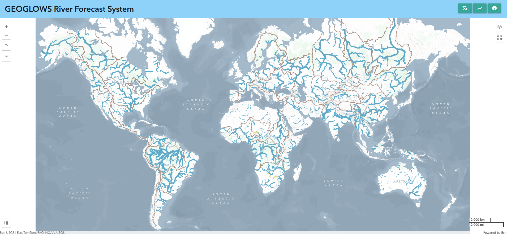

## Mapa

La primera función principal de la aplicación es mostrar mapas que ayudan a los usuarios a explorar y comprender los últimos resultados de pronóstico de RFS. Este es un mapa a múltiples escalas, donde la cantidad de ríos visibles cambia al acercar o alejar el zoom. Hay dos puntos de interrupción, para un total de tres vistas. Los ríos se basan en los conjuntos de datos TDX-Hydro usados en RFS, redondeados al metro más cercano, proporcionando una copia casi perfecta de resolución de los datos originales.

### Estilo de los ríos

Esto permite a los usuarios identificar rápidamente los ríos con caudales altos.

- **Color:** Representa el período de retorno estimado excedido en un paso de tiempo dado. Esto ayuda a identificar rápidamente los ríos con caudales altos.  

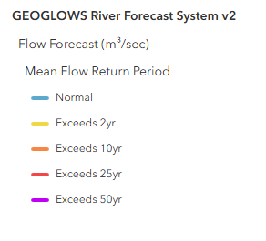

- **Grosor:** Indica la cantidad de agua prevista en el río. Use el grosor como guía del tamaño relativo, pero consulte los gráficos para valores precisos.

Al hacer clic en cualquier río se muestra su ID y se abre una ventana emergente con gráficos detallados.

### Capas adicionales

Hay varias capas adicionales que proporcionan información extra. Algunas de estas incluyen:

1. **Mapa base ambiental:** Este es un producto relativamente nuevo de Esri que combina varios mapas base y tecnologías impresionantes. La capa y el estilo de RFS fueron considerados en el diseño del mapa ambiental, por lo que debería ofrecer una vista útil a muchos niveles. Hay líneas marrones que trazan los límites de las hidrocuencas para referencia al identificar qué cuenca principal se está visualizando al hacer zoom out. También se muestran algunos nombres de ríos en el mapa base.

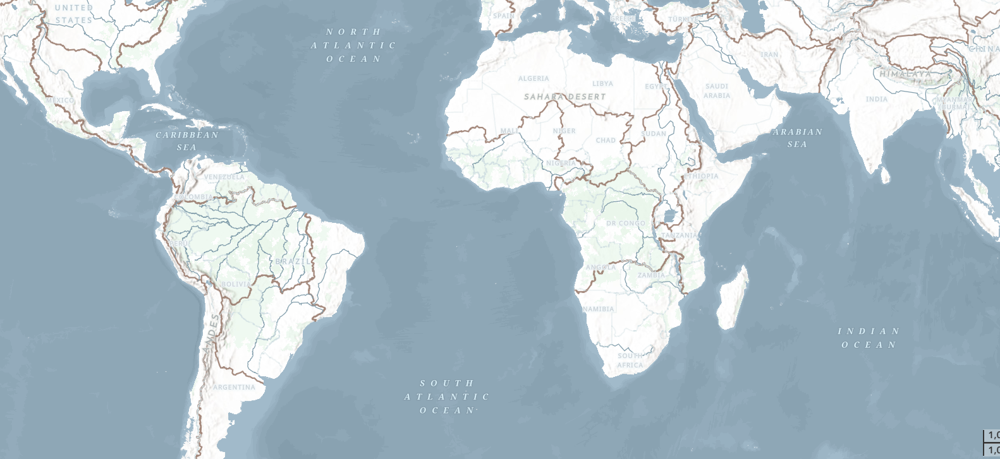

2. **Capas WMO HydroSOS:** Muchos usuarios de RFS participan en actividades de la OMM, como HydroSOS. El programa HydroSOS está en evolución, por lo que no es un producto finalizado. Sin embargo, puede activar la capa y usar el deslizador de tiempo para seleccionar un mes en los últimos 35 años. Hay colores rojo oscuro, rojo claro, amarillo neutro, azul claro y azul oscuro que indican si la cuenca estaba seca, normal o húmeda respecto a la media del período 1990-2019.

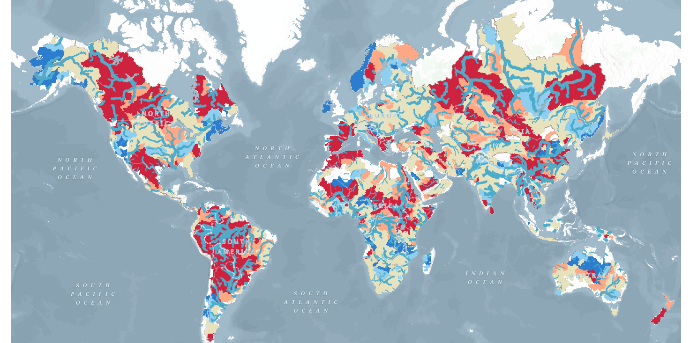

### Filtrado de datos

Los datos también se pueden filtrar haciendo clic en el botón de filtro en el lado izquierdo. Allí encontrará opciones para filtrar según:

- País del río  
- Número de VPU  
- País de salida del río  

Esto mostrará únicamente los ríos que cumplan con estos criterios en el mapa.

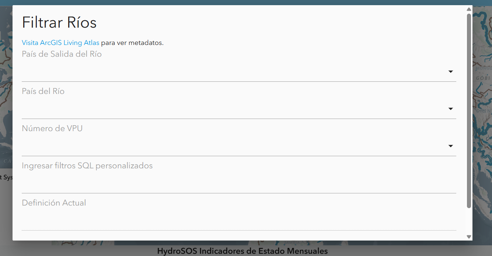

# Gráficos y Tablas

Además del mapa, el Hydroviewer también proporciona información sobre ríos específicos. Esto cumple el segundo propósito del Hydroviewer como herramienta de obtención de datos. Al seleccionar ríos, los usuarios pueden descargar archivos .csv con datos del río y ver gráficos con información del mismo.

## Acceso a gráficos

Los ríos se pueden seleccionar:

- Haciendo clic en un río en el mapa  
- Ingresando directamente un ID de río  

Para ingresar un ID de río:

1. Abra la ventana emergente de gráficos seleccionando el ícono de gráfico en la esquina superior derecha o desde un río previamente seleccionado.  
2. Haga clic en “Seleccione un río” en la parte superior de la ventana emergente.  
3. Escriba el ID del río (por ejemplo, Río Magdalena en Colombia: 610363879) y haga clic en “OK”.  

La ventana emergente mostrará gráficos de pronóstico y retrospectivos. Los datos se pueden descargar mediante el ícono de cámara en la esquina superior derecha de cada gráfico.

## Gráficos de pronóstico

Por defecto, al hacer clic en un río, se mostrará el pronóstico a 15 días desde el día actual. Sin embargo, si lo desea, puede ver un pronóstico de un día anterior seleccionando la fecha en la parte superior.

Un ejemplo de gráfico de pronóstico se muestra aquí. Por defecto, los períodos de retorno están desactivados, pero al hacer clic sobre ellos, se pueden mostrar en el gráfico. Más información sobre cómo interpretar este gráfico se encuentra en la sección [Datos de pronóstico](../../datasets/forecast.md) de este entrenamiento.

También hay una tabla que muestra el porcentaje de miembros del conjunto que exceden cada período de retorno en cada día dado. Esto muestra la probabilidad de que se exceda un determinado período de retorno.

## Gráficos retrospectivos

Puede ver los datos retrospectivos cambiando a la vista retrospectiva en la parte superior de la ventana emergente. El ícono azul resaltado indica si está viendo los datos de pronóstico o retrospectivos. Por defecto, verá 10 años de datos retrospectivos, pero esto se puede ajustar usando los deslizadores grises en la parte inferior. De esta manera se puede acceder al conjunto completo de datos retrospectivos, que se remontan a 1940.

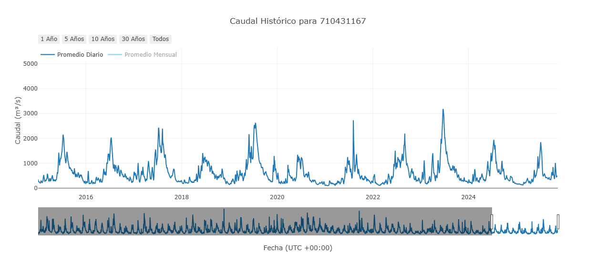

Este es el gráfico principal retrospectivo, pero existen otros gráficos derivados de estos datos. Están diseñados para ayudar a interpretar y analizar la información. Representan interpretaciones de los datos retrospectivos, pero no son exhaustivos. No todos los gráficos serán útiles en todos los casos. Los gráficos disponibles evolucionan según la investigación actual.

### Descarga acumulada anual

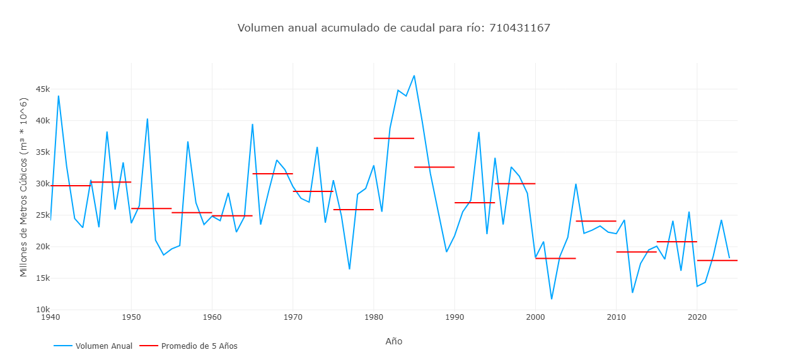

Este gráfico muestra un valor por cada año en la simulación retrospectiva, representando el volumen total de descarga de ese año para ese río. Esto se representa con la línea azul del gráfico. Las líneas rojas muestran promedios de 5 años del volumen para representar cómo puede estar cambiando el volumen del río a lo largo del tiempo.

### Volumen acumulado por año

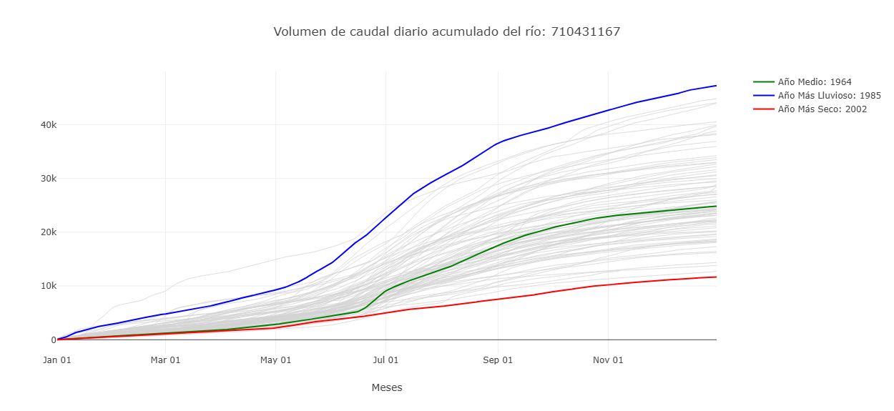

Este gráfico muestra el volumen acumulado en millones de metros cúbicos a lo largo del año. Se etiquetan los años más húmedos y secos para mostrar el rango de valores históricos. Al pasar el cursor sobre una línea en el Hydroviewer, se indica el año específico de cada línea. Este gráfico también muestra cuándo el volumen de agua está aumentando más rápidamente, representando mayor caudal.

### Flujo promedio mensual con categorías HydroSOS

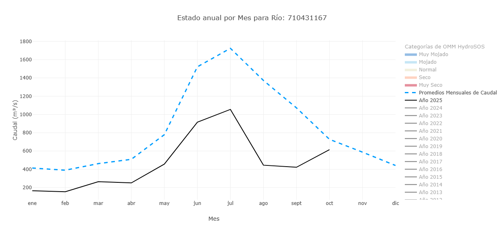

Este gráfico tiene características que se pueden activar o desactivar para resaltar diferentes aspectos. La vista predeterminada muestra los flujos promedio mensuales de todo el período de registro (línea azul punteada) y los promedios mensuales del año en curso (línea negra). Se pueden activar años adicionales para comparar sus promedios mensuales.  Además, los niveles HydroSOS se pueden activar o desactivar para mostrar el rango de condiciones de caudal: muy seco, seco, normal, húmedo y muy húmedo, a lo largo del año. Esto se basa en métodos desarrollados por la OMM para la iniciativa HydroSOS. Los rangos de categoría se calculan usando promedios históricos mensuales y cada valor mensual se clasifica en percentiles que definen los umbrales de cada categoría. Este gráfico ayuda a entender cómo los valores de caudal de un río en un año dado se comparan con lo normal y si las condiciones fueron más húmedas o secas de lo habitual.

### Pico anual de descarga

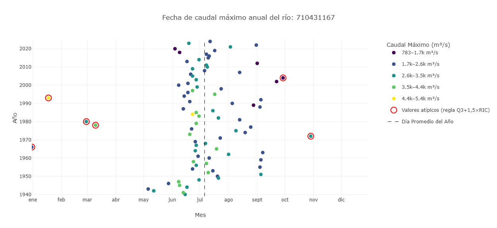

Este gráfico muestra información sobre el pico de descarga de un río. La posición indica el momento en que ocurrió la descarga y el color indica la cantidad de agua. El eje y representa los distintos años. La posición de los puntos a lo largo del eje x indica cuándo ocurrió el pico en el año. Los colores representan los valores del pico cuando ocurrió. Los valores atípicos se resaltan en rojo.

### Hidrograma raster

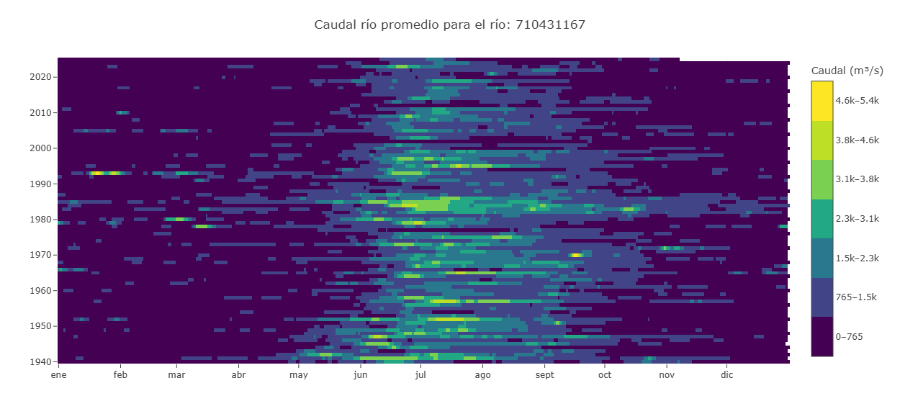

Un hidrograma raster es una visualización basada en cuadrícula que muestra la variación temporal del caudal de un río. El eje x representa los meses, el eje y los años, y el color de cada celda indica la magnitud del caudal. Esto permite ver los 85 años a la vez. Una fila muestra el caudal de un año, mientras que una columna muestra la misma fecha en todos los años, por ejemplo, cada 15 de marzo. Esto facilita identificar patrones estacionales, periodos húmedos o secos, y detectar años atípicos.

### Curva de duración de caudal

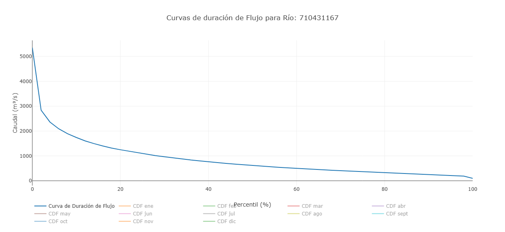

En este gráfico, el eje Y representa el caudal y el eje X muestra la probabilidad de excedencia. Cada punto representa un valor mensual, mostrando cuán a menudo se excede ese nivel. Además de los valores mensuales individuales, el gráfico incluye la curva de duración de caudal general basada en todo el conjunto de datos. Esto permite comparar patrones mensuales con la distribución histórica a largo plazo. Por defecto, solo se muestra la curva general, y los meses individuales deben activarse para visualizarlos.

## Guardar ríos

Los usuarios pueden guardar ríos para acceder rápidamente mediante la pestaña de marcadores en la parte superior del Hydroviewer. Al hacer clic en la pestaña se abre una ventana emergente. Por defecto, varios ríos importantes ya están listados. Para agregar un río:

1. Haga clic en el signo más  
2. Ingrese el ID y nombre del río  

Los ríos guardados se pueden acceder rápidamente haciendo clic en el ícono de gráfico junto al río.

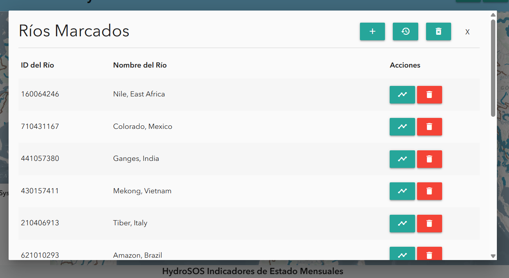