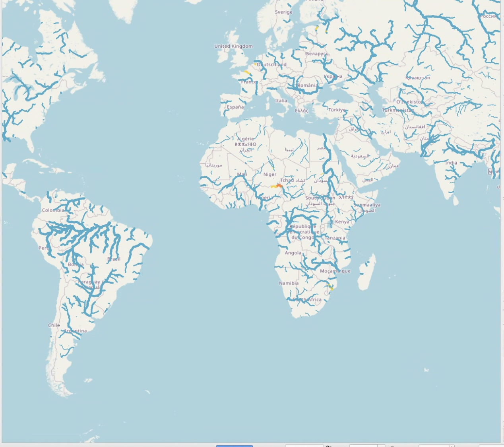

## Living Atlas Layer

RFS results are best explored using a web map available for free through the **ArcGIS Living Atlas of the World**. You do not need to have an ArcGIS 
license to use this layer. You can visualize and interact with the layer in ArcGIS, QGIS, JavaScript apps, and most ways you typically consume GIS data.

The layer is considered "time-enabled" meaning that it has attribute data describing each river segment over the first 10 of each daily forecast. Using that 
information, the streams are animated to change color and size depending on how much water is predicted to be in the river and if that value is above a 
return period level.

Some things that a user can do with this layer:

- Forecast data can be viewed sequentially over time because of the slider incorporated in the app. A user can look at the streams in 3-hour windows.
  The color of the streams will change if the stream experiences high flow during this time.
- Features can be identified by clicking on the map. Preconfigured pop-ups show community sourced river names from OpenStreetMap.

More information about the web map layer can be found at [https://www.arcgis.com/home/item.html?id=8f0573e0c0b9491dbeafde9c72ccf02b](https://www.arcgis.com/home/item.html?id=8f0573e0c0b9491dbeafde9c72ccf02b)
