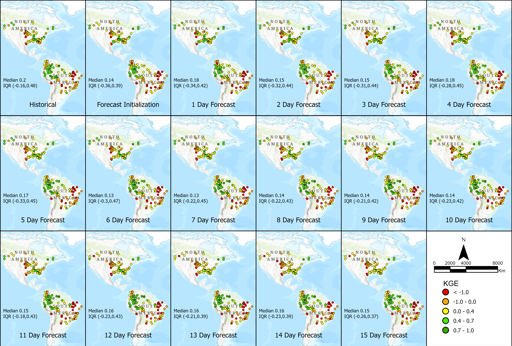
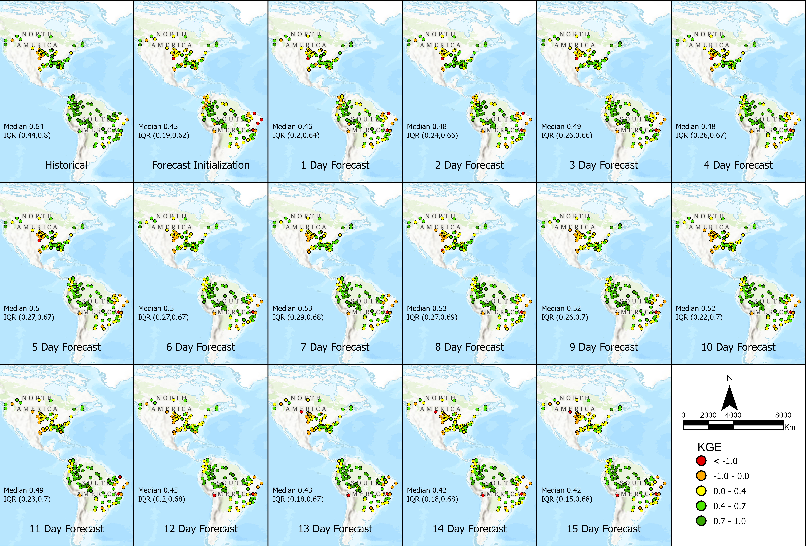

# Méthode de Correction du Biais

Le RFS présente des biais qui peuvent limiter sa précision, ce qui a conduit au développement d'une approche de correction du biais. Pour corriger ces biais systématiques aux
emplacements instrumentés, nous proposons la méthode de Quantile-Mapping avec Courbe de Durée des Débits Mensuelle (MFDC-QM). Cette méthode cible les biais liés à la
variabilité des débits et à la corrélation. Le RFS n'assimile pas les données de débit observées dans son calcul initial. Cependant, la technique de correction du biais
permet d'appliquer localement les données mondiales. Les utilisateurs locaux peuvent ainsi avoir davantage confiance dans leurs données, car ils savent que leurs données observées peuvent
être utilisées pour améliorer les données modélisées à leur emplacement.

Après application de la correction du biais, nous avons observé une amélioration significative de la distribution des ratios de biais et de variabilité, ainsi qu'une légère
amélioration des valeurs de corrélation sur l'ensemble des stations, ce qui se traduit par des simulations plus fiables et de meilleures valeurs des composantes du critère de Kling-Gupta (KGE) : biais,
variabilité et corrélation.

La présentation suivante explique comment le RFS a été validé et détaille les méthodes de correction
du biais.

[GEOGLOWS - Bias Correction.pdf](https://drive.google.com/file/d/1-GyWh_lY2AjRTXM7aRknqmJiIEh_BqMd/view?usp=sharing)

Le RFS applique une correction du biais à ses données de prévision en supposant que la prévision présente les mêmes biais que la simulation rétrospective. Ce processus
consiste à associer les valeurs de débit prévues à une probabilité de non-dépassement à l'aide de la courbe de durée des débits de la simulation historique, puis à remplacer
les valeurs prévues par les valeurs correspondantes de la courbe de durée des débits observée.

Cette méthode permet d'améliorer la précision des prévisions, en particulier pour les premières échéances de prévision, en rapprochant davantage les données des
observations historiques. Cependant, les améliorations sont limitées par l'hypothèse selon laquelle les biais des données de prévision sont identiques à ceux de la simulation
rétrospective. Les images suivantes montrent comment les valeurs de KGE du modèle de prévision se sont améliorées après l'application des techniques de correction du biais.

Pour plus d'informations, consultez cette présentation PowerPoint : [Bias_Correction_Forecast_Data.pdf](https://drive.google.com/file/d/1Fu4KhqhW6lW1eI8U2pcuHJFyCTqw5Qrn/view?usp=sharing)
