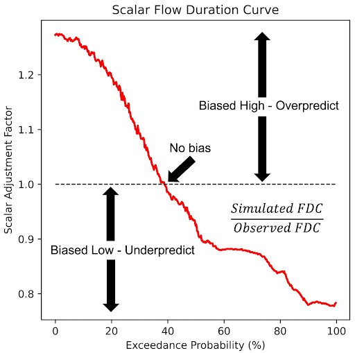

# SABER (Stream Analysis for Bias Estimation and Reduction)

La méthode SABER est un outil de correction du biais conçu pour les grands modèles hydrologiques comme le RFS, qui traite spécifiquement le problème des biais des modèles dans
les bassins fluviaux jaugés comme non jaugés. SABER utilise les courbes de durée des débits (FDC) pour comparer les débits observés aux valeurs simulées par les
modèles hydrologiques, afin d'identifier et de corriger les biais. Pour les emplacements non jaugés, où aucune observation directe n'est disponible, SABER utilise la courbe de durée des débits
scalaire (SFDC).

Contrairement à la correction du biais, que chaque institution effectue localement, SABER est réalisé par l'équipe du RFS et n'est pas effectué par les utilisateurs finaux. Nous utilisons les
données des stations de mesure mises à notre disposition pour améliorer l'ensemble des résultats du modèle. Ce processus est encore expérimental et n'est pas actuellement
appliqué aux données auxquelles accèdent les utilisateurs finaux. Nous espérons qu'il sera appliqué dans les futures versions du RFS.

SABER permet d'étendre le processus de correction du biais aux bassins non jaugés en analysant les comportements similaires des bassins versants, sur la base de la proximité spatiale et du
regroupement (clustering) des régimes d'écoulement. Cette méthode est particulièrement utile dans les régions où la rareté des données limite la calibration traditionnelle, comme dans les
modèles mondiaux tels que le RFS, et garantit des prévisions de débit plus précises sur de vastes domaines spatiaux.

SABER fonctionne en comparant les données de débit simulées aux valeurs observées aux emplacements jaugés afin de détecter les biais positifs ou négatifs. Il applique des techniques d'apprentissage automatique
de regroupement (clustering) pour rassembler les bassins versants ayant des caractéristiques d'écoulement similaires, ce qui permet d'étendre la correction du biais des bassins jaugés aux bassins non jaugés. Le
processus SABER comprend le calcul des SFDC pour différentes probabilités de dépassement et la division des débits simulés par les valeurs SFDC correspondantes, y compris dans les
régions affectées par des barrages ou des réservoirs.

