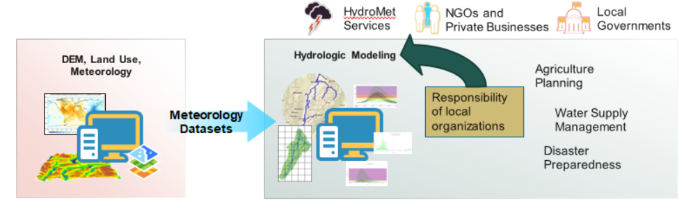
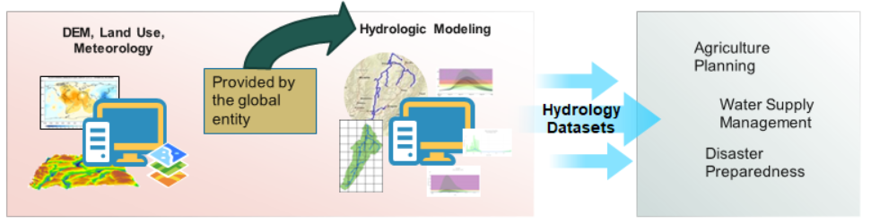
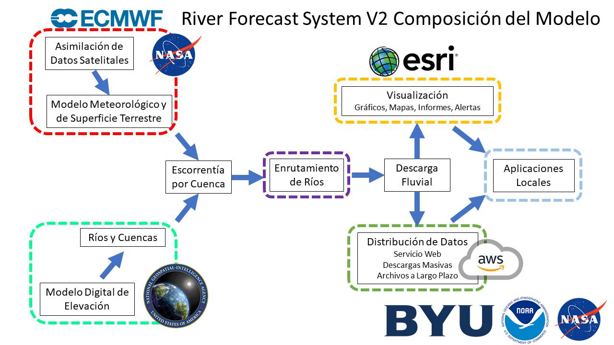
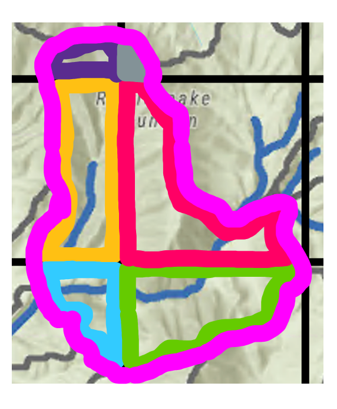
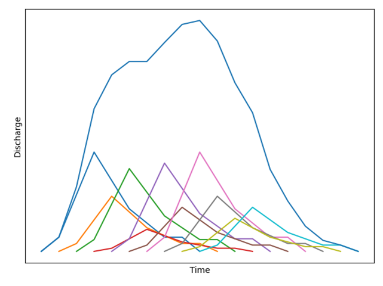

El propósito de esta sección sobre la formulación del modelo es proporcionar una visión general del RFS, incluyendo sus entradas y resultados. Si le interesa principalmente usar los datos, puede omitir esta sección y pasar a la sección "Datos Disponibles" de nuestro sitio.

## Un Cambio de Paradigma

Muchas instituciones carecen de recursos para gestionar datos, ejecutar modelos hidrológicos y pronosticar condiciones futuras. A menudo, el apoyo para estas tareas llega en forma de conjuntos de datos globales, como DEMs y datos meteorológicos. Esto puede ayudar a cubrir algunas de las brechas de datos, pero las instituciones siguen teniendo la responsabilidad de tomar estos conjuntos de datos y realizar ellas mismas el modelado hidrológico. Luego, este modelo hidrológico puede usarse para proporcionar información hídrica útil para la acción en forma de aplicaciones locales, por ejemplo para la preparación ante desastres, la planificación agrícola y la gestión del agua.

RFS es diferente porque toma los conjuntos de datos globales y realiza un modelado hidrológico global. Esto permite que las instituciones hidrológicas se concentren en las aplicaciones locales, usando e interpretando los datos en lugar de ejecutar el modelo por su cuenta. Así pueden dedicar el tiempo y los recursos de la institución a generar un impacto duradero en sus comunidades.

Aunque la siguiente sección sobre la formulación del modelo explica cómo se construye y ejecuta el modelo, los usuarios nunca necesitarán hacerlo por su cuenta. Pueden concentrarse en acceder a los datos y usarlos. El código utilizado para RFS es de código abierto y, por lo tanto, puede usarse para ejecutar el modelo si es necesario; sin embargo, todos los datos producidos están disponibles para su descarga. Recomendamos que los usuarios se concentren en las secciones sobre los datos disponibles y el acceso a los datos de esta capacitación. La siguiente sección está dirigida a quienes tienen motivos para querer entender con mayor profundidad de dónde provienen sus valores de caudal. No es necesario poder recrear y ejecutar el modelo para usar los datos.

## Resumen de RFS

Esta página ofrece un breve resumen del proceso de enrutamiento. Algunas partes se describen con más detalle en las secciones siguientes. El siguiente gráfico ofrece una visión general de la formación del RFS.

### Entradas

RFS utiliza datos disponibles a nivel global para crear los datos globales de caudal. Los datos meteorológicos del ECMWF (consulte [Entradas del Modelo](model-inputs.md) para más detalles) se usan junto con una versión ligeramente modificada de los ríos de TDX-Hydro (consulte [Entradas del Modelo](model-inputs.md) para más información). Los datos de escorrentía se proporcionan como datos en cuadrícula (grilla). 

Para calcular el volumen de agua de una cuenca específica durante un periodo de tiempo determinado, la cuadrícula de escorrentía se interseca con los límites de la cuenca. Sea R la lámina de escorrentía en una celda de la cuadrícula y A el área del polígono resultante (la parte de una celda de la cuadrícula que cae dentro de la cuenca). El volumen total de agua, V, es entonces la suma de la lámina de escorrentía multiplicada por el área en todos esos polígonos: V = Σ (R × A). Este cálculo se repite para cada cuenca y para cada paso de tiempo.

{ width="350" }

### Enrutamiento del Agua

Luego, el volumen de agua se enruta a través de la red de ríos usando el paquete de Python river-route. Esto permite que los volúmenes de escorrentía viajen aguas abajo por la red de ríos, creando un hidrograma. Este hidrograma se guarda para cada río en cada paso de tiempo. Estos son los datos de caudal que se pueden descargar de RFS.

{ width="450" }

### Productos de Datos

Una vez producidos los datos de caudal, se utilizan para crear visualizaciones de los datos, como los gráficos y mapas disponibles en las aplicaciones web. También se almacenan en AWS en formatos diseñados para facilitar la distribución de los datos. Estos productos de caudal se usan para elaborar productos derivados como periodos de retorno, promedios mensuales y curvas de duración de caudal. Estos productos se ponen a disposición para que las instituciones hidrológicas puedan crear aplicaciones locales a partir de los datos.

Además, existen opciones para que los usuarios finales realicen una corrección de sesgo local.

