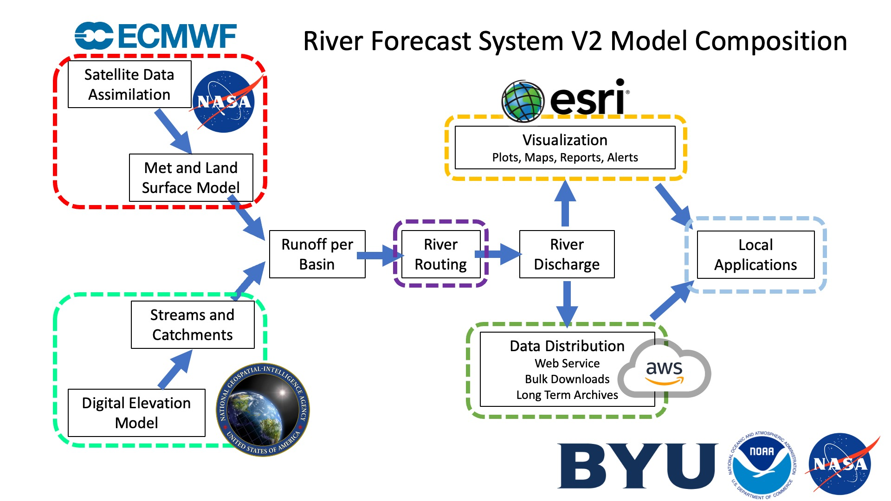

Le but de cette section sur la formulation du modèle est de fournir un aperçu du RFS, y compris ses entrées et ses sorties. Si votre intérêt principal est d'utiliser les données, vous pouvez passer cette section et aller directement à la section « Données Disponibles » de notre site.

## Un Changement de Paradigme

De nombreuses institutions manquent de ressources pour gérer des données, exécuter des modèles hydrologiques et prévoir les conditions futures. Le soutien dans ces domaines prend souvent la forme de jeux de données mondiaux, notamment des MNE (modèles numériques d'élévation) et des données météorologiques. Cela peut aider à combler certaines lacunes en matière de données, mais les institutions restent chargées d'exploiter ces jeux de données et de réaliser elles-mêmes la modélisation hydrologique. Ce modèle hydrologique peut ensuite être utilisé pour fournir des informations exploitables sur l'eau, sous la forme d'applications locales dans des domaines tels que la préparation aux catastrophes, la planification agricole et la gestion de l'eau.

Le RFS est différent, car il prend les jeux de données mondiaux et réalise ensuite une modélisation hydrologique mondiale. Les institutions hydrologiques peuvent ainsi se concentrer sur les applications locales en utilisant et en interprétant les données plutôt qu'en exécutant elles-mêmes le modèle. Cela leur permet de consacrer le temps et les ressources de l'institution à avoir un impact durable dans leurs communautés.

Bien que la section suivante sur la formulation du modèle explique comment le modèle est construit et exécuté, les utilisateurs n'auront jamais besoin de le faire eux-mêmes. Ils peuvent se concentrer sur l'accès aux données et leur utilisation. Le code utilisé pour le RFS est open source et peut donc servir à exécuter le modèle si nécessaire ; cependant, toutes les données produites sont disponibles en téléchargement. Nous recommandons aux utilisateurs de se concentrer sur les sections de cette formation consacrées aux données disponibles et à l'accès aux données. La section suivante s'adresse aux personnes qui ont des raisons de vouloir comprendre plus en profondeur d'où proviennent leurs valeurs de débit. Il n'est pas nécessaire de pouvoir recréer et exécuter le modèle pour utiliser les données.

## Aperçu du RFS

Cette page donne un bref aperçu du processus de routage. Certaines parties sont décrites plus en détail dans les sections suivantes. Le graphique suivant donne un aperçu de la formulation du RFS.

### Entrées

Le RFS utilise des données disponibles à l'échelle mondiale pour créer les données de débit mondiales. Les données météorologiques de l'ECMWF (voir [Entrées du Modèle](model-inputs.md) pour plus de détails) sont utilisées conjointement avec une version légèrement modifiée des cours d'eau TDX-Hydro (voir [Entrées du Modèle](model-inputs.md) pour plus d'informations). Les données de ruissellement sont fournies sous forme de grille.

Pour calculer le volume d'eau d'un bassin donné sur une certaine période, la grille de ruissellement est intersectée avec les limites du bassin. Soit R la hauteur de ruissellement dans une cellule de la grille et A la superficie du polygone obtenu (la partie d'une cellule de la grille située à l'intérieur du bassin). Le volume total d'eau, V, est alors la somme, sur l'ensemble de ces polygones, de la hauteur de ruissellement multipliée par la superficie : V = Σ (R × A). Ce calcul est répété pour chaque bassin et pour chaque pas de temps.

{ width="350" }

### Routage de l'Eau

Le volume d'eau est ensuite acheminé à travers le réseau hydrographique à l'aide du package Python river-route. Cela permet aux volumes de ruissellement de se déplacer vers l'aval à travers le réseau hydrographique, créant ainsi un hydrogramme. Cet hydrogramme est enregistré pour chaque rivière et à chaque pas de temps. Ce sont ces données de débit qui peuvent être téléchargées depuis le RFS.

{ width="450" }

### Produits de Données

Une fois les données de débit produites, elles servent à créer des visualisations, comme les graphiques et les cartes disponibles dans les applications web. Elles sont également stockées sur AWS dans des formats conçus pour faciliter la distribution des données. Ces produits de débit servent à créer des produits dérivés tels que les périodes de retour, les moyennes mensuelles et les courbes de durée des débits. Ces produits sont mis à disposition afin de permettre aux institutions hydrologiques de créer des applications locales à partir des données.

En outre, des options de correction locale du biais peuvent être appliquées par les utilisateurs finaux.
