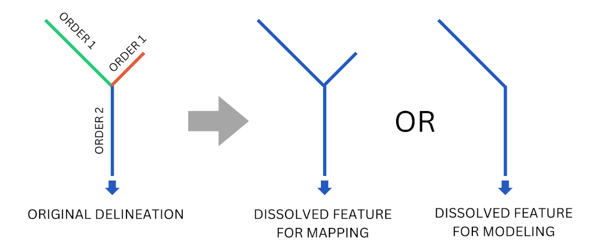
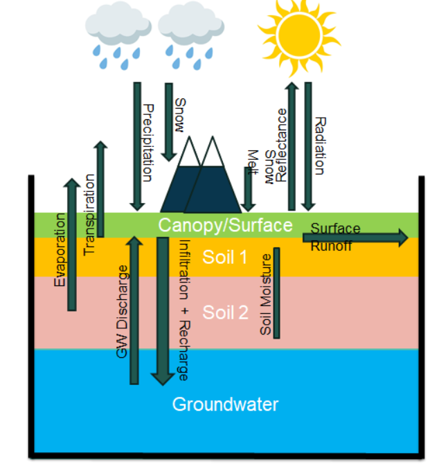

# Entradas del Modelo

El Sistema de Pronóstico de Ríos (RFS) depende de tres entradas clave:

## 1. **Hidrografía de TDX-Hydro**  
La red de ríos utilizada por RFS se basa en hidrografía derivada de los datos de elevación digital de TDX-Hydro. Para prepararla para RFS, la red de ríos pasa por varias modificaciones y pasos de posprocesamiento. 

### Modificaciones a TDX-Hydro

Todas las modificaciones que realizamos en cada región de TDX-Hydro están registradas en 3 archivos: 1) processing_options.xlsx, 2) tdx_header_numbers.json y 3)
terminal_node_vpu_list.csv. El archivo JSON de números de encabezado de TDX asigna a cada número de región de TDX-Hydro un número único de 2 dígitos, donde el primer dígito es
el primer dígito del número de la región y el segundo dígito corresponde al índice, en orden ordenado, de todas las regiones que comparten el primer
dígito. El archivo CSV de nodos terminales por VPU asocia cada nodo terminal (el ID asociado con la salida de una cuenca) con un número de VPU. A continuación se incluye un resumen de estos
cambios.

Las regiones excluidas incluyen las que están más al norte y algunas de las islas más pequeñas, donde los conjuntos de datos de escorrentía pueden no ser tan precisos y
la población es escasa o nula. Las versiones futuras podrían reintroducir estas regiones. Además, corregimos errores encontrados en el conjunto de datos de TDX-Hydro, que
fueron reportados a la NGA para su corrección en versiones futuras. Estos errores incluyen:

1. Ríos sin longitud y sin segmentos aguas arriba ni aguas abajo, es decir, ríos con solo dos puntos donde ambos puntos están en la misma
   ubicación. Estos, junto con sus cuencas asociadas, fueron eliminados.
2. Ríos sin longitud pero con segmentos aguas arriba o aguas abajo. Estos fueron eliminados junto con sus cuencas asociadas, y los atributos de
   los segmentos aguas arriba y/o aguas abajo se modificaron para que hicieran referencia entre sí y se preservara la conectividad de la red de ríos.
3. Las cuencas con un identificador de stock de '0' nunca tuvieron un río asociado. Estas fueron eliminadas.

En la mayoría de las regiones, aunque no en todas, los ríos de cabecera se disolvieron con los segmentos aguas abajo, hasta e incluyendo el segmento
aguas abajo con un orden de Strahler de 2 o 3. Se decidió que las regiones mayormente costeras (Japón, islas del Caribe, Indonesia)
eran más sensibles a los cambios en sus redes de ríos, por lo que en estas regiones no se modificaron las cabeceras. Otras áreas, como el
desierto del Sahara, se delinearon con la misma resolución que el resto del mundo, a menudo con demasiada resolución. En estas áreas se podían fusionar más elementos
sin alterar significativamente el enrutamiento fluvial. Así, los ríos de cabecera y los ríos aguas abajo se disolvieron en un solo elemento junto con
sus cuencas asociadas, y se recalcularon los atributos relevantes como la longitud y la pendiente. El orden de río hasta el cual se disolverían las cabeceras
también se eligió con base en estas consideraciones.

En todas las regiones se eliminaron del conjunto de datos de TDX-Hydro las cuencas pequeñas de hasta 200 kilómetros cuadrados. Esto se hizo por razones similares a las de
la disolución diferenciada de los ríos de cabecera. En las regiones más costeras se eliminaron cuencas de hasta entre 25 y 75 kilómetros cuadrados. En otras áreas, como
el desierto del Sahara o el norte de Canadá, se eliminaron cuencas de 200 kilómetros cuadrados. En estas regiones más planas, la alta resolución de la
delineación crea pequeños "charcos" o pequeños grupos de ríos que no drenan al océano y no representan ríos con flujo. A menudo
tienen en conjunto un área menor a 200 kilómetros cuadrados. En las regiones menos costeras y más planas/secas se eliminaron cuencas más grandes.

En la mayoría de las regiones, aunque no en todas, los ríos de cabecera que desembocaban directamente en un río con un orden de Strahler de dos o más se disolvieron con el segmento
inmediatamente aguas abajo. La decisión de podar estos ríos se tomó por las mismas razones que se explicaron arriba.

   ¿Hablar sobre las entradas de ríos y embalses?

## 2. **Modelo de superficie terrestre retrospectivo (ERA5)**  
Los buenos modelos hidrológicos dependen de una buena meteorología, ya que la meteorología impulsa la hidrología. Los modelos meteorológicos son en gran medida cálculos de balance de energía impulsados por la radiación solar entrante, construidos a partir de celdas de cuadrícula en 3D de alturas variables.

El ECMWF ejecuta un modelo de superficie terrestre sobre estos datos meteorológicos para producir variables adicionales como la escorrentía, el agua "sobrante" en hidrología. Cada celda se trata como su propio cubo, donde interactúan la precipitación, la infiltración, la evapotranspiración, el deshielo, la descarga de agua subterránea y la humedad del suelo. La escorrentía es lo que queda después de esos procesos.

{ width="350" }

Para la simulación retrospectiva (histórica), RFS utiliza la escorrentía de ERA5, el producto de reanálisis global del ECMWF. Como reconstruye las condiciones pasadas a partir de observaciones, ERA5 proporciona el registro largo y consistente que RFS usa para construir su caudal histórico.

## 3. **Modelo de superficie terrestre de pronóstico (IFS)**  
La escorrentía pronosticada proviene del Sistema Integrado de Predicción (IFS) del ECMWF, que ejecuta los mismos cálculos de cubo de superficie terrestre hacia adelante en el tiempo para predecir la escorrentía futura. En lugar de un único pronóstico, IFS se ejecuta como un ensamble: múltiples simulaciones iniciadas a partir de condiciones iniciales ligeramente diferentes para capturar la incertidumbre del clima futuro. Esto produce un rango de valores de escorrentía en lugar de uno solo, que RFS enruta para obtener un conjunto de pronósticos de caudal que transmiten la probabilidad y la posible magnitud de los caudales próximos.

Esta escorrentía alimenta los pronósticos de RFS y proporciona las predicciones de caudal a corto plazo que complementan el registro histórico basado en ERA5.

Los datos de escorrentía de ERA5 e IFS se convierten en volúmenes de caudal usando herramientas del [repositorio basininflow](https://github.com/geoglows/basininflow).

La siguiente tabla resume los principales conjuntos de datos de entrada utilizados por RFS:

| Nombre                               | DOI                                                                                | Tipo                                          | Productor | Licencia                                                                                                                                                                          |
|--------------------------------------|------------------------------------------------------------------------------------|-----------------------------------------------|-----------|-----------------------------------------------------------------------------------------------------------------------------------------------------------------------------------|
| ERA5                                 | [DOI](https://doi.org/10.24381/cds.adbb2d47)                                       | Modelo de superficie terrestre de reanálisis  | ECMWF     | [Licencia Copernicus](https://cds.climate.copernicus.eu/api/v2/terms/static/licence-to-use-copernicus-products.pdf) - Gratis para uso comercial y no comercial con atribución |
| TDX-Hydro                            | [Enlace](https://earth-info.nga.mil/)                                              | Hidrografía de ríos y cuencas                 | NGA       | [Licencia TDX-Hydro](https://earth-info.nga.mil/php/download.php?file=tdx-hydro-license) - Disponible públicamente, se proporciona "tal cual", sin garantía                    |
| Sistema Integrado de Predicción 48R1 | [Enlace](https://confluence.ecmwf.int/display/FCST/Implementation+of+IFS+Cycle+48r1) | Modelo de superficie terrestre de pronóstico  | ECMWF     | Requiere licencia de pago                                                                                                                                 

Además de las entradas del modelo propiamente dicho, se utilizan datos observados en el proceso de calibración. ¿Hablar brevemente sobre la recopilación y el uso de datos observados?
