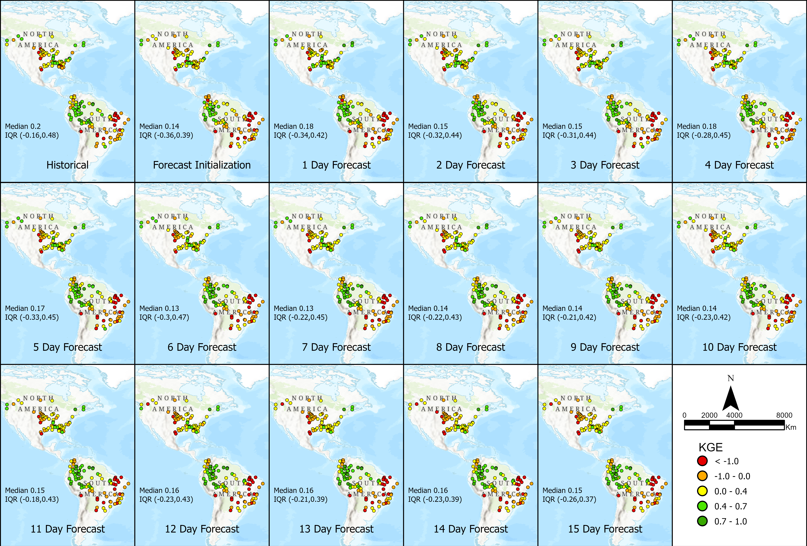
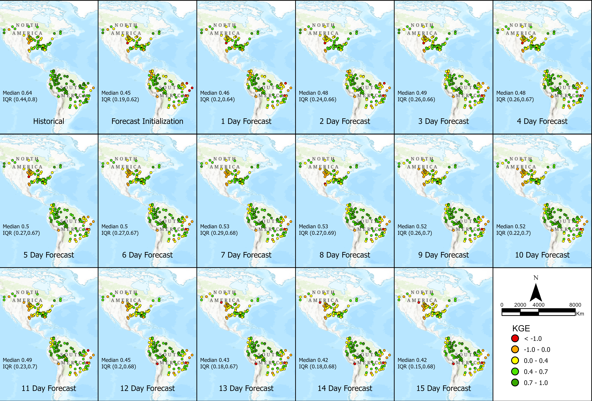

# Correction de Biais des Prévisions

Le RFS applique une correction de biais à ses données de prévision en supposant que les prévisions partagent les mêmes biais que la simulation rétrospective. Ce processus consiste à **mapper les valeurs de débit prévisionnel** sur une probabilité de non-dépassement en utilisant la courbe de durée de débit de la simulation historique, puis à remplacer les valeurs prévisionnelles par les valeurs correspondantes de la courbe de durée de débit observée.

Cette méthode permet d’améliorer la précision des prévisions, en particulier pour les horizons de prévision les plus courts, en alignant les données plus étroitement avec les observations historiques. Cependant, les améliorations sont limitées par l’hypothèse que les biais des données prévisionnelles sont identiques à ceux de la simulation rétrospective. Les images suivantes montrent comment les valeurs de **KGE** se sont améliorées pour le modèle prévisionnel après l’application des techniques de correction de biais.

---

[Correction_de_Biais_Données_Prédictives.pdf](https://drive.google.com/file/d/1Fu4KhqhW6lW1eI8U2pcuHJFyCTqw5Qrn/view?usp=sharing)

Ce notebook Colab propose un guide étape par étape pour effectuer la correction de biais sur les valeurs de prévision du RFS. Il montre comment ajuster les valeurs de débit prévisionnel à l’aide des observations historiques, améliorant ainsi la précision des prévisions et alignant les données sur les mesures réelles pour une meilleure analyse hydrologique :

[Correction_de_Biais_GEOGloWS_ECMWF_Modèle_Hydrologique_Prédiction Colab.ipynb](https://colab.research.google.com/drive/1AWwF60XP_6GKhl1fe9KDhhndT802cHUq?usp=sharing)
