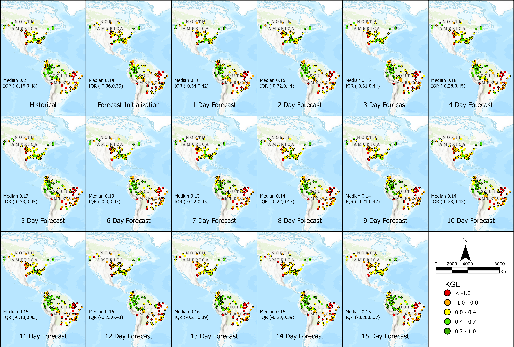
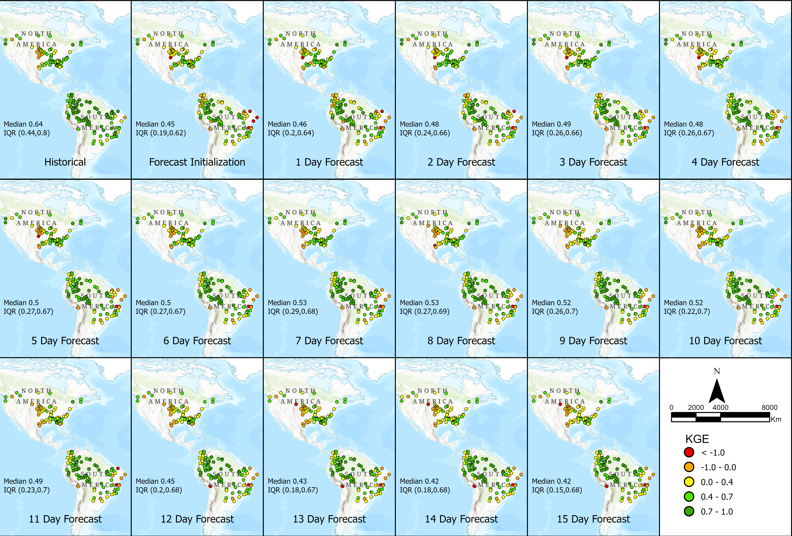

# Corrección de Sesgo en las Predicciones

RFS aplica corrección de sesgo a sus datos de predicción asumiendo que la predicción comparte los mismos sesgos que la simulación retrospectiva. Este proceso
implica mapear los valores de caudal pronosticados a una probabilidad de no superación utilizando la curva de duración de caudal de la simulación histórica y luego reemplazar
los valores pronosticados con los valores correspondientes de la curva de duración de caudal observada.

Este método ayuda a mejorar la precisión de las predicciones, particularmente durante los primeros tiempos de predicción, alineando los datos más estrechamente con las observaciones históricas. Sin embargo, las mejoras están limitadas por la suposición de que los sesgos en los datos de predicción son idénticos a los de la simulación retrospectiva. Las siguientes imágenes muestran cómo los valores de **KGE** mejoraron para el modelo pronosticado después de aplicar las técnicas de corrección de sesgo.

---

[Bias_Correction_Forecast_Data.pdf](https://drive.google.com/file/d/1CjsVCMkZjngEZt1k45dd4tgGTJREhi2D/view?usp=sharing)

Este cuaderno de Colab ofrece una guía paso a paso para realizar la corrección de sesgo en los valores de predicción de GEOGLOWS. Muestra cómo ajustar los valores de caudal pronosticados utilizando observaciones históricas, mejorando la precisión de las predicciones y alineando los datos con mediciones del mundo real para un mejor
análisis hidrológico:

[Bias_Correction_GEOGloWS_ECMWF_Hydrological_Model_Forecast Colab.ipynb](https://colab.research.google.com/drive/1vXJNrCjef3G4KoCc1LlNm5T_mqLu20E_?usp=sharing)
