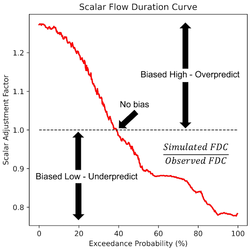

# SABER (Stream Analysis for Bias Estimation and Reduction)

The SABER method is a bias correction tool designed for large hydrologic models like RFS, specifically addressing the issue of model biases in
both gauged and ungauged river basins. SABER uses flow duration curves (FDC) to compare the observed discharge with the simulated values from
hydrologic models, identifying and correcting biases. For ungauged locations, where direct observations are unavailable, SABER uses the scalar flow
duration curve (SFDC).

Unlike bias-correction, which each institution performs locally, SABER is performed by the RFS team and is not done by the end users. We use the
gauge data made available to us to perform an improvement to all the model results. This process is still in experimentation and is not currently
being applied to the data accessed by the end-users. We hope for it to be applied in future versions of RFS.

SABER allows the bias correction process to extend to ungauged basins by analyzing similar watershed behaviors based on spatial proximity and
clustering of flow regimes. This method is particularly useful for regions where data scarcity limits traditional calibration, such as in global
models like RFS, ensuring more accurate discharge forecasts across large spatial domains.

SABER works by comparing simulated discharge data to observed values at gauged locations to detect high or low biases. It applies machine learning
clustering techniques to group watersheds with similar flow characteristics, helping to extend bias correction from gauged to ungauged basins. SABER's
process includes calculating SFDCs for different exceedance probabilities, dividing the simulated flows by the corresponding SFDC values, even in
regions affected by dams or reservoirs.

