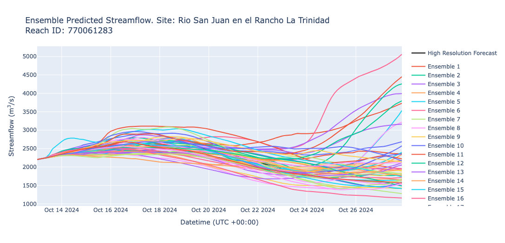
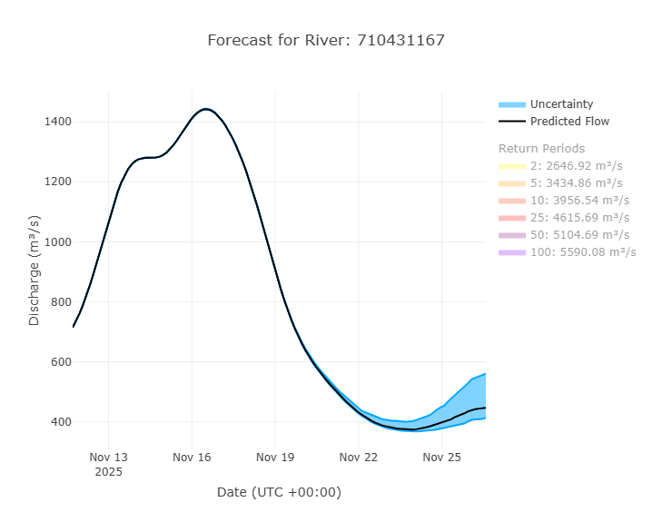

## Termes et Vocabulaire

- **IFS** : Integrated Forecast System. Nom du modèle couplé de météorologie et de surface terrestre utilisé pour générer les forçages pour les résultats du RFS.

---

## Aperçu

Le RFS produit des prévisions de débit fluvial en ensemble en utilisant les données IFS du ECMWF. Les prévisions quotidiennes sont calculées au centre de supercalcul de l’ECMWF à
Bologne, en Italie, et sont disponibles avant 12h UTC. Les débits sont exprimés en mètres cubes par seconde. La prévision a un **pas de temps de 3 heures**, où chaque valeur de débit
représente le débit moyen survenu dans la rivière au cours des 3 heures précédentes. Ci-dessous un exemple de graphique montrant tous les membres de l’ensemble.

Chaque prévision inclut un **ensemble de 50+1 membres**, ce qui signifie qu’il y a **1 prédiction de référence (contrôle)** et **50 perturbations** (légères variations)
de l’état de référence.

La prévision de chaque jour est initialisée en utilisant la valeur moyenne sur 24 heures des membres de l’ensemble du jour précédent comme condition initiale.  
Les données IFS ont une résolution spatiale d’environ 9 kilomètres horizontalement à l’équateur. La grille des valeurs de débit IFS est mappée aux limites des bassins RFS
à l’aide de méthodes SIG de statistiques zonales.

| Propriété du modèle      | Simulation Rétrospective |
|--------------------------|-------------------------|
| Date la plus ancienne    | 01 juillet 1940         |
| Type de simulation       | Ensemble                |
| Membres de l’ensemble    | 50+1                    |
| Horizon de prévision     | 15 jours                |
| Pas de temps             | Moyenne 3 heures        |
| Fréquence de mise à jour | Quotidienne à 00:00 UTC|
| Téléchargement en masse disponible | Oui          |
| Requête & sous-ensemble disponible | Oui          |

## Interprétation d’une prévision en ensemble

Chaque membre de l’ensemble a une probabilité égale de se produire. Par conséquent, il est préférable de comprendre les prévisions en examinant les résumés de l’ensemble
plutôt que les membres individuels.

Les graphiques de prévision sont conçus pour aider les utilisateurs à interpréter la plage des résultats possibles et les incertitudes. Le graphique de prévision le plus utilisé
comprend la médiane, le 20ᵉ percentile et le 80ᵉ percentile. Ceux-ci représentent 60 % de la distribution de probabilité parmi les membres de l’ensemble et donnent
un aperçu de la variabilité potentielle du débit futur. Cette approche permet aux utilisateurs de visualiser la gamme de scénarios probables pour leurs rivières.

Dans l’exemple de graphique de prévision suivant, il y a 3 zones sur lesquelles se concentrer :

- **Ligne noire :** La médiane des 51 membres de l’ensemble. C’est la "meilleure estimation" du débit fluvial.  
- **Lignes bleues :** Les valeurs des 20ᵉ et 80ᵉ percentiles  
- **Zone bleue ombrée :** Représente l’incertitude de la prévision. Il s’agit des 60 % centraux de l’ensemble. Plus la zone bleue est étroite, plus le modèle est confiant.  
  Le débit réel est plus susceptible de se situer dans cette zone bleue ombrée.

