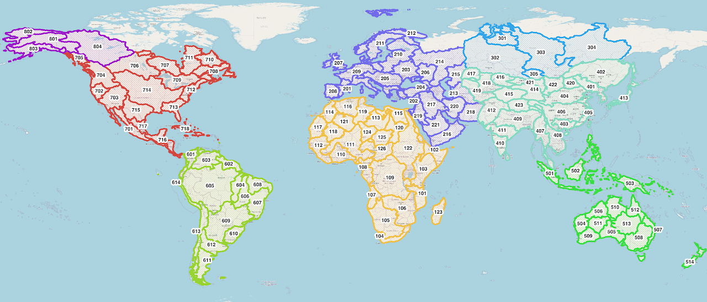

## Terms and Vocabulary

- **Hydrography**: GIS datasets of hydrological features such as streams, confluence points, catchment boundaries, watershed boundaries, lake
  boundaries, and other features.
- **Hydrofabric**: hydrography.
- **TanDEM-X**: A SAR satellite mission from the German Aerospace Center (DLR) and Airbus Defence and Space. It is used to produce a 12-meter digital
  elevation model which is the highest accuracy and resolution global product of its kind. It is not publicly available but the Copernicus Glo30 and
  FABDEM products derived from it are.
- **TDX-Hydro**: A stream centerline and catchment boundary dataset produced by the National Geospatial Intelligence Agency in 2023. The streams are
  delineated from 12-meter TanDEM-X elevation data using TauDEM with extensive elevation preprocessing and stream centerline location correction
  post-processing.
- **TauDEM**: A terrain analysis tool used to delineate streams and catchments from elevation data.
- **VPU**: Vector Processing Unit. A group of 1 or more complete watersheds put together to make smaller pieces of the global hydrography dataset for
  convenience in distributing data, dividing computations, and making maps.
- **River ID**: A unique identifier for each stream centerline in the RFS hydrography dataset. GIS and hydrology software usually have different
  names for this ID. For example, TauDEM and TDX-Hydro uses "link number" (LINKNO) and Esri software calls it a "common identifier" (COMID). For
  the RFS, it is referred to as a River ID. Any references to LINKNO, COMID, ReachID, StreamID, RiverID, or any similar term should be understood as
  the same thing.
- **Strahler Stream Order**: A number for classifying rivers topologically. The smallest rivers are order 1 and when two order 1 rivers meet, they
  form an order 2 river. When two order 2 rivers meet, they form an order 3 river, and so on. In TDX-Hydro, the largest stream order is 9.

---

## Overview

The RFS hydrography is a modification of the TDX-Hydro streams and catchments dataset. It comes from proprietary TanDEM-X 12-m elevation data. You can
download the full dataset and review the full technical description document describing its creation at https://earth-info.nga.mil/ under the "Geosciences" tab. The full TDX-Hydro dataset has about 16 million river segments and covers the full globe in 62 pieces corresponding to HydroBASINS
level 2. We skipped 12 regions and representing islands or the farther north land areas. Additional, many revisions to reduce the stream feature count
and optimize the network for channel routing reduce the total number of rivers to a total of 6.25 million rivers. This version used in RFS is
available for users to download and use for their own purposes. This dataset is referred to as hydrography, hydrofabric, or river network. It is
vector data with points and lines with coordinates, not grid data, and it includes four main components:

- The exact **stream center lines** used in RFS. Each stream has a unique 9 number ID which is referred to as a reachID, link number, or stream ID.
  This is the file called "streams_{vpu}.gpkg".
- The **catchment boundaries** used RFS. There are the boundaries around each of the streamlines and represent the area connected to that streamline.
  It is identified using the same link number as the stream center lines. This is the file called "catchments_{vpu}.spatialite". Each stream
  centerline corresponds to exactly one unique catchment boundary.
- The **connection points** used in RFS where different stream centerlines connect. Each point has the an attribute called DSLINKNO which represents
  the one downstream link number for each of the points. It has another attribute called USLINKNOs. This is a comma seperated list of the link numbers
  upstream of the nexus point. This is the file called "nexus_{vpu}.gpkg".
- The **merged lake catchments** used in RFS to represent the locations of lakes. Stream catchments that were identified through GIS searching to be
  part of a lake were merged to present the lakes. Therefore, it will have a different shape than the actual lake boundary based on the shapes of the
  merged stream catchments. This is the file called "lakes_{vpu}.gpkg".

---

## VPUs

The GIS data are divided into 125 smaller pieces, VPUs. This makes the large quantity of data easier to manage and access. Each VPU represents one or
more complete watersheds.

The VPU boundaries are also available for download to help identify which VPU includes a user's area of interest. The other GIS data sets should be
downloaded based on the VPU of interest and are downloaded as an entire VPU.

---

## Available Metadata

The V2 streams have the following attributes, which come from the TauDEM delineation process. For more explanation of these attributes, please
check [TauDEM Documentation](https://hydrology.usu.edu/taudem/taudem5/help53/StreamReachAndWatershed.html){:target="_blank"}.

| Attribute            | Source    | Description                                                               |
|----------------------|-----------|---------------------------------------------------------------------------|
| LINKNO               | TDX-Hydro | A 9 digit globally unique ID number for that river.                       |
| DSLINKNO             | TDX-Hydro | The ID (LINKNO) of the river immediately downstream of that river.        |
| strmOrder            | TDX-Hydro | The Strahler stream order.                                                |
| USContArea           | TDX-Hydro | The total drainage area upstream of the most upstream point.              |
| DSContArea           | TDX-Hydro | The total drainage area upstream of the most downstream point.            |
| LengthGeodesicMeters | RFS V2    | Geodesic length of the river arcs in meters.                              |
| TDXHydroRegion       | RFS V2    | The original TDX regional group number of which this stream is part.      |
| TopologicalOrder     | RFS V2    | The order that streams occurs from headwater to outlet.                   |
| Musk_k               | RFS V2    | The initial Muskingum k parameter calculated for river routing.           |
| Musk_x               | RFS V2    | The initial Muskingum x parameter calculated for river routing.           |
| TerminalLink         | RFS V2    | The ID of the final outlet of this stream's watershed.                    |
| VPUCode              | RFS V2    | A three-digit number representing which RFS VPU region this stream is in. |
