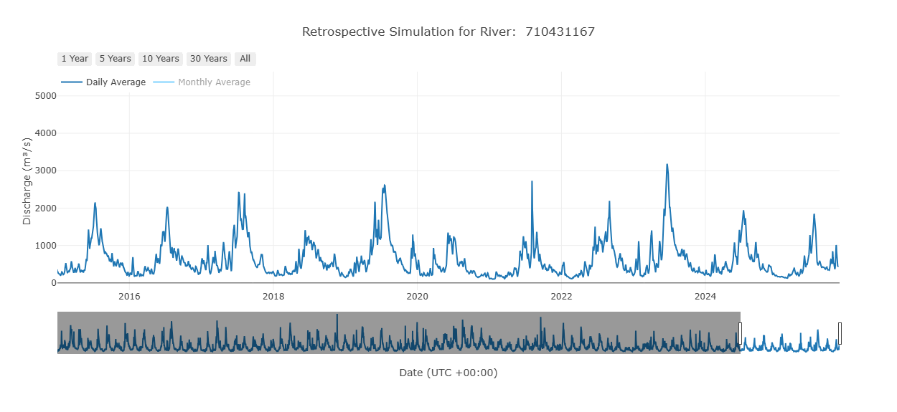

## Termes et Vocabulaire

- **ERA5** : Cinquième génération de réanalyse atmosphérique globale du climat produite par l’ECMWF. Il s’agit du jeu de données de réanalyse le plus récent du Centre Européen pour les Prévisions Météorologiques à Moyen Terme (ECMWF). Disponible de 1940 à aujourd’hui et mis à jour quotidiennement avec un décalage de 5 jours.  
- **Réanalyse** : Produit modélisé intégrant des données in situ et/ou issues de la télédétection pour fournir la meilleure estimation possible des conditions hydrométéorologiques historiques. Les données de réanalyse sont utilisées comme entrées pour le modèle RFS.  

---

## Aperçu

La simulation rétrospective du RFS est une simulation déterministe sur plus de 85 ans avec une résolution horaire à partir du 1er janvier 1940. La simulation rétrospective et de nombreux produits dérivés sont mis à jour chaque semaine. Elle est basée sur le jeu de données ERA5.  

De nouvelles données ERA5 sont produites chaque jour avec un décalage de 5 jours par rapport au temps réel, donc le décalage minimal possible est de 5 jours. Une fois par semaine, toutes les nouvelles données ERA5 depuis la dernière simulation sont utilisées pour étendre la simulation rétrospective, ramenant le décalage à 5 jours.  

Le jeu de données est déterministe et basé sur la modélisation de surface terrestre par réanalyse, ce qui signifie qu’il n’y a qu’une seule valeur par pas de temps, contrairement aux prévisions.  
La simulation rétrospective fournit des débits moyens horaires, qui sont ensuite agrégés en moyennes journalières, mensuelles et annuelles. Les débits sont rapportés comme la moyenne sur l’intervalle correspondant (heure, jour, mois ou année). Les dates sont indiquées au début de l’intervalle en UTC +00:00 (dates "alignées à gauche"). La valeur indiquée représente le débit moyen à partir de ce moment jusqu’au pas de temps suivant. Toutes les valeurs sont en mètres cubes par seconde.  

Les données mensuelles moyennes sont disponibles en deux formats différents. L’un est optimisé pour lire la série temporelle complète d’une seule rivière ou d’un groupe de rivières, ce qui est le cas d’utilisation le plus fréquent. L’autre est optimisé pour lire un grand nombre de rivières à un pas de temps donné.  

| Propriété du modèle       | Simulation Rétrospective      |
|---------------------------|------------------------------|
| Date la plus ancienne     | 01 janvier 1940              |
| Type de simulation        | Déterministe                 |
| Membres de l’ensemble     | 1                            |
| Délai                     | 5-12 jours par rapport à aujourd’hui |
| Pas de temps              | Moyenne horaire              |
| Fréquence de mise à jour  | Hebdomadaire, dimanche 00:00 UTC |
| Téléchargement en masse disponible | Oui                 |
| Requête & sous-ensemble disponible | Oui                 |

---

## Produits Dérivés

### Périodes de Retour

Une période de retour est une estimation de la fréquence à laquelle un débit extrême élevé (crue) ou un épisode prolongé de faible débit (sécheresse) se produit. Les périodes de retour ont été pré-calculées en utilisant les distributions de Gumbel et Log Pearson Type 3, sur les débits moyens horaires maximum de chaque année complète.  

Les périodes de retour pré-calculées sont utilisées pour définir les niveaux d’alerte pour chaque segment de rivière dans le modèle. Les valeurs pré-calculées concernent les intervalles de retour de 2, 5, 10, 25, 50 et 100 ans. Vous pouvez calculer une période de retour avec votre méthode préférée en accédant aux mêmes données de maxima annuels.  

### Courbes de Durée de Débit

Les **Courbes de Durée de Débit (FDCs)** représentent les schémas de débit dans une rivière. Elles relient chaque débit à une probabilité d’excédence. La probabilité d’excédence est la chance qu’un débit échantillonné au hasard soit supérieur ou égal au débit pour cette probabilité.  

Les grandes crues ont une faible probabilité d’excédence, tandis que les faibles débits ont une probabilité élevée. Les FDC sont un outil utile pour comprendre la variabilité des débits et la probabilité de différents débits.  

Les FDCs sont pré-calculées pour chaque mois (12 courbes au total représentant chaque mois) et pour toute la période historique de la rivière. Elles permettent de comprendre le débit tout au long de l’année et les variations saisonnières, ce qui est utile pour la gestion des ressources en eau, la prévision des crues et l’analyse des modèles hydrologiques.  
