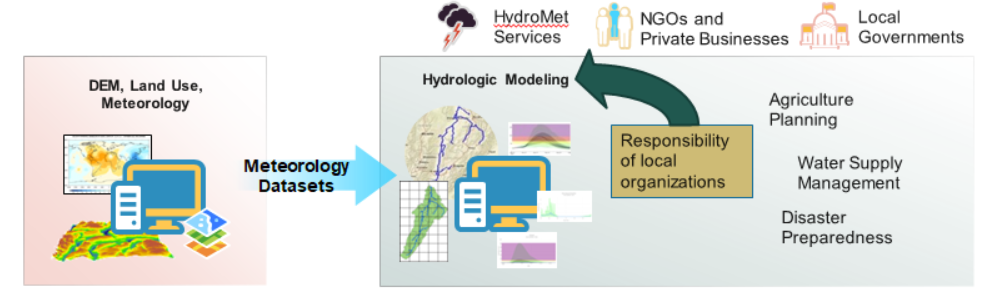
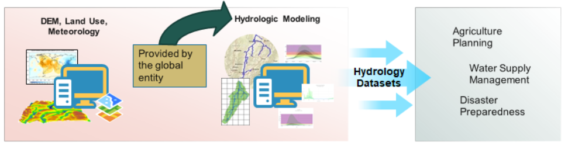
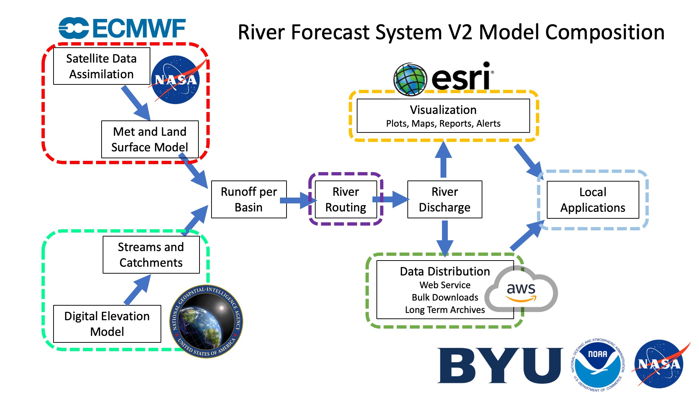
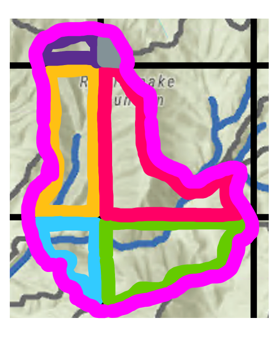
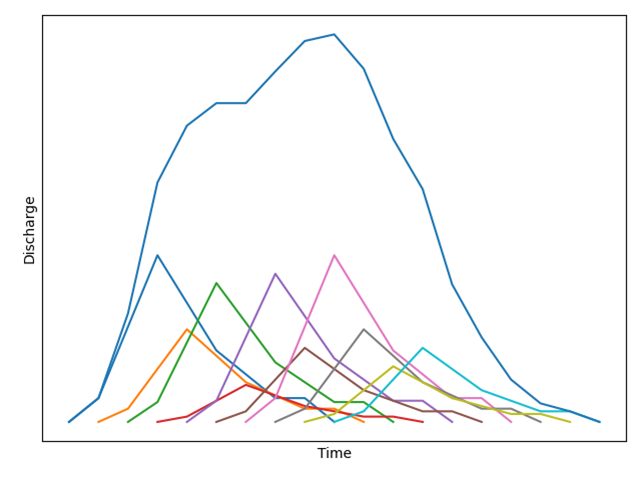

The purpose of this section on model formulation is to provide an overview of the RFS, including its inputs and outputs. If you're primarily interested in using the data, feel free to skip this and move to the "Available Data" section of our page.

## A Paradigm Shift

Many institutions lack resources to manage data, run hydrologic models, and forecast future conditions. Often supprt for these things comes in the form of global datasets, including DEMs and meteorology data. This can help cover some of the data gaps, but the institutions still have the responsibility to take these datasets and do the hydrologic modeling themselves. Then this hydrologic model can be used to provide actionable water information in the form of local applications for things such as disaster preparedness, agricultural planning, and water management.

RFS is different because it takes the global datasets and then does global hydrologic modeling. This leaves the hydrologic institutions to focus on the local applications by using and interpreting the data rather than running the model themselves. This allows them to use the time and resources of the institution to focus on making lasting impact in their communities.

While the following model formulation section explains how the model is built and run, users will never need to do that themselves. They are able to focus on accessing and using the data. The code used for RFS is open source, and thus can be used to run the model if needed, however, all the produced data is available for download. We recommend that users focus on the available and accessing data section of this training. The following section is for people who have reasons to want to understand on a deeper level where their streamflow values are coming from. It is not necessary to be able to re-create and run the model to use the data.

## RFS Overview

This page gives a brief overview of the routing process. Portions are described more in depth in subsequent sections. The following graphic provides an overview of the formation of the RFS.

### Inputs

RFS uses globally available data to create the global streamflow data. Meteorology data from ECMWF (see [Model Inputs](model-inputs.md) for more details) are used in conjunction with a slightly altered version of TDX-Hydro streams (see [Model Inputs](model-inputs.md) for more information). The runoff data is provided as gridded data. 

To calculate the volume of water for a specific basin over a certain time period, the runoff grid is intersected with the basin boundaries. Let R be the runoff depth in a grid cell and A be the area of the resulting polygon (the portion of a grid cell that falls within the basin). The total volume of water, V, is then the sum of the runoff depth multiplied by the area across all of those polygons: V = Σ (R × A). This calculation is repeated for every basin and for every time step.

{ width="350" }

### Routing Water

Then the volume of water is routed through the stream network using the river-route python package. This allows the runoff volumes to travel downstream through the stream network creating a hydrograph. This hydrograph is saved at every river at every timestep. This is the streamflow data that can be downloaded from RFS.

{ width="450" }

### Data Products

Once the discharge data has been produced, this is then used to create visualizations for the data such as the plots and maps you see available in the web applications. It is also stored to AWS in formats designed for easy data distribution. These discharge products are used to make derivative products such as return periods, monthly averages, and flow duration curves. These products are made available allowing hydrologic institutions to create local applications from the data.

Additionally there are options for local bias correction to be performed by end users.

