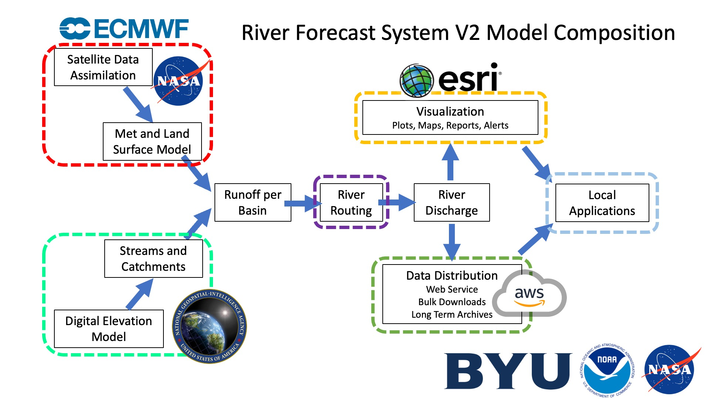

# Model Formulation
The purpose of this page is to provide an overview of the RFS model, including its inputs and outputs. If you're primarily interested in using the data, feel free to skip this page and move to the next section.

The following graphic provides an overview of the formation of the RFS model.

## Inputs

The River Forecast System (RFS) depends on three key inputs, as illustrated in the graphic:

1. **Hydrography from TDX-Hydro**  
   The river network used by RFS is based on hydrography derived from TDX-Hydro digital elevation data. To prepare this for RFS, the stream network undergoes several modifications and post-processing steps, which are documented in the [TDX-Hydro Post-Processing repository](https://github.com/geoglows/tdxhydro-postprocessing).

2. **Retrospective Meteorological Forcing (ERA5)**  
   Historical runoff data is provided by ERA5, a global reanalysis product from the European Centre for Medium-Range Weather Forecasts (ECMWF).

3. **Forecast Meteorological Forcing (IFS)**  
   Future runoff predictions are generated using the Integrated Forecasting System (IFS), also from ECMWF.

The runoff data from both ERA5 and IFS is converted into streamflow volumes using tools from the [basininflow repository](https://github.com/geoglows/basininflow).

The following table summarizes the core input datasets used by RFS:

| Name                              | DOI                                                                 | Type                              | Producer | License                                                                                                                                                                      |
|-----------------------------------|----------------------------------------------------------------------|-----------------------------------|----------|------------------------------------------------------------------------------------------------------------------------------------------------------------------------------|
| ERA5                              | [DOI](https://doi.org/10.24381/cds.adbb2d47)                         | Reanalysis Land Surface Model     | ECMWF    | [Copernicus License](https://cds.climate.copernicus.eu/api/v2/terms/static/licence-to-use-copernicus-products.pdf) - Free for commercial and non-commercial use with attribution |
| TDX-Hydro                         | [Link](https://earth-info.nga.mil/)                                 | River and Catchment Hydrography   | NGA      | [TDX-Hydro License](https://earth-info.nga.mil/php/download.php?file=tdx-hydro-license) - Publicly available, provided "as is" without warranty                                |
| Integrated Forecast System 48R1   | [Link](https://confluence.ecmwf.int/display/FCST/Implementation+of+IFS+Cycle+48r1) | Forecast Land Surface Model       | ECMWF    | Requires Paid License                                                                                  

## Model Steps

The runoff volumes are routed through the stream network using [RAPIDpy](https://github.com/geoglows/RAPIDpy). RAPID uses Muskingum Routing to route the volume files through the river. The x and k values were calculated based on research done at the BYU Hydroinformatics Lab. The configuration files needed to run RAPID are available in our data catalog which is described later in [the training ](../datasets/catalog.md).

## Outputs

The RFS produces several key outputs:

- **Streamflow Data**: This includes both:
  - **15-day forecasts** for real-time applications.
  - **85 years of retrospective simulations** for historical analysis and calibration.
- **Stream Network**: The processed river network used in the model.
- **Esri Mapping Layer**: A geospatial layer for integration with GIS tools and visualization platforms produced by Esri.

The following sections in this training will explain each of these outputs and how they can be accessed for local applications.
