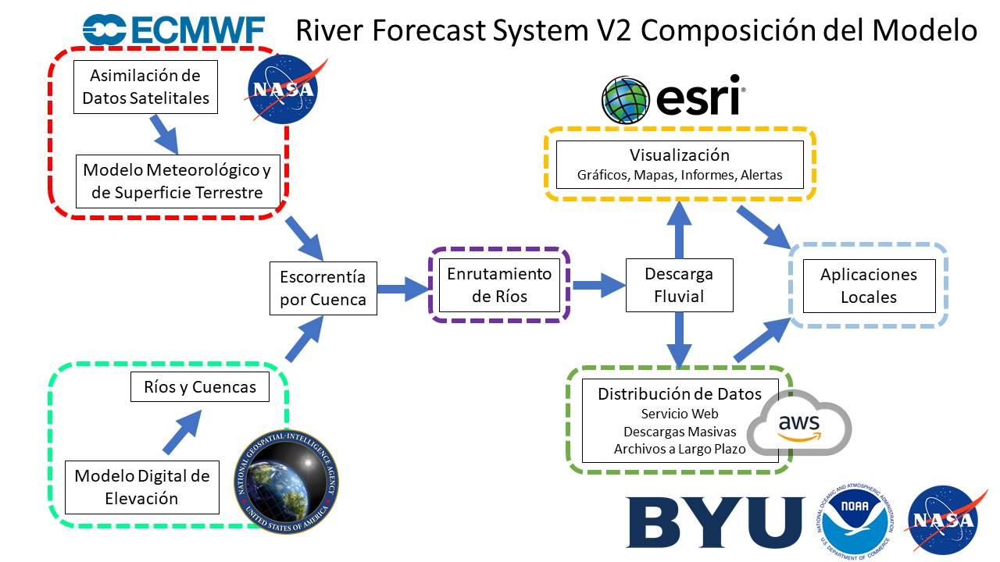

# Formulación del Modelo

El propósito de esta página es proporcionar una visión general del modelo RFS, incluyendo sus insumos y resultados. Si estás interesado principalmente en usar los datos, puedes omitir esta página y pasar a la siguiente sección.

El siguiente gráfico ofrece una visión general de la formación del modelo RFS.  

## Insumos

El Sistema de Pronóstico Fluvial (RFS) depende de **tres insumos clave**, como se muestra en el gráfico:

1. **Hidrografía de TDX-Hydro**  
   La red de ríos utilizada por RFS se basa en hidrografía derivada de datos de elevación digital de TDX-Hydro. Para su uso en RFS, esta red es sometida a diversas modificaciones y pasos de postprocesamiento, documentados en el repositorio de [postprocesamiento de TDX-Hydro](https://github.com/geoglows/tdxhydro-postprocessing).

2. **Forzamiento meteorológico retrospectivo (ERA5)**  
   Los datos históricos de escorrentía provienen de ERA5, un producto de reanálisis global del Centro Europeo de Pronósticos Meteorológicos a Medio Plazo (ECMWF).

3. **Forzamiento meteorológico de pronóstico (IFS)**  
   Las predicciones de escorrentía futura se generan mediante el Sistema Integrado de Pronóstico (IFS), también del ECMWF.

Los datos de escorrentía de ERA5 e IFS se convierten en volúmenes de caudal usando herramientas disponibles en el repositorio [basininflow](https://github.com/geoglows/basininflow).

La siguiente tabla resume los principales conjuntos de datos de entrada utilizados por RFS:

| Nombre                            | DOI                                                                  | Tipo                              | Productor | Licencia                                                                                                                                                                      |
|----------------------------------|----------------------------------------------------------------------|-----------------------------------|-----------|------------------------------------------------------------------------------------------------------------------------------------------------------------------------------|
| ERA5                              | [DOI](https://doi.org/10.24381/cds.adbb2d47)                         | Modelo de superficie terrestre de reanálisis | ECMWF     | [Licencia Copernicus](https://cds.climate.copernicus.eu/api/v2/terms/static/licence-to-use-copernicus-products.pdf) - Gratis para uso comercial y no comercial con atribución |
| TDX-Hydro                         | [Enlace](https://earth-info.nga.mil/)                                | Hidrografía de ríos y cuencas     | NGA       | [Licencia TDX-Hydro](https://earth-info.nga.mil/php/download.php?file=tdx-hydro-license) - Disponible públicamente, se proporciona "tal cual", sin garantía                   |
| Sistema Integrado de Pronóstico 48R1 | [Enlace](https://confluence.ecmwf.int/display/FCST/Implementation+of+IFS+Cycle+48r1) | Modelo de superficie terrestre de pronóstico | ECMWF     | Requiere licencia de pago                                                                                                                |

## Pasos del Modelo

Los volúmenes de escorrentía se enrutan a través de la red de ríos utilizando [RAPIDpy](https://github.com/geoglows/RAPIDpy). RAPID emplea el método de enrutamiento de Muskingum para transportar los volúmenes por los ríos. Los valores de x y k fueron calculados con base en investigaciones realizadas en el Laboratorio de Hidroinformática de BYU. Los archivos de configuración necesarios para ejecutar RAPID están disponibles en nuestro catálogo de datos, el cual se describe más adelante en [la capacitación](../datasets/catalog.md).
