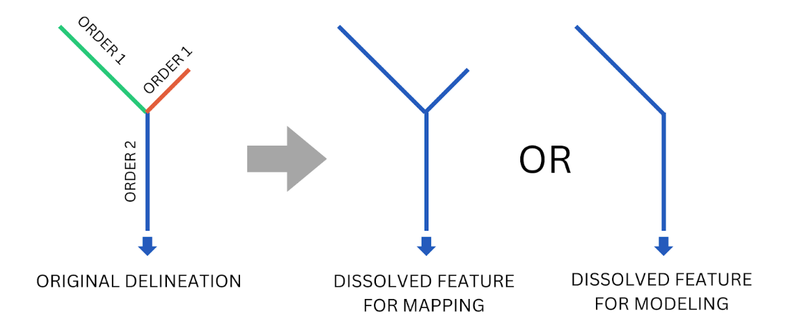
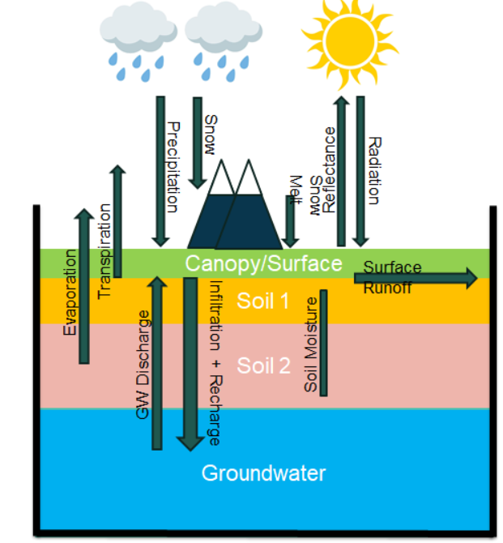

# Model Inputs

The River Forecast System (RFS) depends on three key inputs:

## 1. **Hydrography from TDX-Hydro**  
The river network used by RFS is based on hydrography derived from TDX-Hydro digital elevation data. To prepare this for RFS, the stream network undergoes several modifications and post-processing steps. 

### Modifications to TDX-Hydro

All the modifications we performed on each TDX-Hydro region are recorded in 3 files: 1) processing_options.xlsx, 2) tdx_header_numbers.json, and 3)
terminal_node_vpu_list.csv. The TDX header number JSON file maps every TDX-Hydro region number to a unique 2-digit number, with the first digit being
the first digit of the region number, and the second digit corresponding to the index of the sorted order of all the regions that share the first
digit. The terminal node vpu CSV matches every terminal node (the id associated with the outlet of a watershed) with a VPU number. An overview of these
changes are included here.

The regions that were excluded include those that are farther north and some of the smaller islands, where runoff datasets may not be as accurate and
there is sparser or no population. Future versions may reintroduce these regions. Additionally, we corrected errors found in TDX-Hydro dataset which
were reported to the NGA for correction in future versions. These errors include:

1. Streams that have no length and no upstream/downstream segments, i.e. streams where there are only two points and both points are the same
   location. These, along with any associated catchments, were removed.
2. Streams that have no length with upstream or downstream segments. These were removed along with any associated catchments, and the attributes of
   the upstream and/or downstream segments were modified to refer to each other and preserve the stream network's connectivity.
3. Catchments with a stock identifier of '0' never had an associated stream. These were deleted.

For most, but not all, of the regions, the headwaters streams were dissolved with the downstream segments, up to and including the downstream
segment with a Strahler stream order of either 2 or 3. It was decided that regions that were largely coastal (Japan, Carribean islands, Indonesia)
were more sensitive to changes in their stream networks, and so these regions did not have their headwaters modified. Other areas, such as the
Saharan desert, were delineated to the same resolution as the rest of the world -- often too much resolution. In these areas, more features could
be merged without significantly altering the river routing. Thus, the headwaters and downstream streams were dissolved into one feature along with
their associated catchments, and relevant attributes such as length and slope were recomputed. The stream order to which the headwaters would be
dissolved was also chosen based on these considerations.

Small watersheds up to 200 square kilometers were removed from the TDX-Hydro dataset for all regions. This was done for similar reasons as the
differing headwater stream dissolving. The more coastal regions had watersheds between up to 25 and 75 square kilometers dropped. Other areas, like
the Saharan desert or northern Canada, had watersheds of 200 square kilometers dropped. In these flatter regions, the high resolution of the
delineation creates little "pools" or small collections of streams that do not drain to the ocean and do not represent flowing streams. They often
collectively have an area of less than 200 square kilometers. For the less coastal and flatter/drier regions, bigger watersheds were dropped.

Headwater streams that led directly into a stream with a Strahler stream order of two or greater were dissolved with the immediate downstream segment
for most, but not all, of the regions. The decision to prune these streams are the same as above.

   Discuss streams and reservoir inputs?

## 2. **Retrospective land-surface model (ERA5)**  
Good hydrology models depend on good meteorology, since meteorology drives hydrology. Weather models are largely energy-balance calculations driven by incoming solar radiation, built from 3D grid cells of varying heights.

ECMWF runs a land surface model on this meteorology data to produce additional variables such as runoff—the "left-over" water in hydrology. Each cell is treated like its own bucket, where precipitation, infiltration, evapotranspiration, snowmelt, groundwater discharge, and soil moisture all interact. Runoff is what remains after those processes.

{ width="350" }

For the retrospective (historical) simulation, RFS uses runoff from ERA5, ECMWF's global reanalysis product. Because it reconstructs past conditions from observations, ERA5 provides the long, consistent record RFS uses to build its historical streamflow.

## 3. **Forecast land-surface model (IFS)**  
Forecast runoff comes from ECMWF's Integrated Forecasting System (IFS), which runs the same land-surface bucket calculations forward in time to predict future runoff. Rather than a single forecast, IFS runs as an ensemble—multiple simulations started from slightly different initial conditions to capture the uncertainty in future weather. This produces a range of runoff values instead of one, which RFS routes into a spread of streamflow forecasts that convey the likelihood and possible magnitude of upcoming flows.

This runoff drives the RFS forecasts, giving the near-term streamflow predictions that complement the ERA5-based historical record.

The runoff data from both ERA5 and IFS is converted into streamflow volumes using tools from the [basininflow repository](https://github.com/geoglows/basininflow).

The following table summarizes the core input datasets used by RFS:

| Name                            | DOI                                                                                | Type                            | Producer | License                                                                                                                                                                          |
|---------------------------------|------------------------------------------------------------------------------------|---------------------------------|----------|----------------------------------------------------------------------------------------------------------------------------------------------------------------------------------|
| ERA5                            | [DOI](https://doi.org/10.24381/cds.adbb2d47)                                       | Reanalysis Land Surface Model   | ECMWF    | [Copernicus License](https://cds.climate.copernicus.eu/api/v2/terms/static/licence-to-use-copernicus-products.pdf) - Free for commercial and non-commercial use with attribution |
| TDX-Hydro                       | [Link](https://earth-info.nga.mil/)                                                | River and Catchment Hydrography | NGA      | [TDX-Hydro License](https://earth-info.nga.mil/php/download.php?file=tdx-hydro-license) - Publicly available, provided "as is" without warranty                                  |
| Integrated Forecast System 48R1 | [Link](https://confluence.ecmwf.int/display/FCST/Implementation+of+IFS+Cycle+48r1) | Forecast Land Surface Model     | ECMWF    | Requires Paid License                                                                                                                                 

In addition to the inputs to the actual model, observed data is used in the calibration process. Discuss collection and use of observed data briefly?
