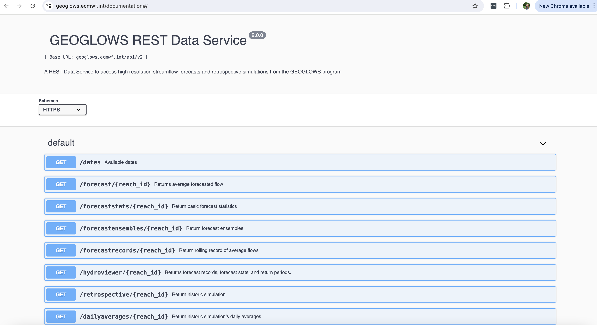
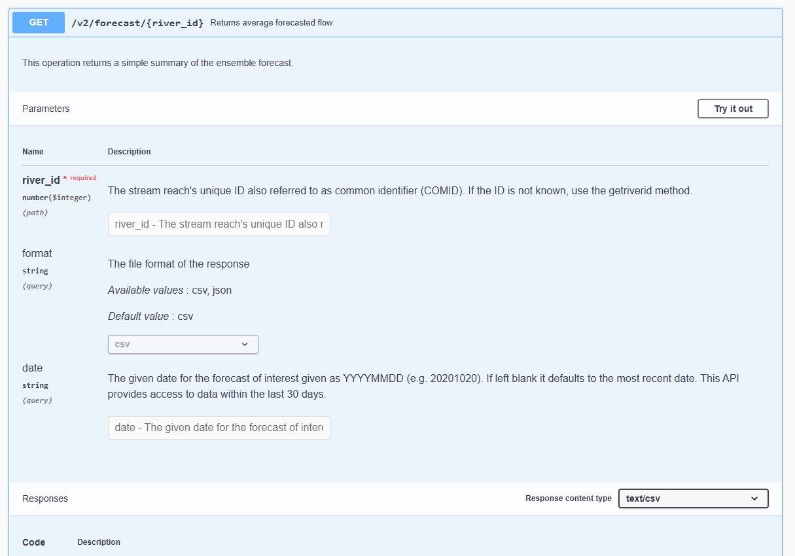
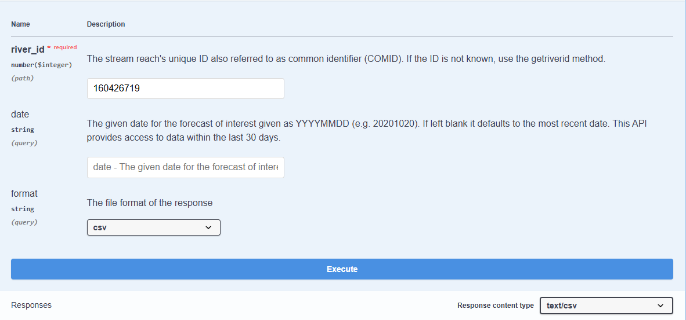
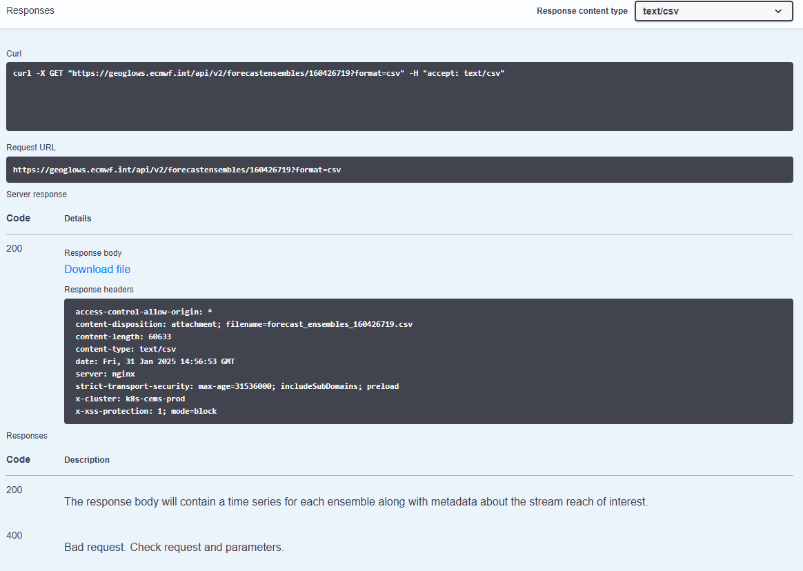

!!! danger "L'API n'est pas nécessaire pour la plupart des utilisateurs"
    La plupart des utilisateurs n'ont pas besoin de ce tutoriel. Tous les produits de prévision et de simulation rétrospective sont disponibles pour des requêtes, des téléchargements en masse et via le service de données. Cependant, les instructions pour interroger les données sont les plus rapides et les plus pratiques (et les moins coûteuses pour GEOGLOWS) pour la plupart des usages.  
    Veuillez suivre le tutoriel sur [interroger les données de rivière](query-data.fr.md) avant de continuer cette section.

Il existe un accès programmatique aux données de débit de RFS via une **API REST**, permettant aux utilisateurs d'intégrer facilement les données hydrologiques mondiales dans leurs applications. Avec cette API, les développeurs et les chercheurs peuvent récupérer des données de débit historiques et prévisionnelles au format **CSV** ou **JSON**, permettant une analyse et une visualisation personnalisées. L'API donne accès à toutes les données rétrospectives et de prévision. Pour plus d'informations, consultez la [Documentation de l'API RFS](https://geoglows.ecmwf.int/documentation).

---

## Utilisation de l'API

Pour utiliser l'API, la plupart des fonctions nécessitent de connaître votre numéro d'identification de rivière. Vous pouvez trouver plus d'informations sur la façon de trouver votre numéro de rivière ici : [Tutoriel sur la recherche des numéros de rivière](find-river-numbers.fr.md). Vous pouvez télécharger les données SIG par VPU via le catalogue de données ou sélectionner un cours d'eau sur l'application web pour obtenir un numéro de rivière.

### Utilisation du site Web de l'API

Pour utiliser le [site Web de l'API](https://geoglows.ecmwf.int/documentation), suivez ces étapes :

**Étape 1 :** Cliquez sur le bouton bleu **“Get”** à côté de la commande qui vous intéresse. Cela ouvre une fenêtre où vous pouvez saisir vos paramètres.

**Étape 2 :** Avant d'entrer des nombres, cliquez sur **“Try it out”** pour activer les champs de saisie. Cela vous permet d'entrer des valeurs et de sélectionner les formats de réponse.

**Étape 3 :** Entrez les informations requises :

- Un **numéro d'identification de rivière à 9 chiffres** (également appelé COMID ou Link Number) dans le champ `river_id`. Ceci est obligatoire.  
- Choisissez `csv` ou `json` dans le menu déroulant sous `format`. La sélection par défaut est `csv`.  
- Pour les **requêtes de données de prévision**, entrez une date au format `YYYYMMDD`. Si laissé vide, la prévision la plus récente sera renvoyée.

**Étape 4 :** Cliquez sur le bouton bleu **“Execute”** en bas de l'écran. Le système traitera votre requête et chargera les données pendant quelques secondes. Une fois terminé, vous recevrez un code de réponse avec une option pour télécharger le fichier.

### Accéder à l'API via Python

Une des façons les plus simples d'accéder à l'API est via Python. Il existe un **package Python GEOGLOWS** (documenté ici : [Documentation de l'API RFS](https://geoglows.readthedocs.io/en/latest/api-documentation.html)) qui contient des commandes pour des analyses de base et pour interroger des types de données spécifiques.

Ce notebook Python fournit des exemples d'utilisation de l'API avec Python, ainsi que l'utilisation du package Python : [Programmatic_Access Colab.ipynb](https://colab.research.google.com/drive/19PiUTU2noCvNGr6r-1i9cv0YMduTxATs?usp=sharing)

L'API peut être utilisée dans des applications nécessitant des données de débit et peut être intégrée directement dans des workflows Python.
