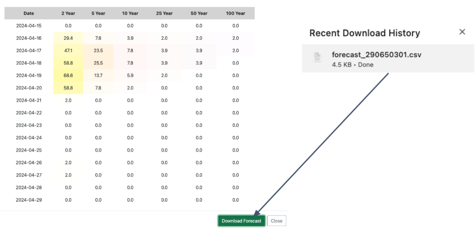
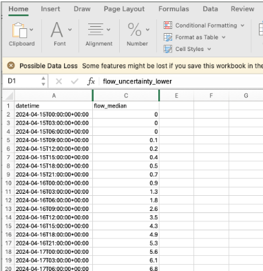
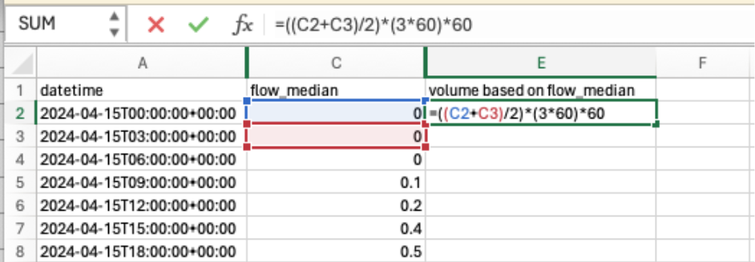
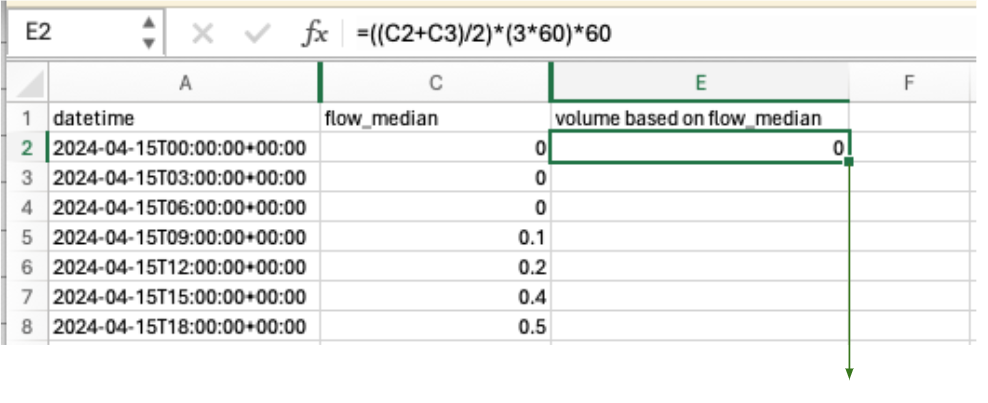

## Overview

One common use of RFS data involves getting the volume of water in the stream. This is useful specifically for reservoir management because a user is able to tell how much water is entering the reservoir over a given period of time and therefore can know what volume of water needs to be released to prevent dam failure.

RFS data is reported at a rate of cubic meters per second. This is reported at a given time interval. For example, for forecasts, this represents the average rate of flow over the 3 hour timestep.

To convert the streamflow value to be a volume in its place you can multiply the rate by the number of seconds over the time period. For 3 hour forecasts, you would multiply each discharge value by 10800 (3 hours × 60 minutes per hour × 60 seconds per minute). This would then give you the total volume over that three hour time period. You can then add the values over time to get the total volume over time.

## Example in Excel

The following provides an example of how volume calculations could be done in Excel.

1. Download your forecast data for your river.

    

2. Open the data in Excel. Delete the extra column so that you only have the `flow_median` column.

    

3. Enter the formula to calculate the volume at each timestep. You get the average discharge and then multiply it by the number of seconds in the time period.

    

4. Copy the formula down to autofill all the values.

    

5. You now have the projected input volume over time. Each number is reported in cubic meters. You can sum this to get the total volume over the 15-day forecast.

## Example in Code

All these calculations can also be performed in a Python notebook. The following script gives an example of these types of calculations.

[VolumeStatistics.ipynb](https://colab.research.google.com/drive/1UmIyMWsbpOcPjFGO0F2YhBbX9nV3dGlm?usp=sharing)
