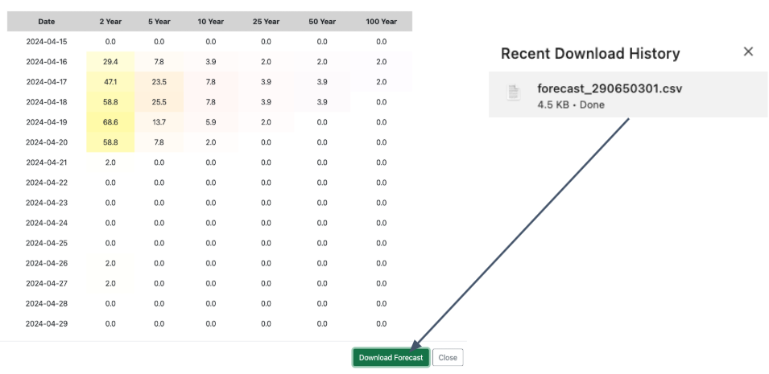
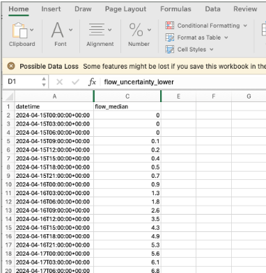
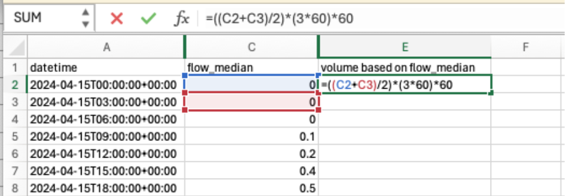
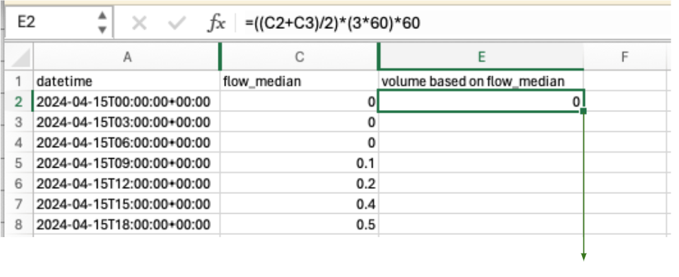

## Aperçu

Une utilisation courante des données du RFS consiste à obtenir le volume d'eau d'un cours d'eau. C'est particulièrement utile pour la gestion des réservoirs, car l'utilisateur peut ainsi savoir quelle quantité d'eau entre dans le réservoir sur une période donnée et donc connaître le volume d'eau à relâcher pour éviter une rupture de barrage.

Les données du RFS sont exprimées sous forme de débit en mètres cubes par seconde. Ce débit est fourni pour un intervalle de temps donné. Par exemple, pour les prévisions, il représente le débit moyen sur le pas de temps de 3 heures.

Pour convertir la valeur de débit en volume, vous pouvez multiplier le débit par le nombre de secondes de la période. Pour les prévisions à pas de 3 heures, il faut multiplier chaque valeur de débit par 10800 (3 heures × 60 minutes par heure × 60 secondes par minute). Vous obtenez ainsi le volume total sur cette période de trois heures. Vous pouvez ensuite additionner les valeurs dans le temps pour obtenir le volume total sur la période.

## Exemple dans Excel

L'exemple suivant montre comment effectuer les calculs de volume dans Excel.

1. Téléchargez les données de prévision de votre rivière.

    

2. Ouvrez les données dans Excel. Supprimez les colonnes supplémentaires afin de ne conserver que la colonne `flow_median`.

    

3. Saisissez la formule pour calculer le volume à chaque pas de temps. Prenez le débit moyen, puis multipliez-le par le nombre de secondes de la période.

    

4. Recopiez la formule vers le bas pour remplir automatiquement toutes les valeurs.

    

5. Vous disposez maintenant du volume entrant prévu au fil du temps. Chaque nombre est exprimé en mètres cubes. Vous pouvez en faire la somme pour obtenir le volume total sur la prévision à 15 jours.

## Exemple en Code

Tous ces calculs peuvent également être effectués dans un notebook Python. Le script suivant donne un exemple de ce type de calculs.

[VolumeStatistics.ipynb](https://colab.research.google.com/drive/1UmIyMWsbpOcPjFGO0F2YhBbX9nV3dGlm?usp=sharing)
