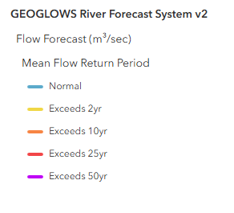
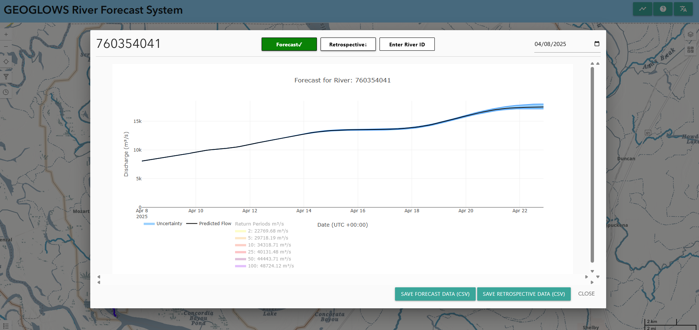
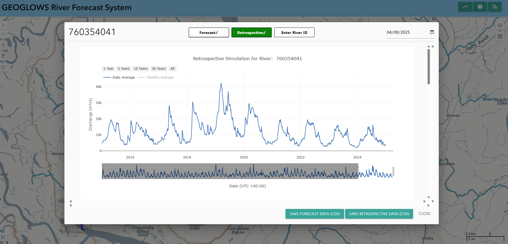
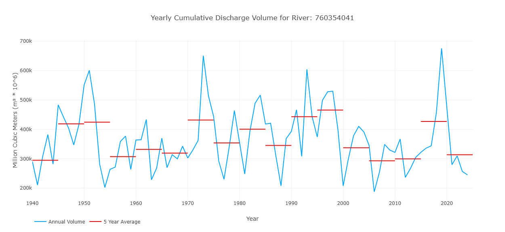
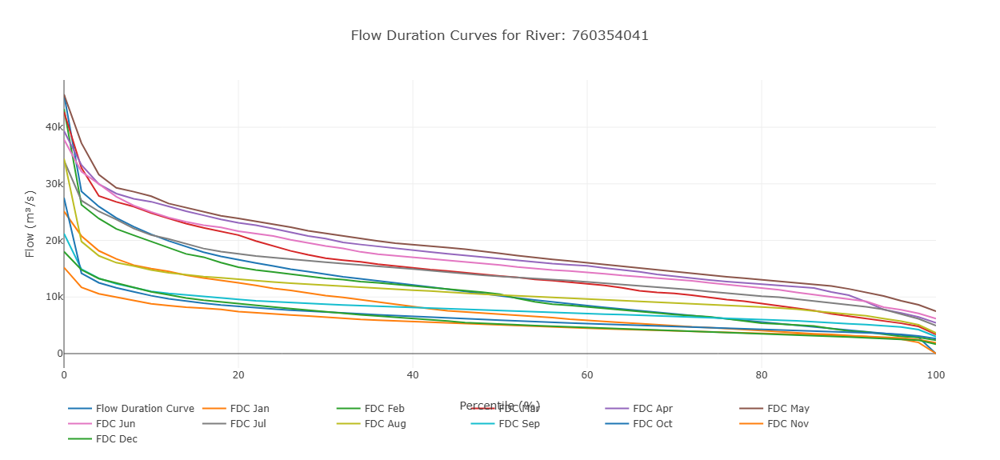

# Usando el RFS Hydroviewer

El RFS Hydroviewer es una herramienta para visualizar y acceder a pronósticos de flujo de ríos y datos históricos a nivel mundial. Esta aplicación basada en la web permite a los usuarios explorar las condiciones de flujo en tiempo real, analizar las tendencias de pronósticos y revisar simulaciones hidrológicas para cualquier río, ayudando a los tomadores de decisiones e investigadores a comprender mejor los desafíos relacionados con el agua. Con herramientas de visualización fáciles de usar, los usuarios pueden evaluar los valores de descarga e identificar posibles riesgos de inundaciones o sequías. El HydroViewer apoya la toma de decisiones informadas en la gestión de recursos hídricos, la reducción de riesgos de desastres y la planificación de la resiliencia climática. Accede a la aplicación en [RFS Hydroviewer](https://hydroviewer.geoglows.org/es/).

## Visualización de Flujos

El Hydroviewer resalta los ríos donde se espera que los flujos superen los periodos de retorno, usando la siguiente leyenda codificada por colores:

Esto permite a los usuarios identificar rápidamente los ríos que están experimentando flujos altos.

**Características del Mapa:**

1. **Niveles de Zoom**:
    - A nivel global, solo se muestran los ríos más grandes.
    - A medida que los usuarios hacen zoom, más ríos se vuelven visibles dentro de su área de interés.
2. **Selección Interactiva de Ríos**:
    - Hacer clic en un río muestra datos retrospectivos y de pronóstico para ese río.
    - El ID del río se muestra para referencia fácil.
3. **Ingreso Directo del ID del Río**:
    - Si se conoce el ID del río, los usuarios pueden ingresarlo directamente en la aplicación para ver los datos.

Los usuarios pueden descargar **gráficos** y archivos **.csv** para los ríos de su interés.

# Selección de Datos

A nivel global, solo se muestran los ríos más grandes. Más ríos se vuelven visibles a medida que el usuario hace zoom en el mapa y en su área de interés. Si no eres lo suficientemente preciso al hacer clic, aparecerá una advertencia pidiéndote que hagas más zoom y seas más preciso al hacer clic en el segmento del río.

## Datos Retrospectivos

Una vez que hayas seleccionado los cauces, aparecerá una ventana emergente con el nombre del río, su ID y los datos de pronóstico acompañados de un gráfico. Puedes encontrar más información sobre este gráfico en [Datos de Pronóstico](../datasets/forecast.md).

Se pueden descargar los gráficos y archivos `.csv` de los cauces de interés seleccionando el ícono de la cámara en la esquina del gráfico.

## Datos de Pronósticos Anteriores

Por defecto, al hacer clic en un cauce se mostrará el pronóstico a 15 días desde el día actual. Sin embargo, si lo deseas, puedes ver un pronóstico de un día anterior seleccionando una fecha en el menú desplegable de fechas.

## Datos Retrospectivos

Puedes ver los datos retrospectivos cambiando a la vista retrospectiva en la parte superior de la ventana emergente. El ícono azul resaltado indica si estás viendo los datos de pronóstico o los retrospectivos. Por defecto, se muestran 10 años de datos retrospectivos, pero esto se puede ajustar usando los controles deslizantes grises en la parte inferior. Todo el conjunto de datos retrospectivos, que se remonta hasta 1940, está disponible de esta manera.

Hay varios otros gráficos con información sobre los datos retrospectivos que puedes consultar al desplazarte hacia abajo en la ventana emergente. Todos estos datos se basan en los valores del conjunto retrospectivo y son resultados de cálculos realizados con esos datos.

### Descarga Anual Acumulada

Este gráfico muestra un valor por cada año de la simulación retrospectiva, representando el volumen total de descarga durante ese año para ese cauce. Esto se representa con la línea azul en el gráfico. Las líneas rojas muestran los promedios móviles de 5 años del volumen, lo que permite observar cómo puede estar cambiando el volumen del cauce con el tiempo.

### Gráfico del Régimen de Caudal

Este gráfico muestra el rango de condiciones de caudal —muy seco, seco, normal, húmedo y muy húmedo— a lo largo del año. Se basa en métodos desarrollados por la OMM para su iniciativa HydroSOS. Los rangos de categoría se calculan usando promedios históricos mensuales. Los valores de cada mes se ordenan por separado y se les asigna un percentil. Estos percentiles se utilizan para definir los umbrales de cada categoría.

Los colores en el gráfico representan estas categorías para cada mes. Los usuarios pueden seleccionar los años que desean visualizar, siendo el año más reciente el que se muestra por defecto. Los promedios mensuales de los años seleccionados se trazan sobre los colores de fondo, lo que permite comparar visualmente el caudal actual o pasado con los valores históricos.

Este gráfico ayuda a los usuarios a entender cómo los valores del caudal en un año determinado se comparan con lo considerado normal, y si las condiciones fueron más húmedas o más secas de lo habitual en cada mes.

### Curvas de Duración de Caudal

Este gráfico muestra el caudal en el eje y y la probabilidad de excedencia en el eje x. Cada punto representa un valor mensual de caudal, indicando con qué frecuencia se supera ese nivel de caudal. Además de los valores mensuales individuales, el gráfico incluye una curva de duración de caudal general basada en todo el conjunto de datos. Esto permite a los usuarios comparar los patrones de caudal mensuales con la distribución de caudales a largo plazo.

## Ingresar un ID de Río

Si un usuario ya conoce el ID del río para su río de interés, puede ingresarlo directamente en la aplicación para ver los datos.

1. Abre la ventana emergente del gráfico ya sea seleccionando el ícono del gráfico en la esquina superior derecha o abriéndola desde una selección anterior de río.
2. Haz clic en **“Ingresar ID de Río”** en la parte superior de la ventana emergente.
3. Escribe cualquier ID de río (por ejemplo, este ID de alcance es para el río Magdalena en Colombia: `610363879`) y haz clic en **“OK”**.
4. Los datos de pronóstico y retrospectivos se recargarán y se mostrarán para el nuevo río en la ventana emergente.

## Filtrar Datos

Los datos también se pueden filtrar:

- Haz clic en el botón de **filtro** en el lado izquierdo para mostrar las opciones de filtrado.
- Allí, encontrarás opciones para filtrar basadas en:
    - País del río
    - Número de VPU
    - País de salida del río

Esto solo mostrará los ríos que cumplan con estos criterios en el mapa.

