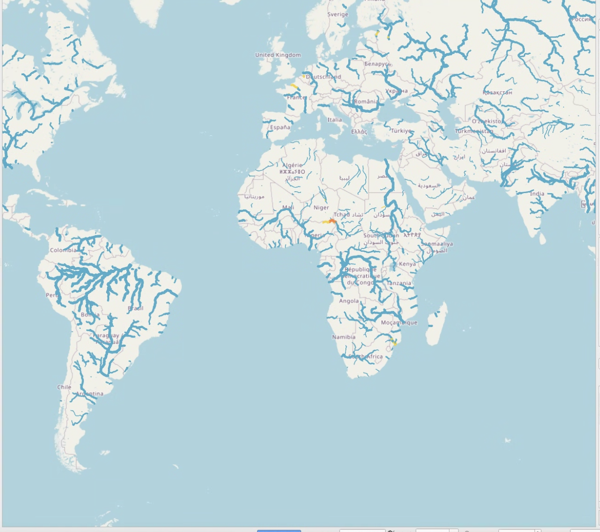
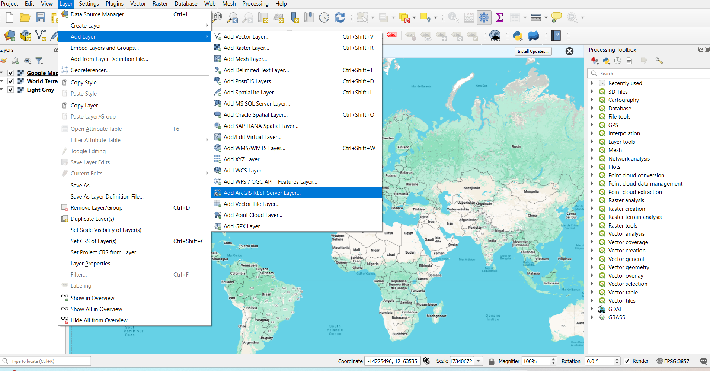

## Living Atlas Layer

RFS results are best explored using a web map available for free through the **ArcGIS Living Atlas of the World**. You do not need to have an ArcGIS 
license to use this layer. You can visualize and interact with the layer in ArcGIS, QGIS, JavaScript apps, and most ways you typically consume GIS data.

You can add it to web maps as a web layer without needing to download the additional data or stream network. If you are trying to download the hydrofabric, there are instructions about that in the [available data](../../datasets/catalog) section.

The layer is considered "time-enabled" meaning that it has attribute data describing each river segment over the first 10 of each daily forecast. Using that 
information, the streams are animated to change color and size depending on how much water is predicted to be in the river and if that value is above a 
return period level.

Some things that a user can do with this layer:

- Forecast data can be viewed sequentially over time because of the slider incorporated in the app. A user can look at the streams in 3-hour windows.
  The color of the streams will change if the stream experiences high flow during this time.
- Features can be identified by clicking on the map. Preconfigured pop-ups show community sourced river names from OpenStreetMap.

[More information](https://www.arcgis.com/home/item.html?id=8f0573e0c0b9491dbeafde9c72ccf02b) about the web map layer can be is on the ArcGIS website. Information about loading Living Atlas Layers into ArcGIS can be found [here](https://enterprise.arcgis.com/en/portal/10.5/use/add-living-atlas-layers.htm).

To load this map into QGIS do the following:

**Step 1:** At the bottom of the Esri map layer information page on the right-hand side is the URL link to access the map layer:  
https://livefeeds3.arcgis.com/arcgis/rest/services/GEOGLOWS/GlobalWaterModel_Medium/MapServer  
Copy this link to your clipboard.

**Step 2:** In your GIS software, go to *Layer* → *Add Layer* → *Add ArcGIS REST Service Layer*.

**Step 3:** Click to add a new REST service layer. Enter a name for the layer and paste the copied URL into the window.

The layer can also be used in [Esri Instant Apps](https://www.esri.com/en-us/arcgis/products/arcgis-instant-apps/overview). 