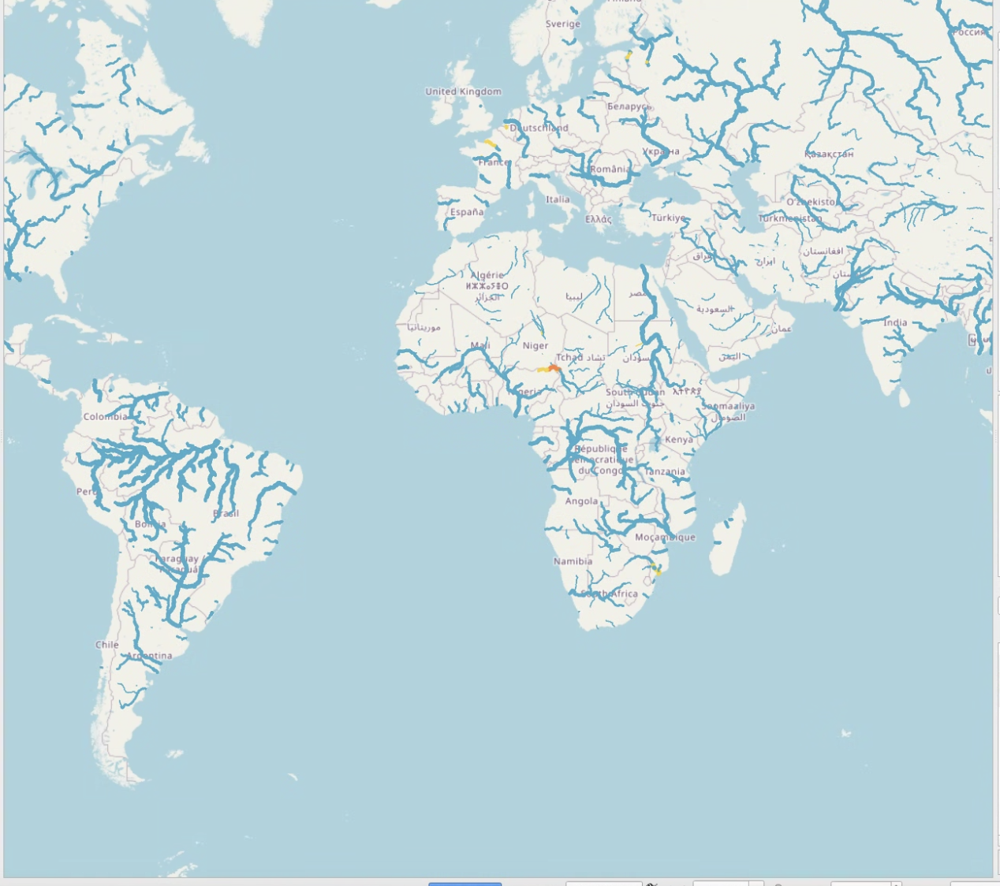
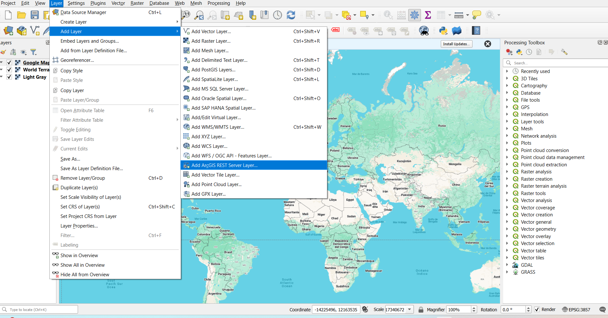

## Capa de Living Atlas

La mejor manera de explorar los resultados de RFS es mediante un mapa web disponible de forma gratuita a través del **ArcGIS Living Atlas of the World**. No necesita una licencia de ArcGIS
para usar esta capa. Puede visualizar e interactuar con la capa en ArcGIS, QGIS, aplicaciones de JavaScript y la mayoría de las formas en que normalmente utiliza datos SIG.

Puede añadirla a mapas web como una capa web sin necesidad de descargar los datos adicionales ni la red de ríos. Si desea descargar el *hydrofabric* u otros datos, puede encontrarlos en el [almacén de datos de RFS](https://apps.geoglows.org/previews/rfs-data-store/datasets/v3).

La capa es "temporal" (time-enabled), lo que significa que tiene datos de atributos que describen cada segmento de río durante los primeros 10 días de cada pronóstico diario. Con esa
información, los ríos se animan para cambiar de color y tamaño según cuánta agua se prevé que haya en el río y si ese valor supera el nivel de un
período de retorno.

Algunas cosas que un usuario puede hacer con esta capa:

- Los datos de pronóstico se pueden ver secuencialmente a lo largo del tiempo gracias al control deslizante incorporado en la aplicación. Un usuario puede observar los ríos en ventanas de 3 horas.
  El color de los ríos cambiará si el río experimenta un caudal alto durante ese tiempo.
- Los elementos se pueden identificar haciendo clic en el mapa. Las ventanas emergentes preconfiguradas muestran nombres de ríos aportados por la comunidad de OpenStreetMap.

En el sitio web de ArcGIS hay [más información](https://www.arcgis.com/home/item.html?id=8f0573e0c0b9491dbeafde9c72ccf02b) sobre la capa del mapa web. La información sobre cómo cargar capas de Living Atlas en ArcGIS se encuentra [aquí](https://enterprise.arcgis.com/en/portal/10.5/use/add-living-atlas-layers.htm).

Para cargar este mapa en QGIS, haga lo siguiente:

**Paso 1:** En la parte inferior de la página de información de la capa del mapa de Esri, en el lado derecho, se encuentra el enlace URL para acceder a la capa del mapa:  
https://livefeeds3.arcgis.com/arcgis/rest/services/GEOGLOWS/GlobalWaterModel_Medium/MapServer  
Copie este enlace en su portapapeles.

**Paso 2:** En su software SIG, vaya a *Capa* → *Añadir capa* → *Añadir capa de servicio ArcGIS REST*.

**Paso 3:** Haga clic para añadir una nueva capa de servicio REST. Introduzca un nombre para la capa y pegue la URL copiada en la ventana.

La capa también se puede utilizar en [Esri Instant Apps](https://www.esri.com/en-us/arcgis/products/arcgis-instant-apps/overview).
