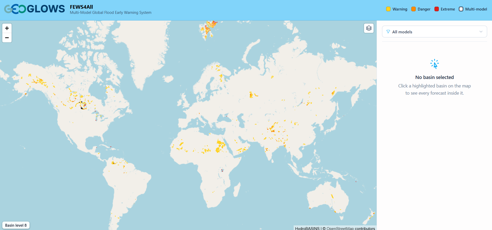
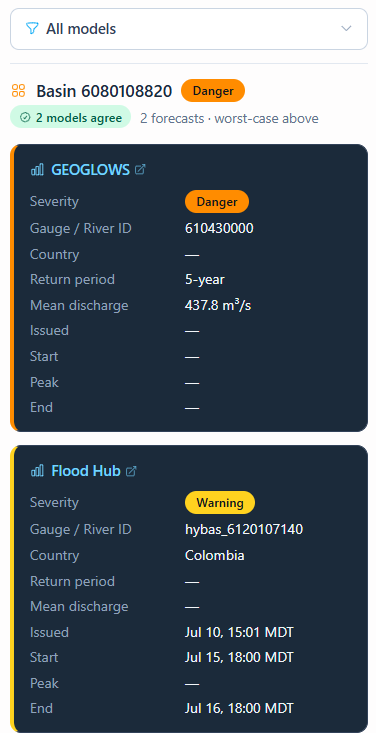
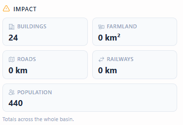

# Application FEWS

Cette application web est conçue pour afficher rapidement des alertes aux inondations. Elle utilise les données du modèle RFS ainsi que celles du [Flood Hub de Google](https://sites.research.google/floods/l/0/0/3) pour afficher les bassins qui présentent un risque élevé d'inondation. Les endroits les plus exposés au risque d'inondation sont mis en évidence sur la carte.

Les bassins peuvent être sélectionnés ; un panneau latéral s'ouvre alors pour indiquer quel(s) modèle(s) estime(nt) qu'il existe un risque d'inondation, ainsi que le niveau de risque d'inondation indiqué par ce modèle.

La carte de chaque modèle indique l'identifiant de la rivière ou de la station de mesure utilisé, ainsi que les détails de la prévision. Sous ces informations figurent des données sur la population totale et les infrastructures de ce bassin. Cela permet de mettre en contexte les impacts que l'inondation pourrait avoir.

