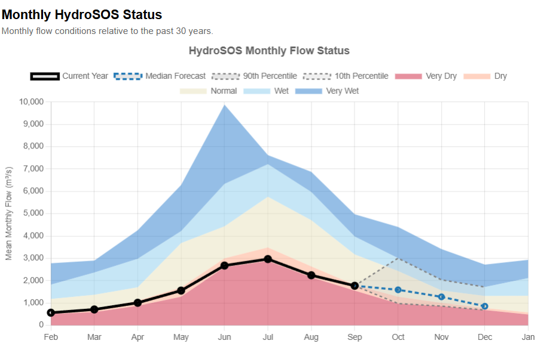
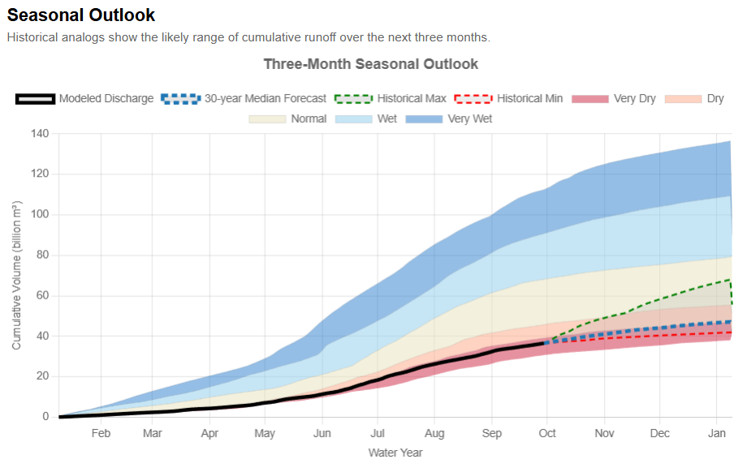
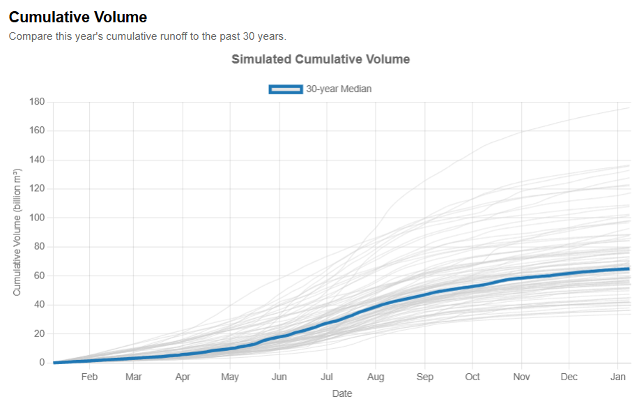
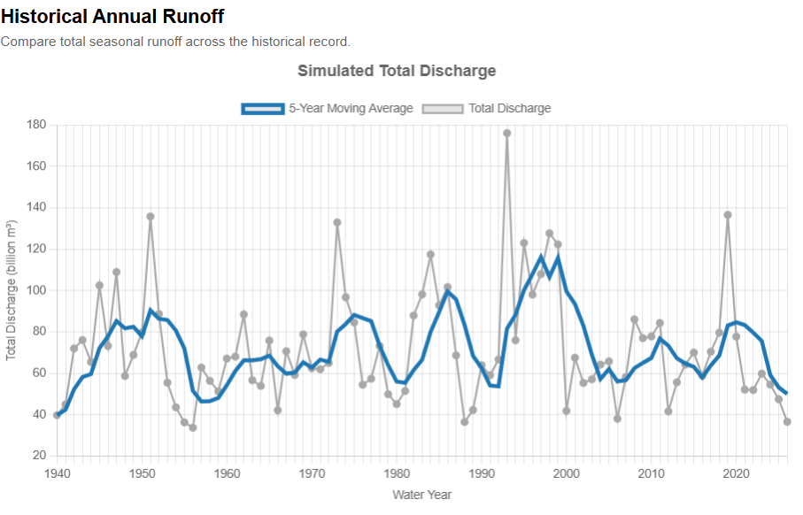

# Application HydroSOS

## Aperçu et Objectifs

Cette application vise à fournir une visualisation des conditions hydrologiques actuelles dans le monde entier, ainsi que des conditions futures possibles pour chaque rivière.

Des données fiables sur l'eau sont essentielles pour informer les décideurs sur les conditions hydrologiques actuelles afin qu'ils puissent prendre les mesures nécessaires à la gestion de leurs ressources en eau.
Disposer d'informations précises et fiables sur les conditions hydrologiques locales, qu'il s'agisse de l'état actuel ou des perspectives prévues, est indispensable pour orienter les choix de gestion en matière d'approvisionnement en eau, d'hydroélectricité et d'exploitation des réservoirs. En s'appuyant à la fois sur les données historiques et sur les prévisions des modèles, les outils d'état et de perspectives présentent les tendances actuelles et attendues dans leur contexte historique. Ces produits combinent des indicateurs clés avec des cartes et des graphiques interactifs, aidant les gestionnaires à comparer rapidement les régimes hydrologiques actuels et futurs aux références normales afin de soutenir une prise de décision efficace.

HydroSOS (Hydrologic Status and Outlook, ou État et Perspectives Hydrologiques) est une initiative créée par l'OMM (Organisation Météorologique Mondiale) qui propose une méthode standard pour comparer les conditions actuelles et prévues à la moyenne historique pour la même période de l'année. Ses méthodes s'appliquent à plusieurs variables hydrologiques, mais pour les contributions du RFS, nous nous concentrons sur le débit, car c'est la variable fournie par le RFS. Pour en savoir plus, consultez les pages de l'OMM : [https://wmo.int/activities/hydrosos/global-hydrological-status-and-outlook-system-hydrosos](https://wmo.int/activities/hydrosos/global-hydrological-status-and-outlook-system-hydrosos) et [https://wmohydrosos.ceh.ac.uk/](https://wmohydrosos.ceh.ac.uk/). L'OMM a également créé un [portail HydroSOS](https://wmohydrosos.ceh.ac.uk/portal/) conçu pour afficher HydroSOS à partir d'informations provenant de plusieurs sources différentes. Le RFS fournit des données de débit à ce portail, et ces mêmes informations sont affichées dans cette application.

## Comment Utiliser l'Application

### Vue Mondiale

Explorez la carte mondiale pour voir l'état hydrologique actuel des bassins fluviaux. Chaque bassin est coloré en fonction de sa catégorie HydroSOS pour le mois affiché dans le coin supérieur droit. Vous pouvez sélectionner le bouton calendrier pour afficher un autre mois.

### Sélectionner un Bassin

Vous pouvez sélectionner un bassin soit en cliquant directement dessus dans l'application, soit en le recherchant dans la barre de recherche. Pour rechercher un bassin, vous pouvez utiliser le nom du bassin (ex. : Mississippi) ou son identifiant HydroBASINS pour un bassin fluvial de niveau 4. Une fois le bassin sélectionné, un temps de chargement peut être nécessaire, puis un panneau latéral affiche des graphiques et des informations sur ce bassin.

### Interpréter les Graphiques

En haut du panneau latéral, vous verrez le nom du bassin, son état et quelques informations de base à son sujet.

Vous verrez ensuite un graphique de l'état HydroSOS mensuel. Les bandes colorées indiquent les plages de chacune des catégories HydroSOS. La ligne noire montre ensuite les moyennes mensuelles de l'année en cours, indiquant dans quelles catégories se situait le débit tout au long de l'année. Vient ensuite une prévision de ce à quoi pourraient ressembler les prochains mois, avec une plage de possibilités.

Le graphique suivant présente le débit sous forme de volume cumulé tout au long de l'année. Les catégories HydroSOS et les valeurs de débit du RFS sont toutes deux converties en volumes. Les volumes historiques sont ensuite utilisés pour prévoir ce que pourrait être le volume total dans trois mois, d'après les volumes observés au cours de ces mêmes mois dans le passé.

Le graphique suivant affiche le volume cumulé de la rivière. Chaque ligne grise représente une année différente. La ligne bleue représente l'année médiane.

Le dernier graphique présente l'écoulement historique. Il affiche le volume annuel total de chaque année (en gris), puis le compare à une moyenne mobile sur 5 ans.

## Comprendre l'État des Bassins

Les couleurs des bassins représentent le percentile de l'écoulement cumulé actuel par rapport à la période de référence historique. Elles sont obtenues en classant les moyennes mensuelles. Chaque mois n'est comparé qu'à lui-même : janvier est comparé à janvier, février à février, etc. Les mois sont ensuite étiquetés selon le percentile dans lequel ils se situent.

| État        | Plage de percentiles            |
|-------------|---------------------------------|
| Très sec    | En dessous du 10ᵉ percentile    |
| Sec         | Du 10ᵉ au 30ᵉ percentile        |
| Normal      | Du 30ᵉ au 70ᵉ percentile        |
| Humide      | Du 70ᵉ au 90ᵉ percentile        |
| Très humide | Au-dessus du 90ᵉ percentile     |

## Limites des Bassins

L'application utilise HydroBASINS de niveau 4 pour définir les limites des bassins fluviaux et associer les informations hydrologiques à chaque bassin. Chaque bassin est identifié par un identifiant HydroBASINS unique. Le cours d'eau RFS situé à l'exutoire de chaque bassin a été identifié et sélectionné pour représenter les conditions de débit de ce bassin. Les valeurs de débit de ce cours d'eau ont été utilisées pour colorer l'ensemble du bassin. Si le bassin n'était pas bien représenté par un seul cours d'eau, il a été laissé vide.

## Données Corrigées du Biais

Cette application web offre la possibilité d'utiliser des données hydrologiques corrigées du biais à l'échelle mondiale. Cette option charge les données du RFS corrigées du biais à l'échelle mondiale à l'aide de la méthode SABER. Veuillez consulter la [section avancée](../advanced/bias-correction/saber-method.md) pour en savoir plus sur ce dont il s'agit et sur la manière de l'utiliser. Le classement de chaque bassin ne change pas, mais les valeurs absolues changent. Par conséquent, la carte affichée ne change pas lorsque cette option est activée, mais les valeurs des graphiques de chaque bassin changent. Comme les données corrigées du biais sont récupérées séparément, l'activation de cette option peut augmenter le temps de chargement.
