# Uso del RFS Hydroviewer

## Resumen
El [RFS Hydroviewer](https://apps.geoglows.org/rfs) es una herramienta web para visualizar y acceder a pronósticos de caudal y datos históricos a nivel mundial. Permite a los usuarios:

- Explorar las condiciones de caudal en tiempo real  
- Analizar tendencias de pronóstico  
- Revisar simulaciones hidrológicas de cualquier río  

El Hydroviewer apoya la toma de decisiones informadas en la gestión de recursos hídricos, la reducción del riesgo de desastres y la planificación de la resiliencia climática. Los usuarios pueden evaluar los valores de caudal e identificar riesgos potenciales de inundación o sequía.

El Hydroviewer cumple dos propósitos principales:

- Visualización de datos de caudal  
- Graficación y obtención de datos  

La interfaz está disponible en inglés y español. Si el visor se deja en inglés, se pueden usar herramientas de traducción automática, aunque las traducciones no están garantizadas.

Para más información, vea el [webinario](../../webinars/rfs-v2-webinar-4.md)
 sobre el Hydroviewer.

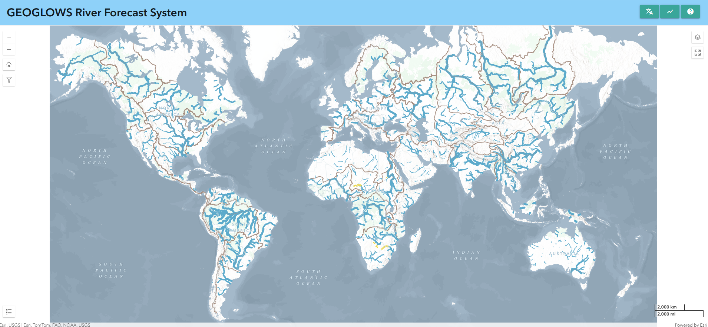

## Mapa

La primera función principal de la aplicación es mostrar mapas que ayudan a los usuarios a explorar y comprender los últimos resultados de pronóstico de RFS. Este es un mapa a múltiples escalas, donde la cantidad de ríos visibles cambia al acercar o alejar el zoom. Hay dos puntos de corte, para un total de tres vistas. Los ríos se basan en los conjuntos de datos TDX-Hydro usados en RFS, redondeados al metro más cercano de precisión, lo que proporciona una copia de resolución casi perfecta de los datos originales.

### Estilo de los ríos

Esto permite a los usuarios identificar rápidamente los ríos con caudales altos.

- Color: Representa el período de retorno estimado excedido en un paso de tiempo dado. Esto ayuda a identificar rápidamente los ríos con caudales altos.

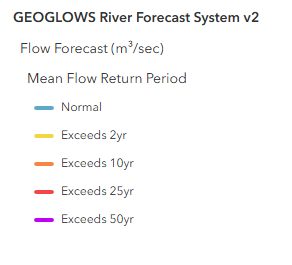

- Grosor: Indica la cantidad de agua prevista en el río. Use el grosor como guía del tamaño relativo, pero consulte los gráficos para obtener valores precisos.

Al hacer clic en cualquier río se muestra su ID de río y se abre una ventana emergente con gráficos detallados.

### Capas adicionales

Hay varias capas adicionales que proporcionan información extra. Algunas de ellas son:

1. Mapa base ambiental: Este es un producto relativamente nuevo de Esri que combina varios mapas base y tecnologías impresionantes. La capa y el estilo de RFS fueron uno de los muchos aspectos considerados en el diseño del mapa ambiental, por lo que debería ofrecer una vista útil a muchos niveles. Hay líneas marrones que trazan los límites de HydroBASINS como referencia útil para identificar qué cuenca principal se está viendo al alejar el zoom. También se muestran algunos nombres de ríos en el mapa base.

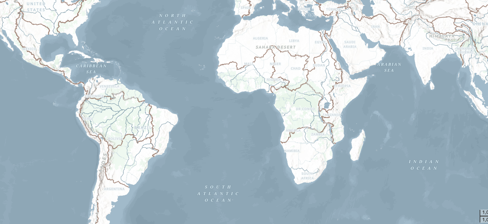

2. Capas HydroSOS de la OMM: Muchos usuarios de RFS participan en actividades de la OMM, como HydroSOS. El programa HydroSOS está en evolución, por lo que no es un producto finalizado. Sin embargo, puede activar la capa y usar el deslizador de tiempo para seleccionar un mes de los últimos 35 años que desee ver. Hay colores rojo oscuro, rojo claro, amarillo neutro, azul claro y azul oscuro que indican si la cuenca estaba seca, normal o húmeda en relación con la cantidad normal durante el período 1990-2019.

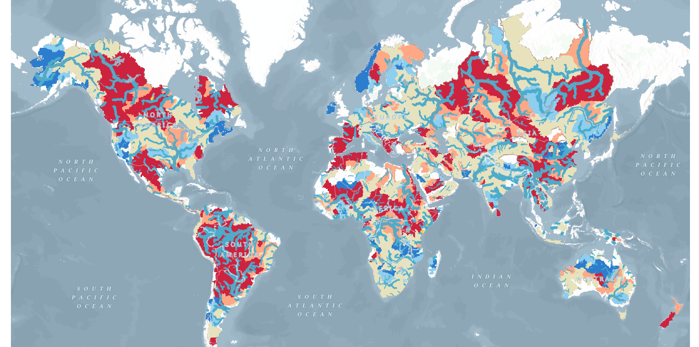

### Filtrado de datos

Los datos también se pueden filtrar haciendo clic en el botón de filtro en el lado izquierdo. Allí encontrará opciones para filtrar según:

- País del río  
- Número de VPU  
- País de salida del río  

Esto mostrará en el mapa únicamente los ríos que cumplan con estos criterios.

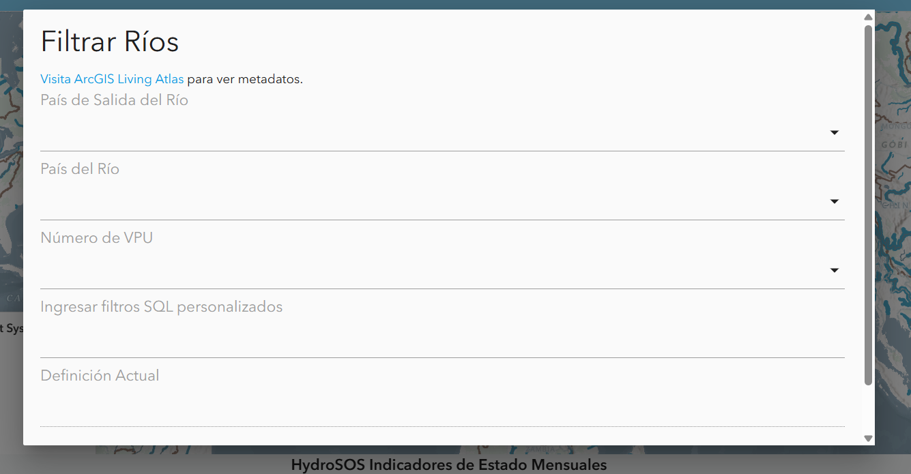

# Gráficos y Tablas

Además del mapa, el Hydroviewer también proporciona información sobre ríos específicos. Esto cumple el segundo propósito del Hydroviewer como herramienta de obtención de datos. Al seleccionar ríos, los usuarios pueden descargar archivos .csv con datos del río y ver gráficos con información sobre el mismo.

## Acceso a gráficos

Los ríos se pueden seleccionar:

- Haciendo clic en un río en el mapa  
- Ingresando directamente un ID de río  

Para ingresar un ID de río:

1. Abra la ventana emergente de gráficos seleccionando el ícono de gráfico en la esquina superior derecha o desde un río previamente seleccionado.  
2. Haga clic en “Seleccione un río” en la parte superior de la ventana emergente.  
3. Escriba el ID del río (por ejemplo, río Magdalena en Colombia: 610363879) y haga clic en “OK”.  

La ventana emergente mostrará gráficos de pronóstico y retrospectivos. Los datos se pueden descargar mediante el ícono de cámara en la esquina superior derecha de cada gráfico.

## Gráficos de pronóstico

Por defecto, al hacer clic en un río se mostrará el pronóstico a 15 días desde el día actual. Sin embargo, si lo desea, puede ver un pronóstico de un día anterior eligiendo una fecha en la parte superior. 

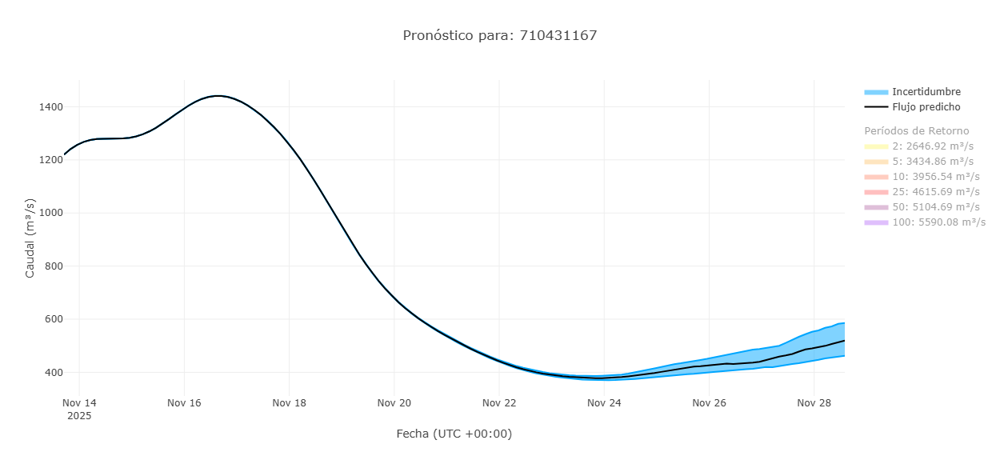

Aquí se muestra un ejemplo de gráfico de pronóstico. Por defecto, los períodos de retorno están desactivados, pero al hacer clic sobre ellos se pueden mostrar en el gráfico. Encontrará más información sobre cómo interpretar este gráfico en la sección [Datos de Pronóstico](../what-is-it/available-data.md#datos-de-pronostico-de-15-dias) de esta capacitación.

También hay una tabla que muestra el porcentaje de miembros del ensamble que exceden cada período de retorno en cada día. Esto ayuda a mostrar la probabilidad de que se exceda un determinado período de retorno.

## Gráficos retrospectivos

Puede ver los datos retrospectivos cambiando a la vista retrospectiva en la parte superior de la ventana emergente. El ícono azul resaltado indica si está viendo los datos de pronóstico o los retrospectivos. Por defecto, verá 10 años de datos retrospectivos, pero esto se puede ajustar usando los deslizadores grises en la parte inferior. De esta manera se puede acceder al conjunto completo de datos retrospectivos, que se remonta a 1940.

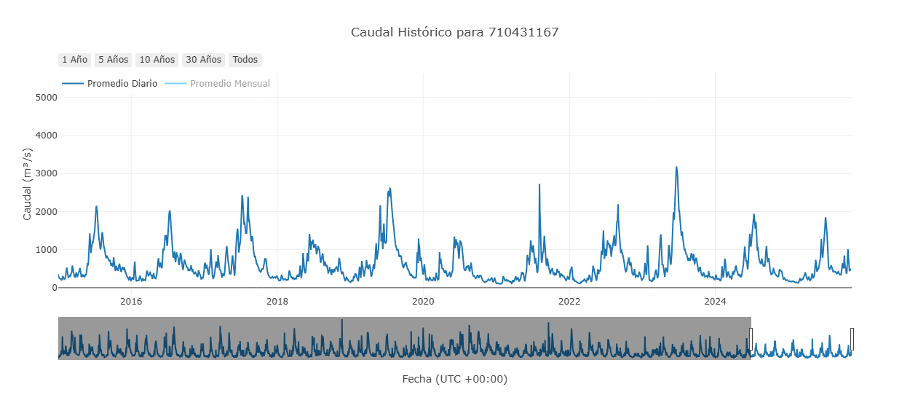

Este es el gráfico retrospectivo principal, pero existen otros gráficos derivados de estos datos retrospectivos. Están diseñados para ayudar a interpretar y analizar los datos. Representan interpretaciones de los datos retrospectivos, pero no son exhaustivos. No todos los gráficos serán útiles en todos los casos de uso. Los gráficos disponibles evolucionan según la investigación actual.

### Caudal acumulado anual

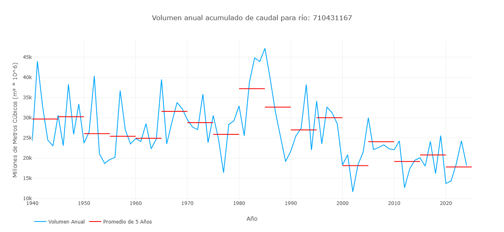

Este gráfico muestra un valor por cada año de la simulación retrospectiva, que representa el volumen total de caudal de ese año para ese río. Esto se representa con la línea azul del gráfico. Las líneas rojas muestran promedios de 5 años del volumen para representar cómo puede estar cambiando el volumen del río a lo largo del tiempo.

### Volumen acumulado por año

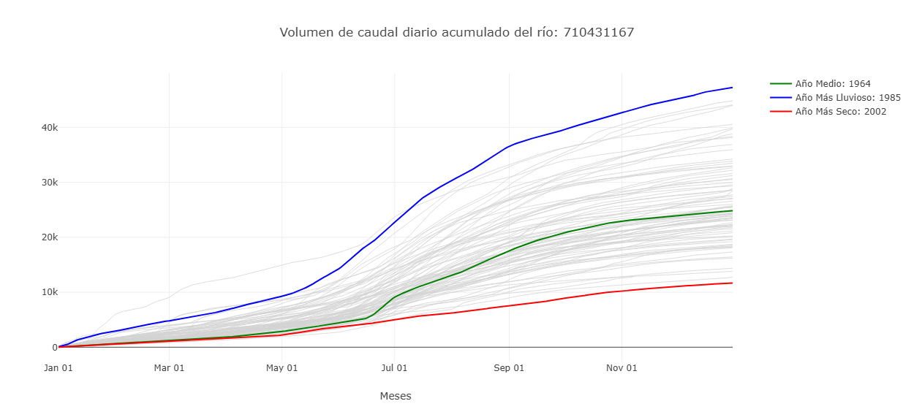

Este gráfico muestra el volumen acumulado en millones de metros cúbicos a lo largo del año. Se etiquetan los años más húmedos y más secos para dar una idea del rango de valores observados en el pasado. Al pasar el cursor sobre una línea en el Hydroviewer, se indica el año específico de cada línea. Este gráfico también muestra cuándo el volumen de agua aumenta más rápidamente, lo que representa un mayor caudal.

### Caudal promedio mensual con categorías HydroSOS

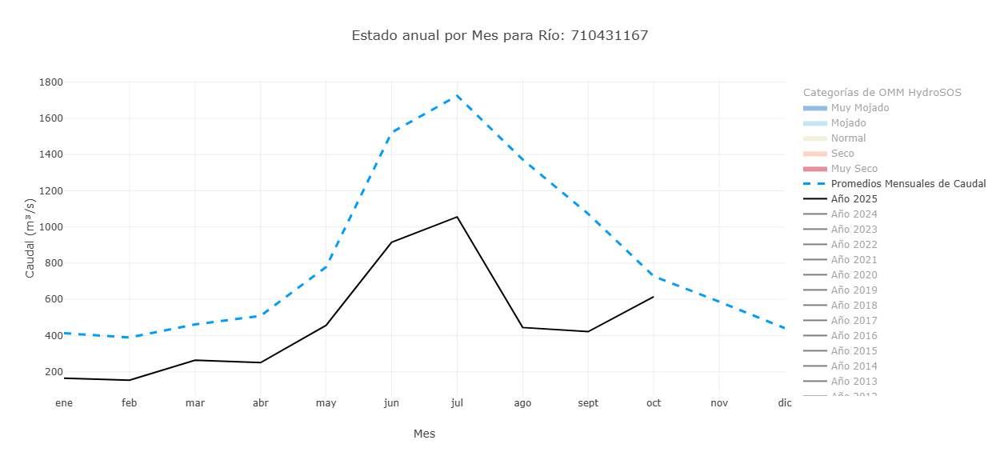

Este gráfico tiene características que se pueden activar o desactivar para resaltar diferentes aspectos.
La vista predeterminada muestra los caudales promedio mensuales de todo el período de registro (la línea azul punteada) y los promedios mensuales del año en curso (la línea negra). Se pueden activar y desactivar años adicionales para ver cómo se comparan sus promedios mensuales.
Además, los niveles de HydroSOS se pueden activar o desactivar para mostrar el rango de condiciones de caudal (muy seco, seco, normal, húmedo y muy húmedo) a lo largo del año. Se basa en métodos desarrollados por la OMM para su iniciativa HydroSOS. Los rangos de las categorías se calculan usando promedios mensuales históricos. Los valores de cada mes se clasifican por separado y se les asigna un percentil. Luego, estos percentiles se usan para definir los umbrales de cada categoría.
Este gráfico ayuda a los usuarios a entender cómo se comparan los valores de caudal de un río en un año dado con lo que se considera normal, y si las condiciones fueron más húmedas o más secas de lo habitual en cada mes.

### Caudal pico anual

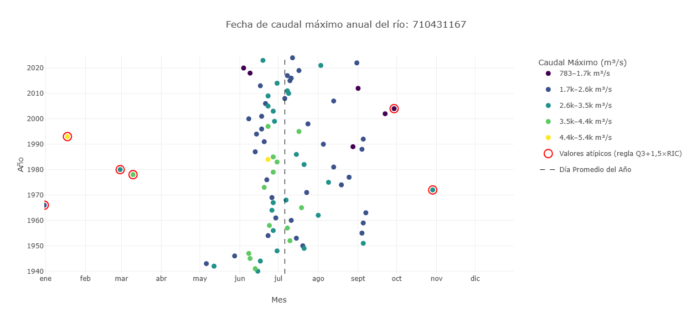

Este gráfico está diseñado para mostrar información sobre el caudal pico de un río. La posición indica el momento en que ocurrió el caudal y el color indica la cantidad de agua. El eje y representa los distintos años. La posición de un punto a lo largo del eje x muestra en qué momento del año ocurrió el caudal pico. Los colores representan los valores del caudal pico cuando ocurrió. Los valores atípicos se resaltan en rojo.

### Hidrograma raster

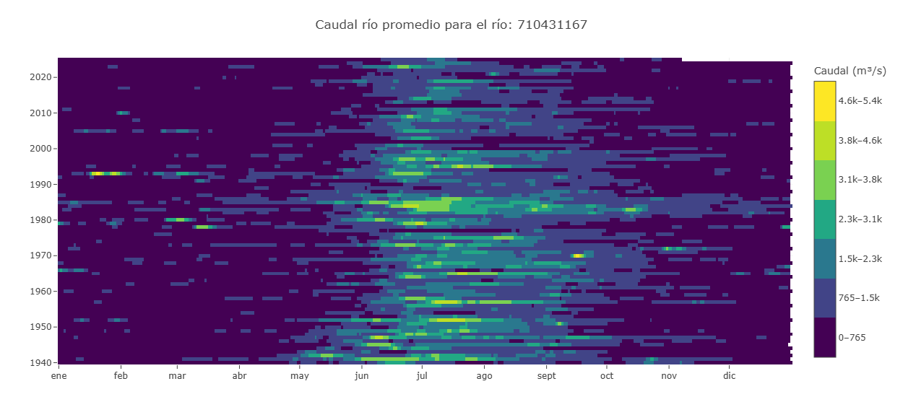

Un hidrograma raster es una visualización basada en una cuadrícula que muestra la variación temporal del caudal de un solo río. El eje x representa los meses, el eje y representa los años y el color de cada celda indica la magnitud del caudal. La ventaja es que se pueden ver los 85 años a la vez. Al recorrer una fila se ve el caudal de un año, mientras que al recorrer una columna hacia arriba o hacia abajo se ve la misma fecha en todos los años, por ejemplo, cada 15 de marzo. Esto facilita identificar patrones estacionales, ver rápidamente los periodos húmedos y secos, y detectar valores atípicos o años en los que la temporada de lluvias fue más larga o más corta de lo normal.

### Curva de duración de caudal

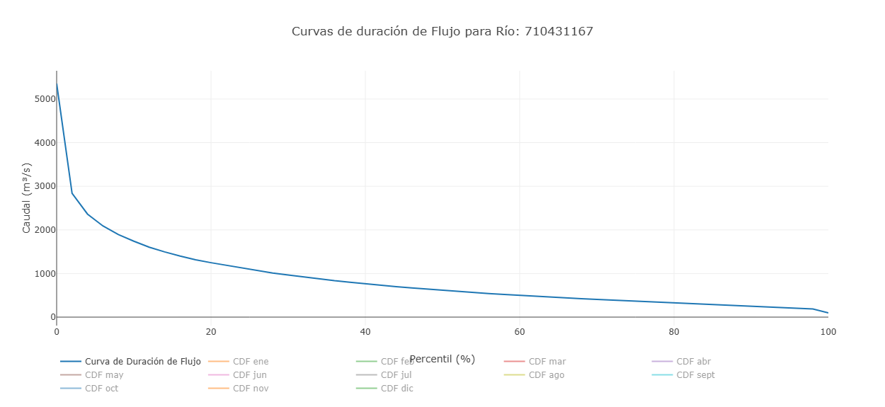

Este gráfico muestra el caudal en el eje y y la probabilidad de excedencia en el eje x. Cada punto representa un valor de caudal mensual y muestra con qué frecuencia se excede ese nivel de caudal. Además de los valores mensuales individuales, el gráfico incluye una curva de duración de caudal general basada en todo el conjunto de datos. Esto permite a los usuarios comparar los patrones de caudal mensuales con la distribución de caudales a largo plazo. Por defecto, solo se muestra la curva general, y los meses individuales deben activarse para verlos.

## Guardar ríos

Los usuarios pueden guardar ríos para acceder a ellos repetidamente mediante la pestaña de marcadores en la parte superior del Hydroviewer. Al hacer clic en la pestaña se abre una ventana emergente. Por defecto, ya hay varios ríos importantes en la lista. Para agregar un río:

1. Haga clic en el signo más
2. Ingrese el ID y el nombre del río.
Los ríos guardados se pueden abrir rápidamente haciendo clic en el ícono de gráfico junto al río.

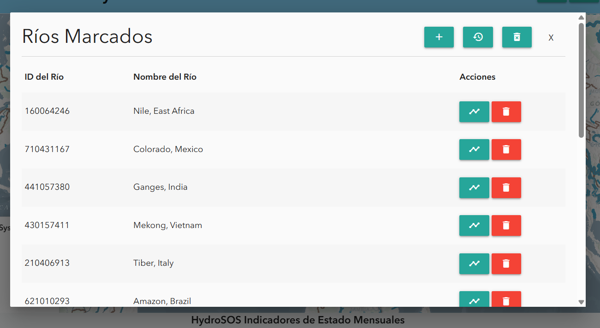
