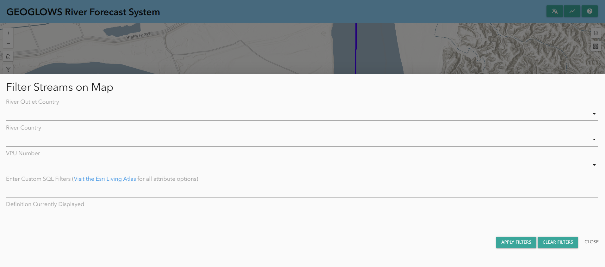
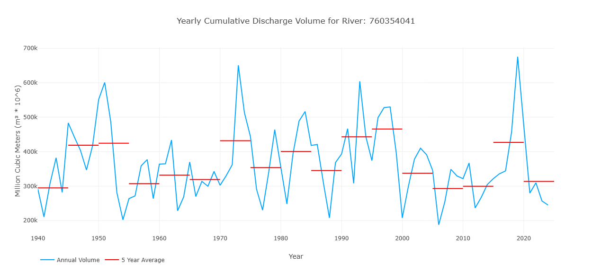
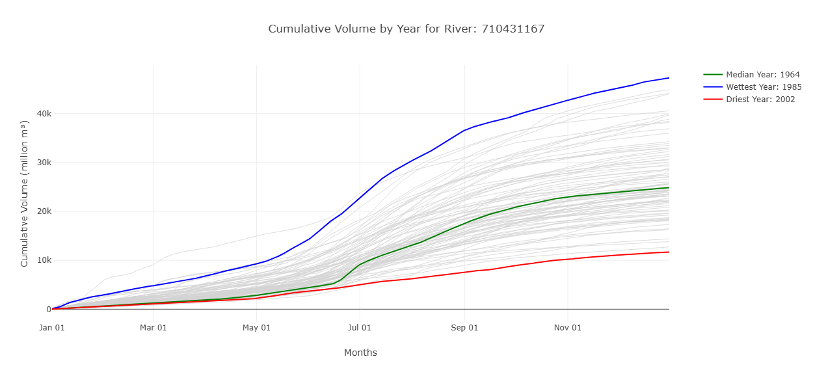
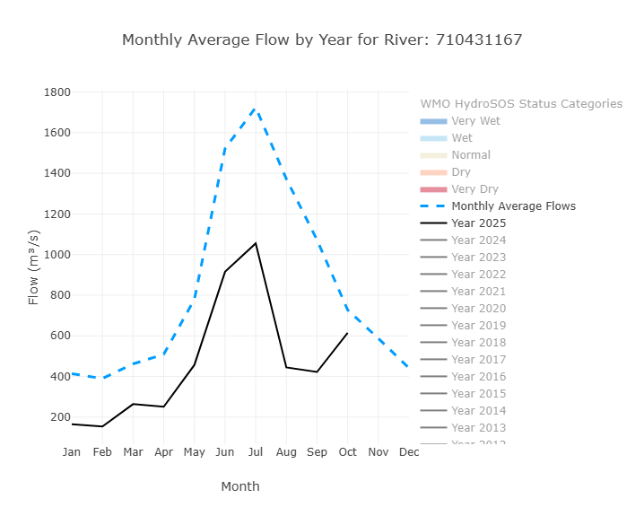
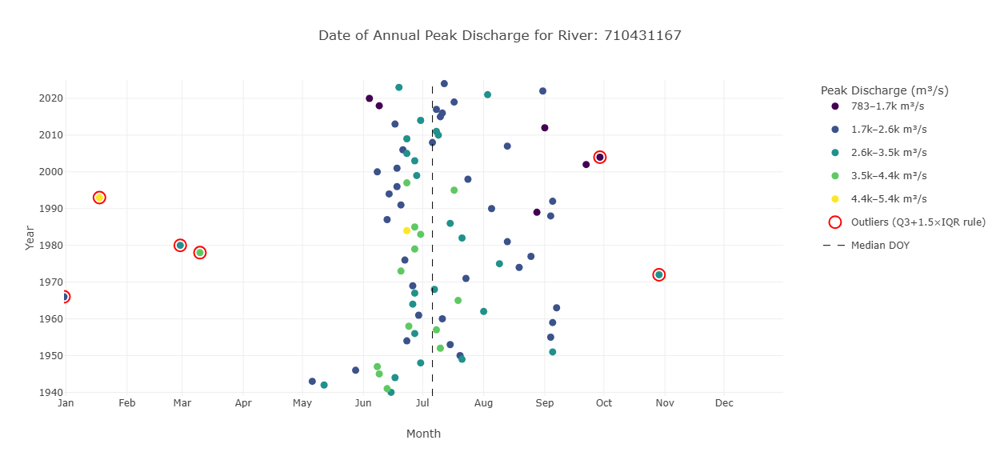
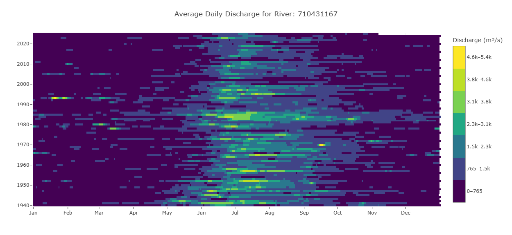
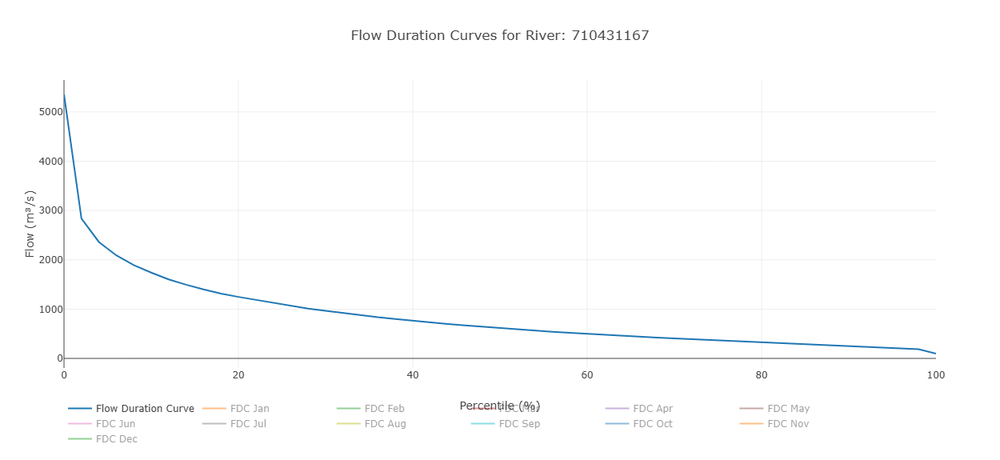
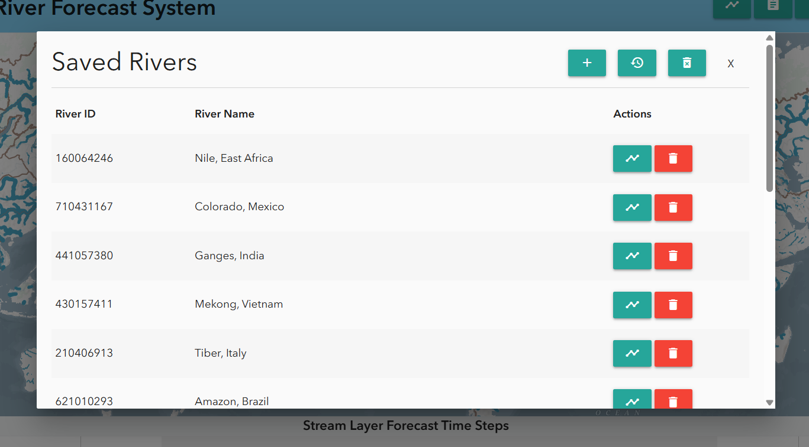

# Utilisation du RFS Hydroviewer

## Aperçu
Le [RFS Hydroviewer](https://apps.geoglows.org/rfs) est un outil web permettant de visualiser et d'accéder aux prévisions de débit et aux données historiques des rivières dans le monde entier. Il permet aux utilisateurs de :

- Explorer les conditions de débit en temps réel  
- Analyser les tendances des prévisions  
- Consulter les simulations hydrologiques pour n'importe quelle rivière  

Le Hydroviewer soutient la prise de décisions éclairées en matière de gestion des ressources en eau, de réduction des risques de catastrophe et de planification de la résilience climatique. Les utilisateurs peuvent évaluer les valeurs de débit et identifier les risques potentiels d'inondation ou de sécheresse.

Le Hydroviewer a deux objectifs principaux :

- Visualisation des données de débit  
- Traçage et récupération des données  

L'interface est disponible en anglais et en espagnol. Si le visualiseur reste en anglais, des outils de traduction automatique peuvent être utilisés, mais les traductions ne sont pas garanties.

Pour plus d'informations, consultez le [webinaire](../../webinars/rfs-v2-webinar-4.md)
 sur le Hydroviewer.

## Carte

La première fonction majeure de l'application est d'afficher des cartes qui aident les utilisateurs à explorer et à comprendre les derniers résultats de prévision du RFS. Il s'agit d'une carte multi-échelle : la quantité de cours d'eau visibles change selon que vous zoomez ou dézoomez. Il y a deux seuils de zoom, pour un total de trois vues. Les cours d'eau sont basés sur les jeux de données TDX-Hydro utilisés dans le RFS, arrondis au mètre près, ce qui offre une copie de résolution quasi parfaite des données originales.

### Style des Cours d'Eau

Cela permet aux utilisateurs d'identifier rapidement les rivières connaissant des débits élevés.

- Couleur : représente la période de retour estimée dépassée à un pas de temps donné. Cela aide à identifier rapidement les rivières connaissant des débits élevés.

- Épaisseur : indique la quantité d'eau prévue dans la rivière. Utilisez l'épaisseur comme indication de la taille relative, mais consultez les graphiques pour obtenir des valeurs précises.

Cliquer sur une rivière affiche son identifiant de rivière et ouvre une fenêtre contextuelle avec des graphiques détaillés.

### Couches Supplémentaires

Il existe plusieurs couches supplémentaires qui fournissent des informations complémentaires. Parmi elles :

1. Carte de base environnementale : il s'agit d'un produit Esri assez récent qui combine plusieurs cartes de base et technologies impressionnantes. La couche et le style du RFS ont fait partie des nombreux éléments pris en compte dans la conception de la carte environnementale ; elle devrait donc offrir une vue utile à de nombreux niveaux de zoom. Des lignes brunes tracent les limites des bassins HydroBASINS, ce qui aide à identifier le grand bassin versant que vous regardez lorsque vous êtes dézoomé. Certains noms de rivières sont également affichés sur la carte de base.

2. Couches HydroSOS de l'OMM : de nombreux utilisateurs du RFS participent aux activités de l'OMM telles que HydroSOS. Le programme HydroSOS évolue ; il ne s'agit donc pas d'un produit finalisé. Cependant, vous pouvez activer la couche et utiliser le curseur temporel pour trouver un mois que vous souhaitez visualiser au cours des 35 dernières années. Les couleurs rouge foncé, rouge clair, jaune neutre, bleu clair et bleu foncé indiquent si le bassin était sec, normal ou humide par rapport à la quantité normale sur la période 1990-2019.

### Filtrage des Données

Les données peuvent également être filtrées en cliquant sur le bouton de filtre situé sur le côté gauche. Vous y trouverez des options pour filtrer selon :

- Le pays de la rivière  
- Le numéro de VPU  
- Le pays de l'embouchure de la rivière  

Seules les rivières répondant à ces critères seront alors affichées sur la carte.

# Graphiques et Diagrammes

En plus de la carte, le Hydroviewer fournit également des informations sur des rivières spécifiques. Cela remplit le second objectif du Hydroviewer en tant qu'outil de récupération de données. En sélectionnant des rivières, les utilisateurs peuvent télécharger des fichiers .csv contenant des données sur la rivière et consulter des graphiques présentant des informations sur la rivière.

## Accéder aux Graphiques

Les rivières peuvent être sélectionnées :

- En cliquant sur une rivière sur la carte  
- En saisissant directement un identifiant de rivière  

Pour saisir un identifiant de rivière :

1. Ouvrez la fenêtre contextuelle des graphiques en sélectionnant l'icône de graphique dans le coin supérieur droit ou à partir d'une rivière précédemment sélectionnée.  
2. Cliquez sur « Enter River ID » en haut de la fenêtre contextuelle.  
3. Saisissez l'identifiant de la rivière (ex. : rivière Magdalena en Colombie : 610363879) et cliquez sur « OK ».  

La fenêtre contextuelle affiche les graphiques de prévision et rétrospectifs. Les données peuvent être téléchargées via l'icône d'appareil photo dans le coin supérieur droit de chaque graphique.

## Graphiques de Prévision

Par défaut, lorsque vous cliquez sur un cours d'eau, la prévision à 15 jours à partir du jour courant s'affiche. Cependant, si vous le souhaitez, vous pouvez afficher une prévision d'un jour précédent en choisissant une date en haut de la fenêtre.

Un exemple de graphique de prévision est présenté ici. Par défaut, les périodes de retour sont masquées, mais vous pouvez les afficher sur le graphique en cliquant dessus. Plus d'informations sur l'interprétation de ce graphique se trouvent dans la section [Données de Prévision](../what-is-it/available-data.md#donnees-de-prevision-a-15-jours) de cette formation.

Un tableau indique également, pour chaque jour, le pourcentage de membres de l'ensemble qui dépassent chaque période de retour. Cela aide à montrer la probabilité qu'une période de retour donnée soit dépassée.

## Graphiques Rétrospectifs

Vous pouvez consulter les données rétrospectives en passant à la vue rétrospective en haut de la fenêtre contextuelle. L'icône bleue en surbrillance indique si vous consultez les données de prévision ou les données rétrospectives. Par défaut, 10 ans de données rétrospectives sont affichés, mais cette durée peut être ajustée à l'aide des curseurs gris en bas. L'ensemble des données rétrospectives, qui remontent à 1940, peut être consulté de cette manière.

Il s'agit du graphique rétrospectif principal, mais il existe d'autres graphiques dérivés de ces données rétrospectives. Ils sont conçus pour aider à interpréter et à analyser les données. Ils représentent des interprétations des données rétrospectives, sans être exhaustifs. Tous les graphiques ne seront pas utiles dans tous les cas d'utilisation. Les graphiques disponibles évoluent en fonction des recherches en cours.

### Débit Cumulé Annuel

Ce graphique montre une valeur pour chaque année de la simulation rétrospective, représentant le volume total écoulé au cours de cette année pour ce cours d'eau. Elle est représentée par la ligne bleue du graphique. Les lignes rouges montrent les moyennes du volume sur 5 ans afin de représenter l'évolution possible du volume du cours d'eau au fil du temps.

### Volume Cumulé par Année

Ce graphique montre le volume cumulé en millions de mètres cubes tout au long de l'année. Les années les plus humides et les plus sèches sont étiquetées pour donner une idée de la plage de valeurs observées dans le passé. En survolant une ligne dans le Hydroviewer, l'année correspondant à chaque ligne s'affiche. Ce graphique montre également à quel moment le volume d'eau augmente le plus rapidement, ce qui correspond à un débit plus important.

### Débit Moyen Mensuel avec Catégories HydroSOS

Ce graphique comporte des éléments qui peuvent être activés ou désactivés pour mettre en évidence différents aspects.
La vue par défaut montre les débits moyens mensuels sur toute la période d'enregistrement (la ligne bleue pointillée) et les moyennes mensuelles de l'année en cours (la ligne noire). D'autres années peuvent être activées ou désactivées pour comparer leurs moyennes mensuelles.
De plus, les niveaux HydroSOS peuvent être activés ou désactivés pour montrer la plage des conditions de débit (très sec, sec, normal, humide et très humide) tout au long de l'année. Cela repose sur les méthodes développées par l'OMM pour son initiative HydroSOS. Les plages des catégories sont calculées à partir des moyennes mensuelles historiques. Les valeurs de chaque mois sont classées séparément et se voient attribuer un percentile. Ces percentiles servent ensuite à définir les seuils de chaque catégorie.
Ce graphique aide les utilisateurs à comprendre comment les débits d'une rivière pour une année donnée se comparent à ce qui est considéré comme normal, et si les conditions ont été plus humides ou plus sèches que d'habitude pour chaque mois.

### Débit de Pointe Annuel

Ce graphique est conçu pour présenter des informations sur le débit de pointe d'une rivière. La position indique le moment où le débit s'est produit et la couleur indique la quantité d'eau. L'axe des y représente les différentes années. La position d'un point le long de l'axe des x indique à quel moment de l'année le débit de pointe s'est produit. Les couleurs représentent la valeur du débit de pointe au moment où il s'est produit. Les valeurs aberrantes sont mises en évidence en rouge.

### Hydrogramme Raster

Un hydrogramme raster est une visualisation en grille montrant la variation temporelle du débit d'une seule rivière. L'axe des x représente les mois, l'axe des y représente les années, et la couleur de chaque cellule indique l'ampleur du débit. L'intérêt est de pouvoir visualiser les 85 années d'un seul coup d'œil. Parcourir une ligne montre le débit d'une année, tandis que parcourir une colonne de haut en bas montre la même date pour toutes les années, par exemple chaque 15 mars. Cela permet d'identifier facilement les régimes saisonniers, de repérer rapidement les périodes humides et sèches, et de détecter les valeurs aberrantes ou les années où la saison humide a été plus longue ou plus courte que la normale.

### Courbe de Durée des Débits

Ce graphique affiche le débit sur l'axe des y et la probabilité de dépassement sur l'axe des x. Chaque point représente une valeur de débit mensuel et indique à quelle fréquence ce niveau de débit est dépassé. En plus des valeurs mensuelles individuelles, le graphique comprend une courbe globale de durée des débits basée sur l'ensemble des données. Cela permet aux utilisateurs de comparer les régimes d'écoulement mensuels à la distribution des débits à long terme. Par défaut, seule la courbe globale est affichée ; les mois individuels doivent être activés pour être visibles.

## Sauvegarde des Rivières

Les utilisateurs peuvent sauvegarder des rivières pour y accéder régulièrement via l'onglet des signets en haut du Hydroviewer. Cliquer sur l'onglet ouvre une fenêtre contextuelle. Par défaut, plusieurs grandes rivières y sont déjà répertoriées. Pour ajouter une rivière :

1. Cliquez sur le signe plus
2. Saisissez l'identifiant et le nom de la rivière.
Les rivières sauvegardées peuvent être consultées rapidement en cliquant sur l'icône de graphique à côté de la rivière.

