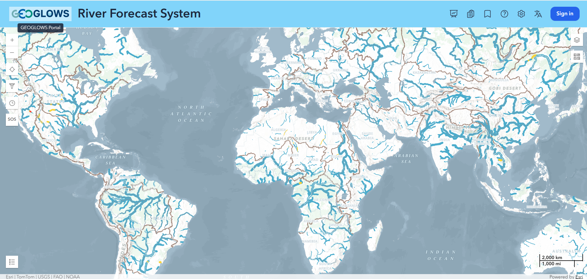
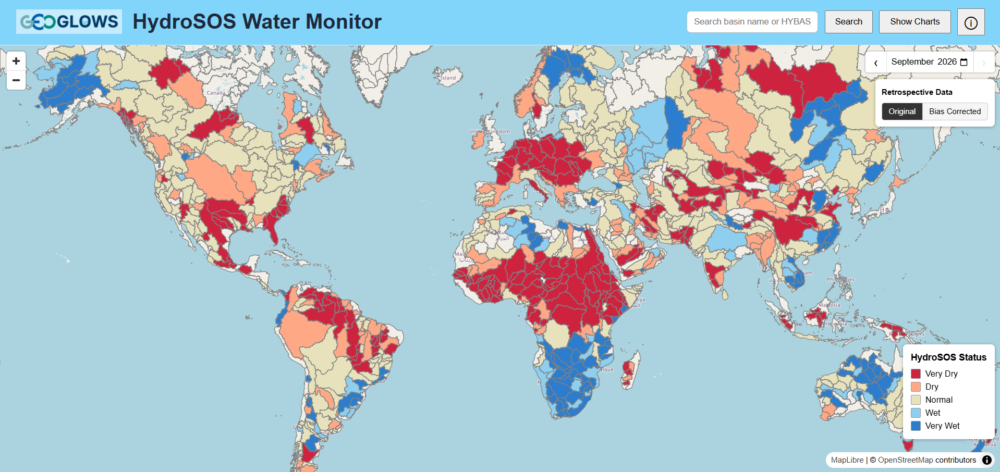

# Aplicaciones Web

Una forma de visualizar, descargar e interactuar con los datos de RFS es mediante una serie de aplicaciones web disponibles en [apps.geoglows.org](https://apps.geoglows.org). Cada una de estas aplicaciones tiene un público y un propósito específicos. Todas funcionan con los datos de RFS y representan una de las formas en que se pueden usar los datos. Es posible crear otras aplicaciones y personalizaciones si los usuarios descargan y utilizan los datos por su cuenta desde el almacén de datos. Cada aplicación web ofrece una visualización e interpretación específicas de los datos, lo que puede hacer que su uso sea más rápido y sencillo. Aquí se presenta un resumen de las aplicaciones y, luego, cada aplicación tiene su propia página donde puede encontrar información más detallada e instrucciones de uso.

## 1. El Hydroviewer

- **Enlace:** [https://apps.geoglows.org/rfs](https://apps.geoglows.org/rfs#lon=10.00&lat=18.00&zoom=3.00&definition=)
- **Propósito principal:** Ofrecer visualizaciones y descargas de datos de forma sencilla
- **Público objetivo:** Usuarios técnicos que desean visualizar rápidamente los datos de algunos de sus ríos de interés.

## 2. FEWS (Sistema de Alerta Temprana de Inundaciones)

- **Enlace:** [https://apps.geoglows.org/previews/fews4all](https://apps.geoglows.org/previews/fews4all)
- **Propósito principal:** Proporcionar alertas de inundación
- **Público objetivo:** Usuarios no técnicos que quieren saber si se verán afectados por una inundación sin tener que descargar los datos por su cuenta.

## 3. HydroSOS

- **Enlace:** [https://apps.geoglows.org/hydrosos](https://apps.geoglows.org/hydrosos)
- **Propósito principal:** Mostrar las categorías de HydroSOS según el protocolo de la OMM
- **Público objetivo:** Usuarios vinculados a la OMM

## 4. ¿Aplicación de Mapas de Inundación?
