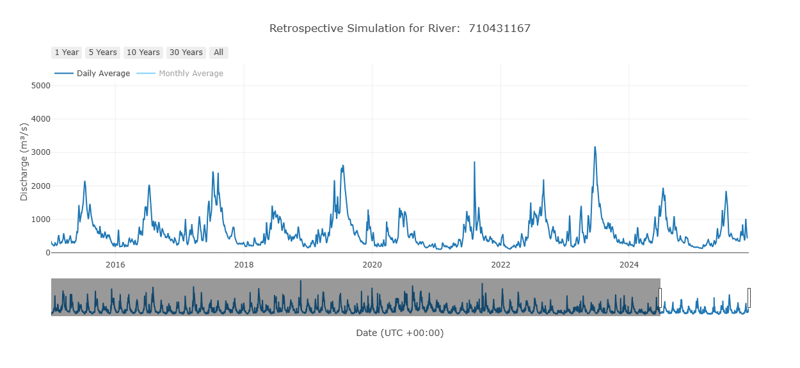
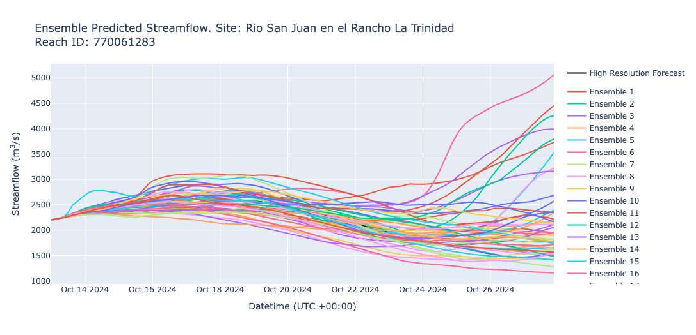
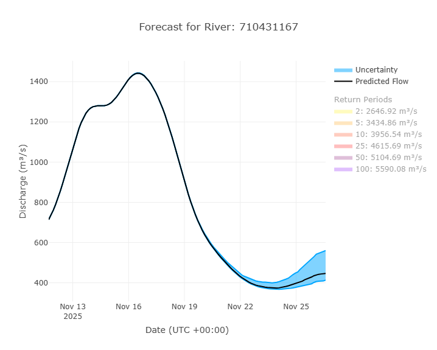

# Available Data

RFS produces streamflow values in around 4.9 million streams. Each stream segment has its own values that can be downloaded and used. The data are available through the [datastore](using-datastore.md) or through several different [web applications](../web-apps/overview.md). There are also advanced options to view the data through code; look at our [advanced section](../advanced/data-access/code-and-apis.md).

There are 3 main sets of data.

1. The retrospective data
2. The 15-day forecast data
3. The 45-day forecast data

Each of these is explained in more depth in the following sections. There is also more information in the [datastore](using-datastore.md).

## Retrospective Data

### Overview

The retrospective simulation from RFS contains data from 85+ years at hourly resolution beginning 1 January 1940. The model is deterministic, meaning there is just one value given for each timestep instead of an ensemble of values. The retrospective
simulation and many derivative products are updated weekly. 

The retrospective simulation provides hourly average streamflows which are resampled to daily, monthly, and yearly averages. Flows are reported as the
average that occurred over the following interval (hour, day, month, or year). The value given represents the average flow starting at that time until the next timestep. All values are in cubic
meters per second.

| Model Property           | Retrospective Simulation   |
|--------------------------|----------------------------|
| Earliest Date            | 01 January 1940            |
| Simulation Type          | Deterministic              |
| Ensemble Members         | 1                          |
| Lag time                 | 5-12 Days from present     |
| Time Step                | Hourly average             |
| Update Frequency         | Weekly on Sunday 00:00 UTC |
| Bulk Download Available  | Yes                        |
| Query & Subset Available | Yes                        |

---

### Derivative Products

#### Return Periods

A return period is an estimate of how infrequently an extreme high flow (flood) or prolonged low flow period (drought) occurs. Return periods have
been precalculated using the Gumbel Distribution and Log Pearson Type 3 distributions and the hourly average maximum flows from each complete year.
The precalculated return periods are used to define warning levels for each river segment in the model. The precalculated values are for 2, 5, 10, 25,
50 and 100-year recurrence intervals. You can calculate a return period using your preferred method by accessing the same annual maximums dataset.

#### Flow Duration Curves

**Flow Duration Curves (FDCs)** are a representation of flow patterns in a river. They relate each discharge to a probability of exceedance. The
exceedance probability is the chance that any randomly sampled discharge value is greater than or equal to the flow for that probability. Large
floods have a low chance of exceedance while low flows have a high chance of exceedance. The FDC is a useful tool for understanding the variability of
streamflow and the likelihood of different flow rates. FDCs are precalculated for each month (e.g. 12 total curves that represent each month) and for
the entire period of record of the river. These help understand streamflow throughout the year and seasonal changes in flow which is applicable to
effective water resource management, flood forecasting, and understanding hydrological patterns.

## 15 Day Forecast Data

### Overview

RFS produces ensemble streamflow forecasts using IFS (Integrated Forecast System) data from the ECMWF. Flows are reported in cubic meters per second. The forecast has a **3-hour time step**, where each flow
value represents the average flow that occurred in the river during the previous 3 hours. Below is an example graph showing all the ensemble members.

Each forecast includes a **50+1 member ensemble**, meaning there is **1 baseline (control)** prediction and **50 perturbations** (slight variations) of
the baseline condition.

Each day's forecast is initialized using the 24-hour mean value from the ensemble members on the previous day as the initial condition. 

| Model Property           | Forecast Simulation |
|--------------------------|--------------------------|
| Simulation Type          | Ensemble                 |
| Ensemble Members         | 50+1                     |
| Lead time                | 15 Days                  |
| Time Step                | 3-hour average           |
| Update Frequency         | Daily at 00:00 UTC       |
| Bulk Download Available  | Yes                      |
| Query & Subset Available | Yes                      |

### Interpreting an Ensemble Forecast

Each ensemble member has an equal probability of occurring. Therefore, forecasts are best understood by looking at summaries of the ensembles rather
than individual members.

Forecast plots are designed to help users interpret the range of possible outcomes and uncertainties. The most commonly used forecast plot includes
the median, the 20th percentile, and the 80th percentile. These represent 60% of the probability distribution within the ensemble members and provide
insight into the potential variability of future streamflow. This approach allows users to see the range of probable scenarios for their streams.

In the following example forecast plot, there are 3 areas to focus on:

- **Black Line:** The median of the 51 ensemble members. This is the "best guess" of river flow.
- **Blue Lines:** The 20th and 80th percentile values.
- **Blue Shaded Area:** Represents the uncertainty in the prediction. It is the middle 60% of the ensemble. The narrower the blue region, the more
  confident the model is. The true flow is more likely than not to fall within the blue shaded area.

## 45 Day Forecast Data
This is a placeholder for what will go here if it is produced.