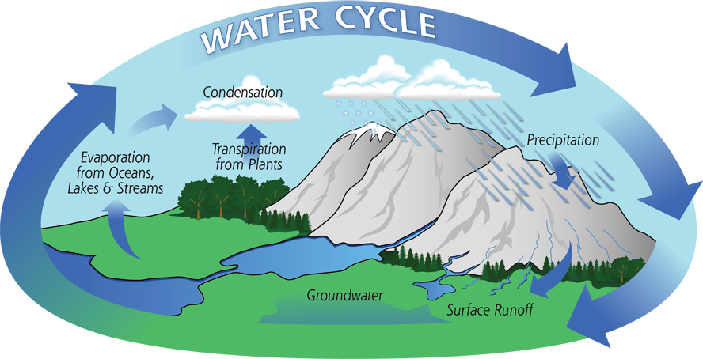

# Resumen

El sistema de pronóstico de ríos está diseñado para predecir cuánta agua hay en los ríos a nivel mundial. Esto se calcula mediante una ecuación básica que establece que toda el agua de la Tierra debe conservarse. En otras palabras, el agua que cae como precipitación debe infiltrarse en el suelo (infiltración), evaporarse de regreso a la atmósfera o continuar escurriendo sobre la superficie del terreno.

Esta idea se conoce comúnmente como el ciclo del agua. El agua circula por la Tierra cayendo como precipitación, luego se evapora hacia el aire, se condensa y vuelve a caer.

*Crédito de la imagen: [NASA Global Precipitation Measurement](https://gpm.nasa.gov/education/water-cycle)*

Para obtener más información sobre el ciclo del agua, consulte la página [Water Cycle](https://gpm.nasa.gov/education/water-cycle) de la NASA.

La escorrentía superficial es el agua que permanece en la superficie sin evaporarse ni infiltrarse en el suelo. Es como el agua que se puede ver correr por las calles o las aceras después de una tormenta.

Esta agua eventualmente se acumula en ciertos lugares, formando arroyos y lagos. Luego, el agua continúa fluyendo cuesta abajo como un río hasta llegar al océano o a un lago sin salidas.

Por lo tanto, para predecir el agua en los ríos necesitamos conocer algunas cosas:

1. **Los datos de elevación.** Con esta información podemos suponer dónde comenzará a acumularse el agua para formar ríos. Sabemos que el agua fluye cuesta abajo, así que con la elevación de la superficie terrestre sabemos hacia dónde irá el agua cuando llueva.
2. **La cantidad de agua que se convierte en escorrentía superficial.** Existen modelos meteorológicos que predicen cuánto lloverá en el futuro y que pueden indicar cuánto llovió en el pasado. Son los mismos que usamos cuando consultamos el pronóstico del tiempo para saber si lloverá mañana. Esa misma información puede usarse para saber cuál será el caudal mañana. Conocer esta información nos permite estimar cuánta agua se convertirá en escorrentía y, por lo tanto, fluirá hacia los ríos.
3. **Cuánta agua hay aguas arriba de mí.** Sabemos que el agua, una vez que está en un río, continúa fluyendo hasta llegar a un lago sin salidas o al océano. Esto significa que el agua del arroyo en el patio de mi casa depende de cuánto llovió en mi patio, pero también de cuánta agua había aguas arriba y bajó hasta mi patio. Podemos calcular esto moviendo continuamente el agua aguas abajo.
4. **Cómo se mueve el agua.** Necesitamos saber cómo entra el agua a los ríos y cómo se mueve aguas abajo una vez que está en el río. Por ejemplo, necesitamos conocer la velocidad con la que esto ocurre para saber cuánto tiempo tarda la lluvia que entra al río Misisipi en el norte de Estados Unidos en llegar al océano Atlántico.

En el sistema de pronóstico de ríos, estas son las piezas necesarias para crear el modelo hidrológico. El sistema de pronóstico de ríos utiliza datos de elevación de TDX-Hydro, que se construyen a partir de datos satelitales, y los usa para estimar dónde se encuentran los ríos a nivel mundial. La cantidad de agua la obtenemos del ECMWF, una institución europea que ejecuta modelos meteorológicos. Ellos modelan cuánta precipitación hubo en el pasado y predicen cuánta habrá en el futuro. También predicen qué parte de la precipitación se convertirá en escorrentía superficial que entrará a los ríos. Así es como se puede predecir la cantidad de agua que entra a los ríos.

Los otros dos componentes, cuánta agua hay aguas arriba y cómo se mueve el agua, están relacionados. Se calculan mediante un proceso llamado enrutamiento. Aquí es donde calculamos el movimiento del agua entre pequeños segmentos de río. Si lo ejecutamos de forma continua, siempre sabemos cuánta agua hay aguas arriba y podemos moverla aguas abajo mientras se agrega más agua al río por la lluvia local. Este es el proceso que realiza nuestro modelo. Existen varios métodos diferentes para realizar este cálculo. Nosotros utilizamos un proceso llamado enrutamiento de Muskingum, que es el nombre de las ecuaciones que usamos para calcular cómo se mueve el agua a través de cada pequeño segmento de río hacia el segmento aguas abajo.

Hemos creado esta aplicación web para demostrar mejor cómo funciona este proceso.

[https://cdn.apps.geoglows.org/webroute/live.html](https://cdn.apps.geoglows.org/webroute/live.html#map=1.6/21.3/-14.8)

Aunque hay muchas formas de verlo, una forma sencilla para la demostración es seleccionar "pulse" como pincel.

<video controls muted playsinline width="100%">
  <source src="/static/videos/webroute-pulse-demo.mp4" type="video/mp4">
</video>

Esto equivale a introducir agua en una ubicación específica. Haga clic en algún lugar del mapa de la red de ríos. A medida que los ríos cambian de color, está viendo cómo el agua se mueve a través de su río usando el algoritmo de enrutamiento que utiliza RFS. La diferencia es que, en lugar de seleccionar ubicaciones al azar como en esta demostración, usamos las predicciones globales para agregar agua a todos los ríos cada vez que llueve.
