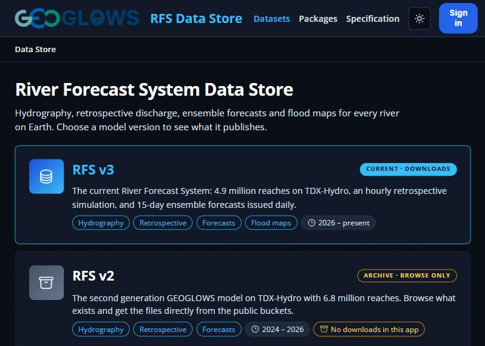
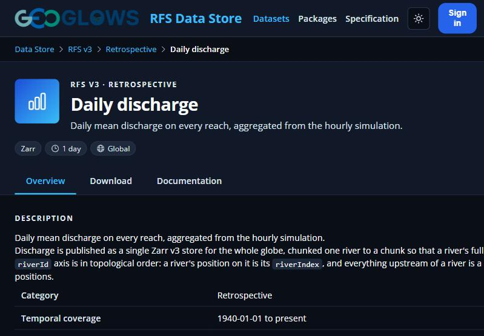
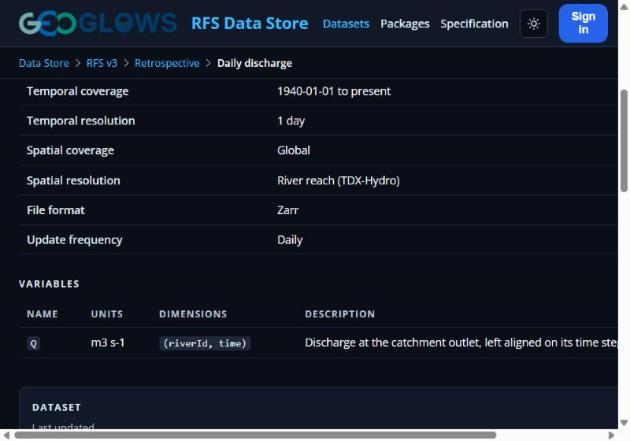
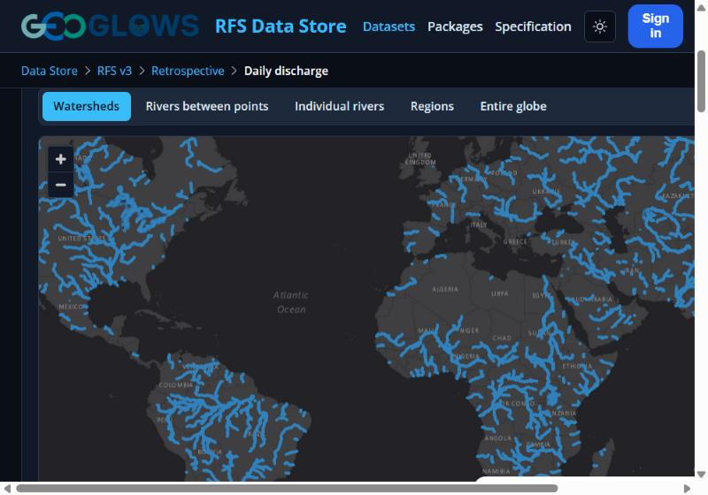
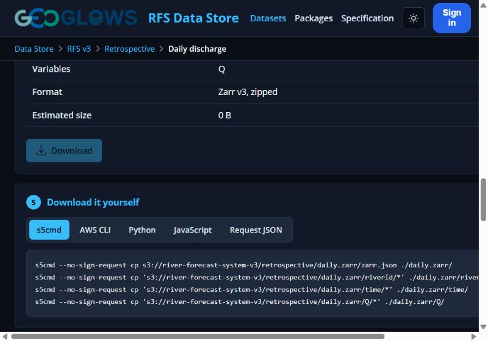

# The Datastore

The [RFS Data Store](https://apps.geoglows.org/previews/rfs-data-store) is the place to find and download RFS data. It lists every dataset the model publishes, describes what is in each one, and lets you download just the rivers and dates you need.

## 1. Choose a model version

The home page lists each version of RFS. Select **RFS v3**, the current version, to see its datasets. RFS v2 and v1 are archives that you can browse, but their data cannot be downloaded through this app.

## 2. Find a dataset

The dataset list shows everything available for that version, such as hydrography, retrospective discharge, forecasts, and flood maps.

- Use the **search bar** to look for a dataset by name.
- Use the **filters** on the left to narrow the list by category, file format, or temporal resolution (for example, hourly or daily data).
- Use **Sort by** to order the list by title or by when it was last updated.

Select a dataset to open its page.

## 3. Learn about the dataset

Each dataset page has three tabs:

- **Overview**: a description of the dataset and its metadata (see below).
- **Download**: tools for downloading the data (see below).
- **Documentation**: more detailed technical information.

### Metadata and dataset information

The **Overview** tab is a good place to start before downloading anything. It describes what the dataset contains and how it is organized, including:

- **Description**: what the data are and how they were produced.
- **Coverage and resolution**: the time period, time step (for example, hourly or daily), spatial coverage, and spatial resolution of the data.
- **Variables**: the name, units, and dimensions of each variable in the files, such as `Q`, discharge in cubic meters per second.
- **Dataset details**: the file format, coordinate reference system, model version, provider, update frequency, and when the dataset was created and last updated.
- **License and citation**: the terms the data are shared under and how to cite them in your work.
- **Storage**: where the data are stored in the public RFS bucket.
- **Changelog**: a history of updates to the dataset.
- **Related datasets**: links to other datasets that are often used together, such as the hourly, daily, and monthly discharge.

## 4. Download the data

On the **Download** tab, work through the numbered steps:

1. **Area of interest**: choose what to download, then select it on the map. You can choose a watershed, the rivers between two points, individual rivers, one or more regions, or the entire globe.
2. **Time range**: pick start and end dates, or use a shortcut such as the last 30 days or the full record.
3. **Format**: choose the file format to download.
4. **Terms of use**: read the data usage agreement and check both boxes to accept it and the dataset's license.
5. **Request**: sign in, review the summary of your request (including its estimated size), and select **Download**.

### Downloading it yourself

If you would rather download the data with your own tools, the **Download it yourself** section at the bottom of the Download tab gives ready-to-use commands for s5cmd, the AWS CLI, Python, and JavaScript. The data are stored in a public bucket, so these commands do not require an account.

The **Packages** page of the Data Store also links to the two maintained code libraries for reading RFS data: **geoglows** for Python and **riverforecastsystem** for JavaScript.
