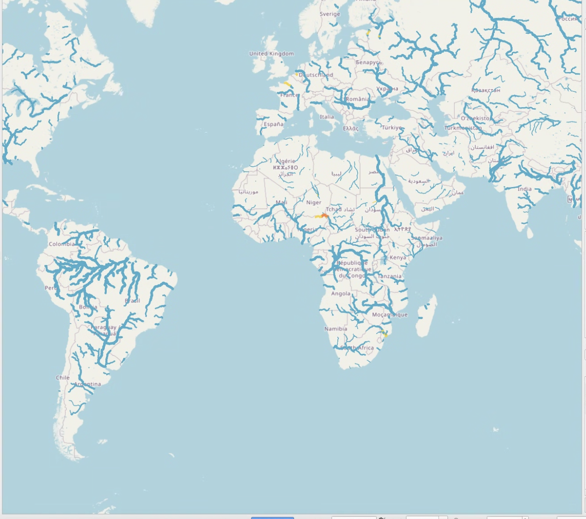

## Couche Living Atlas

Les résultats RFS sont mieux explorés à l'aide d'une carte web disponible gratuitement via le **ArcGIS Living Atlas of the World**. Vous n'avez pas besoin d'une licence ArcGIS pour utiliser cette couche. Vous pouvez visualiser et interagir avec la couche dans ArcGIS, QGIS, des applications JavaScript et la plupart des méthodes que vous utilisez habituellement pour consommer des données SIG.

Vous pouvez l'ajouter aux cartes web en tant que couche web sans avoir besoin de télécharger les données supplémentaires ou le réseau de cours d'eau. Si vous essayez de télécharger l'hydrofabric, des instructions à ce sujet se trouvent dans la section [données disponibles](../datasets/catalog.md).

La couche est considérée comme "activée dans le temps", ce qui signifie qu'elle contient des données attributaires décrivant chaque segment de rivière pour les 10 premiers jours de chaque prévision quotidienne. En utilisant ces informations, les cours d'eau sont animés pour changer de couleur et de taille en fonction de la quantité d'eau prévue dans la rivière et si cette valeur dépasse un niveau de période de retour.

Quelques actions qu’un utilisateur peut effectuer avec cette couche :

- Les données de prévision peuvent être visualisées séquentiellement dans le temps grâce au curseur intégré dans l'application. Un utilisateur peut observer les cours d'eau par fenêtres de 3 heures.  
  La couleur des cours d'eau changera si le flux est élevé pendant cette période.
- Les entités peuvent être identifiées en cliquant sur la carte. Des pop-ups préconfigurés affichent les noms de rivières issus de la communauté OpenStreetMap.

[Plus d'informations](https://www.arcgis.com/home/item.html?id=8f0573e0c0b9491dbeafde9c72ccf02b) sur la couche de carte web sont disponibles sur le site ArcGIS. Des informations sur le chargement des Living Atlas Layers dans ArcGIS peuvent être consultées [ici](https://enterprise.arcgis.com/en/portal/10.5/use/add-living-atlas-layers.htm).

Pour charger cette carte dans QGIS, procédez comme suit :

**Étape 1 :** Au bas de la page d'informations de la couche de carte Esri, sur le côté droit, se trouve le lien URL pour accéder à la couche de carte :  
https://livefeeds3.arcgis.com/arcgis/rest/services/GEOGLOWS/GlobalWaterModel_Medium/MapServer  
Copiez ce lien dans votre presse-papiers.

**Étape 2 :** Dans votre logiciel SIG, allez à *Couche* → *Ajouter une couche* → *Ajouter une couche de service REST ArcGIS*.

**Étape 3 :** Cliquez pour ajouter une nouvelle couche de service REST. Entrez un nom pour la couche et collez l’URL copiée dans la fenêtre.

La couche peut également être utilisée dans les [Esri Instant Apps](https://www.esri.com/en-us/arcgis/products/arcgis-instant-apps/overview).
